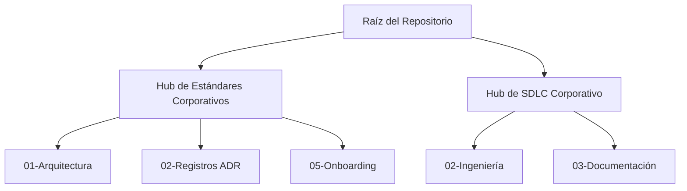

# 🗺️ Índice Maestro Global (Punto de Entrada Corporativo)

> 🌍 **Navegación Bilingüe:** [🇺🇸 English Version (Master Index)](./MASTER_INDEX.md)

Bienvenido al sistema nervioso central de **arc32**. Este índice maestro sirve como la puerta canónica de enrutamiento para todos los actores que interactúan con este repositorio. Localiza tu perfil a continuación para acceder a la ruta acelerada de lectura que garantiza el cumplimiento técnico y procedimental.

---

## 🚀 1. Rutas Aceleradas por Rol (Navegación Basada en Roles)

Identifica tu relación actual con el proyecto para desbloquear la jerarquía de lectura obligatoria adaptada a tu función.

| Rol Empresarial | Ruta de Lectura Recomendada | Cumplimiento Esperado |
| :--- | :--- | :--- |
| **Proveedor Externo de Software** | 1. [Inicio Rápido del Producto](./arc-corporate-ws/corporate-standards-es/05-onboarding/product-quick-start.md) 2. [Base de Stack Agnóstica](./arc-corporate-ws/corporate-standards-es/01-architecture/authoritative-tech-stack-agnostic.md) + [Anexo de Runtime](./arc-corporate-ws/corporate-standards-es/01-architecture/authoritative-tech-stack.md) 3. [Blueprint de Referencia (Deep Dive)](./arc-corporate-ws/corporate-standards-es/01-architecture/reference-blueprint.md) | Validar el emparejamiento del stack local y el aislamiento de fronteras antes de iniciar la orden de trabajo. |
| **Desarrollador Backend / QA** | 1. [Base de Stack Agnóstica](./arc-corporate-ws/corporate-standards-es/01-architecture/authoritative-tech-stack-agnostic.md) + [Anexo de Runtime](./arc-corporate-ws/corporate-standards-es/01-architecture/authoritative-tech-stack.md) 2. [Marco de Trabajo SDLC (Construcción)](./arc-corporate-ws/corporate-sdlc-es/02-engineering/construction-focused-sdlc-framework.md) 3. [Mejores Prácticas para Docs SDLC](./arc-corporate-ws/corporate-sdlc-es/03-documentation/sdlc-documentation-best-practices.md) | Garantizar los umbrales de Unit Test, alineación con el DoD y cero "fugas de lógica" en las Pull Requests. |
| **Arquitecto de Soluciones** | 1. [Blueprint de Referencia](./arc-corporate-ws/corporate-standards-es/01-architecture/reference-blueprint.md) 2. [Roadmap de Estrategia Evolutiva](./arc-corporate-ws/corporate-standards-es/00-vision/evolutionary-strategy-roadmap.md) 3. [Registros de Decisiones (Hub de ADRs)](./arc-corporate-ws/corporate-standards-es/02-adrs/README.md) | Mantener la integridad de los patrones y evaluar la alineación de nuevos disparadores de extracción de servicios. |
| **Líder de Equipo / Product Manager** | 1. [Roadmap de Estrategia Evolutiva](./arc-corporate-ws/corporate-standards-es/00-vision/evolutionary-strategy-roadmap.md) 2. [Hub de Gobernanza SDLC Corporativa](./arc-corporate-ws/corporate-sdlc-es/README.md) 3. [Inicio Rápido del Producto](./arc-corporate-ws/corporate-standards-es/05-onboarding/product-quick-start.md) | Sincronizar los hitos de entrega con las transiciones de fase de la arquitectura. |

---

## 🛡️ 2. Ruta de Cumplimiento Normativo (Línea Base Global)

Todos los participantes del ecosistema, independientemente de su antigüedad o rol, DEBEN adherirse y hacer cumplir los pilares fundacionales alojados a continuación. El no respetar estos anclajes anula la aceptación de artefactos en el código base.

*   📄 **[Línea Base Agnóstica Universal](./arc-corporate-ws/corporate-standards-es/01-architecture/authoritative-tech-stack-agnostic.md)**: Restricciones universales de sistemas para todos los runtimes.
*   📄 **[Anexos de Runtime Autorizado](./arc-corporate-ws/corporate-standards-es/01-architecture/authoritative-tech-stack.md)**: Mapeo de frameworks para Node.js, .NET y Android.
*   📄 **[Blueprint Arquitectónico de Referencia](./arc-corporate-ws/corporate-standards-es/01-architecture/reference-blueprint.md)**: Fundamentación conceptual para las fronteras hexagonales y lógica de Puertos/Adaptadores.
*   📄 **[Definición de Hecho (DoD) Gobernanza SDLC](./arc-corporate-ws/corporate-sdlc-es/02-engineering/construction-focused-sdlc-framework.md#✅-4-checklist-de-definición-de-hecho-dod-de-ingeniería)**: Puerta de calidad final que bloquea la integración a producción.
*   📄 **[Checklist de Simplicidad Fase 1](./arc-corporate-ws/corporate-standards-es/01-architecture/simplicity-checklist-phase-01.md)**: Salvaguarda normativa contra la sobre-ingeniería prematura.

---

## 🏢 3. Mapa Estructural del Ecosistema Hub

A continuación se representa el diseño de agrupación física de los módulos de gobernanza de alto nivel dentro de este espacio de trabajo corporativo.

*   👉 **[Raíz del Centro de Documentación en Español](./arc-corporate-ws/corporate-standards-es/README.md)**
*   👉 **[Raíz del Centro de Gobernanza SDLC en Español](./arc-corporate-ws/corporate-sdlc-es/README.md)**
*   👉 **[Mapa de Navegación Central (Volver al README Principal)](./README.es.md#⚡-4-mapa-rápido-de-navegación-central-contexto-español)**
