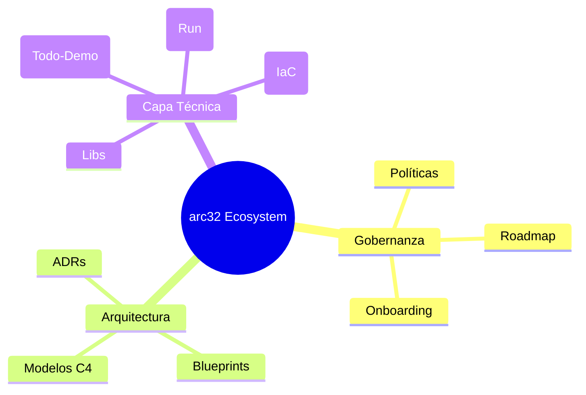

# 🗺️ Índice Maestro Global (SSoT)

> 🌍 **Navegación Bilingüe:** [🇺🇸 English (Master Index)](./MASTER_INDEX.md) | [🇪🇸 Español (Índice Maestro)](./MASTER_INDEX.es.md)

Este índice es la fuente única de verdad (**Single Source of Truth**) para la navegación en el ecosistema **arc32**. Sigue tu ruta según tu rol para garantizar el cumplimiento de los estándares corporativos.

---

## 🚀 1. Rutas Aceleradas por Rol

| Perfil | Acción | Ruta de Aprendizaje |
| :--- | :--- | :--- |
| **🏢 Proveedor / Partner** | Validación de Stack | [Onboarding](./governance/standards-es/onboarding/product-quick-start.md) → [Blueprints](./architecture/blueprints-es/reference-blueprint.md) |
| **💻 Ingeniero (Dev/QA)** | Construcción | [SDLC Framework](./governance/sdlc-es/README.md) → [Clean Code](./governance/standards-es/engineering/README.md) |
| **🏗️ Arquitecto** | Toma de Decisiones | [ADR Hub](./architecture/adrs-es/README.md) → [Estrategia](./governance/standards-es/vision/evolutionary-strategy-roadmap.md) |
| **📈 Product Manager** | Roadmap & Valor | [Visión](./governance/standards-es/vision/README.md) → [Checklist DoD](./governance/sdlc-es/02-engineering/construction-focused-sdlc-framework.md) |

---

## 🛡️ 2. Línea Base de Cumplimiento (Mandatorio)

Todo artefacto integrado en este repositorio debe respetar los siguientes pilares:

1.  📄 **[Agnosticismo de Stack](./architecture/blueprints-es/authoritative-tech-stack-agnostic.md)**: Reglas universales de desacoplamiento.
2.  📄 **[Arquitectura de Referencia](./architecture/blueprints-es/reference-blueprint.md)**: Patrones Hexagonales y DDD.
3.  📄 **[Taxonomía de Repositorio](./governance/standards-es/repository-taxonomy.es.md)**: Organización física obligatoria.
4.  📄 **[Definición de Hecho (DoD)](./governance/sdlc-es/02-engineering/construction-focused-sdlc-framework.md#✅-4-checklist-de-definición-de-hecho-dod-de-ingeniería)**: Puerta de calidad para producción.

---

## 🏢 3. Mapa del Ecosistema Documental

---

  <a href="./README.es.md">← Volver al Portal Principal</a>

