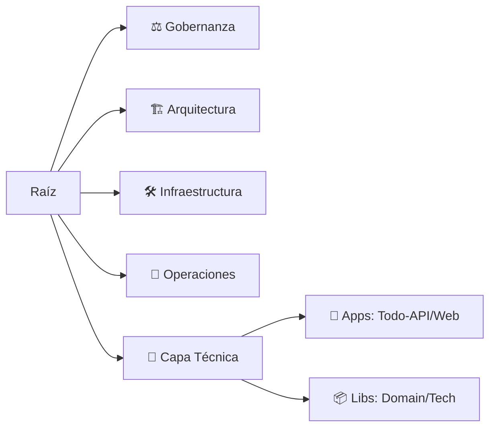

<div align="center">
  

  # 🌐 arc32: Ecosistema de Arquitectura Progresiva
  
  []()
  []()
  []()
  []()

  ### *El plano canónico para sistemas empresariales que escalan del Monolito a la Nube.*

  [🇺🇸 English](./README.md) | [🇪🇸 Español](./README.es.md)
</div>

---

## 🎯 Visión de Misión
**arc32** es una arquitectura de referencia políglota diseñada para maximizar el **agnosticismo técnico** y la **soberanía de datos**. Implementa un modelo de **Monolito Progresivo**, permitiendo que los dominios de negocio evolucionen independientemente sin los costos operativos prematuros de los microservicios distribuidos.

---

## 🧭 Centro de Navegación Maestro
No explores los directorios al azar. Selecciona tu perfil para acceder a tu ruta de lectura obligatoria.

<table align="center">
  <tr>
    <td align="center" width="200">
      <a href="./MASTER_INDEX.es.md">
        <br />
        
        <br />
        <strong>Índice Maestro</strong>
      </a>
    </td>
    <td align="center" width="200">
      <a href="./governance/standards-es/README.md">
        <br />
        
        <br />
        <strong>Gobernanza</strong>
      </a>
    </td>
    <td align="center" width="200">
      <a href="./architecture/adrs-es/README.md">
        <br />
        
        <br />
        <strong>Registro de ADRs</strong>
      </a>
    </td>
  </tr>
</table>

---

## 🏗️ Anatomía del Repositorio (Taxonomía v3.0)
Este repositorio sigue una estructura de dos capas para separar la **Gobernanza** de la **Implementación**.



---

## ⚡ Inicio Rápido (Demo Mode)
Prueba la arquitectura en acción con nuestro sistema de **Todo List** (Clean Architecture).

```bash
# 1. Instalar dependencias del monorepo
cd src/ && npm install

# 2. Levantar infraestructura (Docker)
cd ../infrastructure/ && docker-compose up -d

# 3. Iniciar servicios (Modo Dev)
cd ../src/ && npm run dev
```

---

## 🛡️ Pilares Fundacionales
- **Agnosticismo Radical:** La infraestructura es un detalle. El dominio es sagrado.
- **Seguridad Dinámica:** Cumplimiento nativo de ISO 27001 y GDPR.
- **Evolución Basada en Métricas:** Transición a microservicios guiada por el Índice de Agnosticismo ($PI$).
- **Compliance-as-Code:** Reglas automáticas en el pipeline de CI/CD.

---

<div align="center">
  <sub>© 2026 arc32 | Habilitado por BMAD-METHOD & IA Aumentada</sub>
</div>
