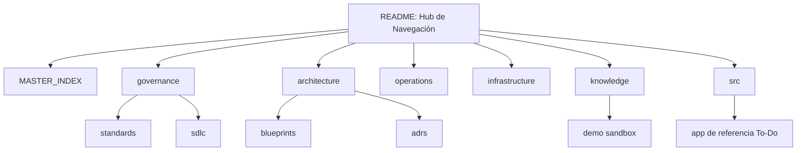

# arc32: Arquitectura Progresiva Enterprise

[]()
[]()
[]()

*El blueprint definitivo para sistemas empresariales resilientes, escalables y aumentados por IA.*

[English](./README.md) | [Español](./README.es.md)

---

## Índice Maestro: empieza aquí

Bienvenido a **arc32**, una referencia técnica abierta para construir productos que puedan evolucionar desde un monolito simple hacia un monolito modular y, cuando esté justificado, hacia microservicios sostenibles.

Usa esta página como hub principal de navegación. El repositorio es amplio por diseño, así que la forma más rápida de leerlo es por intención:

| Quiero... | Empieza aquí | Luego lee | Resultado |
|---|---|---|---|
| Entender la visión | [Directivas Arquitectónicas](./governance/standards-es/vision/architectural-directives.md) | [Roadmap Evolutivo](./governance/standards-es/vision/evolutionary-strategy-roadmap.md) | Entender por qué la arquitectura evoluciona progresivamente |
| Revisar la arquitectura de referencia | [Blueprint de Referencia](./architecture/blueprints-es/reference-blueprint.md) | [Resumen Tech Stack](./architecture/blueprints-es/tech-stack-summary.md) | Entender la arquitectura objetivo y las decisiones tecnológicas |
| Explorar decisiones arquitectónicas | [Registro ADR](./architecture/adrs-es/README.md) | [ADRs Core](./architecture/adrs-es/core/README.es.md) | Entender contexto, trade-offs y consecuencias |
| Aprender el modelo de gobernanza | [Manifiesto de Ingeniería](./governance/standards-es/engineering/engineering-manifesto.md) | [Framework SDLC](./governance/sdlc-es/README.md) | Entender estándares, quality gates y expectativas de entrega |
| Ejecutar o inspeccionar la demo | [Demo Sandbox](./knowledge/demo/README.md) | [Matriz de Verificación](./knowledge/demo/technical/sandbox-verification.md) | Ver cómo los patrones se demuestran en código |
| Operar la plataforma | [Hub de Operaciones](./operations/README.es.md) | [Hub de Infraestructura](./infrastructure/README.es.md) | Entender observabilidad, runbooks e infraestructura local |
| Navegar todo | [Índice Maestro Global](./MASTER_INDEX.es.md) | [Taxonomía del Repositorio](./governance/standards-es/repository-taxonomy.es.md) | Encontrar los artefactos principales sin explorar al azar |

---

## Lectura Recomendada por Rol

No explores los directorios al azar. Elige la fila más cercana a tu rol y sigue la ruta de izquierda a derecha.

| Rol | Ruta recomendada | Por qué importa |
|---|---|---|
| **Ejecutivo / Sponsor** | [Directivas Arquitectónicas](./governance/standards-es/vision/architectural-directives.md) -> [Roadmap Evolutivo](./governance/standards-es/vision/evolutionary-strategy-roadmap.md) -> [Matriz de Madurez](./governance/standards-es/vision/maturity-matrix.md) | Enmarca valor de negocio, reducción de riesgo y madurez arquitectónica |
| **Product Owner / PM** | [PRD Demo](./knowledge/demo/project/01-prd-demo-sandbox-es.md) -> [Glosario de Negocio](./knowledge/demo/functional/business-glossary.md) -> [Backlog y Epics](./knowledge/demo/project/02-backlog-and-epics-es.md) | Conecta intención de producto con alcance, lenguaje y planificación |
| **Arquitecto de Software** | [Blueprint de Referencia](./architecture/blueprints-es/reference-blueprint.md) -> [Registro ADR](./architecture/adrs-es/README.md) -> [Criterios de Extracción a Microservicios](./architecture/adrs-es/core/0045-microservice-extraction-readiness-criteria.md) | Muestra el modelo de decisión detrás de la arquitectura progresiva |
| **Principal / Staff Engineer** | [Resumen Tech Stack](./architecture/blueprints-es/tech-stack-summary.md) -> [Patrones de Diseño Táctico](./architecture/adrs-es/core/0019-tactical-design-patterns-future-proofing.md) -> [Checklist de Simplicidad](./architecture/blueprints-es/simplicity-checklist-phase-01.md) | Ayuda a validar decisiones de implementación y evitar complejidad accidental |
| **Backend Developer** | [Manifiesto de Ingeniería](./governance/standards-es/engineering/engineering-manifesto.md) -> [ADR Clean Architecture](./architecture/adrs-es/nodejs/0002-clean-architecture-nestjs.md) -> [Matriz Técnica Demo](./knowledge/demo/technical/sandbox-verification.md) | Explica límites, casos de uso, adaptadores y expectativas de código |
| **Frontend Developer** | [ADR Resiliencia Frontend](./architecture/adrs-es/nodejs/0004-frontend-offline-resilience.md) -> [ADR BFF/Gateway](./architecture/adrs-es/nodejs/0008-progressive-multimodule-evolution-gateway-bff.md) -> [Demo Web To-Do](./src/apps/todo-web/README.md) | Conecta UX, integración, resiliencia y evolución de APIs |
| **DevOps / SRE** | [Hub de Infraestructura](./infrastructure/README.es.md) -> [Hub de Operaciones](./operations/README.es.md) -> [ADR Observabilidad](./architecture/adrs-es/nodejs/0007-observability-telemetry-loki-opentelemetry.md) | Cubre infraestructura local, observabilidad y readiness operacional |
| **QA / SDET** | [ADR Pirámide de Testing](./architecture/adrs-es/core/0018-testing-pyramid-quality-gates.md) -> [Guía Contract Testing](./governance/standards-es/engineering/contract-testing-guideline.md) -> [ADR Integración y E2E](./architecture/adrs-es/core/0053-estrategia-pruebas-integracion-e2e.md) | Define estrategia de calidad, límites de prueba y automatización |
| **Security Engineer** | [Vendor Risk Assessment](./governance/standards-es/engineering/vendor-risk-assessment.md) -> [ADR Multi-Tenancy](./architecture/adrs-es/core/0010-multi-tenancy-architecture-strategy.md) -> [ADR Auditoría Inmutable](./architecture/adrs-es/core/0016-immutable-business-audit-trail.md) | Superficie seguridad, tenancy, auditabilidad y compliance |
| **AI Contributor** | [Estándares AI-Augmented](./governance/standards-es/ai-augmented/README.md) -> [Reglas Harness](./.harness/rules/global-rules.md) -> [ADRs de IA](./governance/standards-es/ai-augmented/06-adrs/README.md) | Explica cómo se gobierna la ingeniería asistida por IA |
| **New Joiner** | [Product Quick Start](./governance/standards-es/onboarding/product-quick-start.md) -> [Taxonomía del Repositorio](./governance/standards-es/repository-taxonomy.es.md) -> [Índice Maestro](./MASTER_INDEX.es.md) | Da la ruta más corta para entender el repositorio sin perderse |

---

## Viaje Arquitectónico

arc32 se basa en un principio práctico:

> Separar conceptualmente antes de separar físicamente.

El repositorio está organizado alrededor de una ruta de arquitectura progresiva:

| Etapa | Propósito | Referencias principales |
|---|---|---|
| **Monolito Simple** | Empezar pequeño, reducir costo operativo, validar producto y dominio | [Checklist de Simplicidad](./architecture/blueprints-es/simplicity-checklist-phase-01.md), [Manifiesto de Ingeniería](./governance/standards-es/engineering/engineering-manifesto.md) |
| **Monolito Modular** | Establecer límites internos, ports/adapters y ownership de dominio | [Blueprint de Referencia](./architecture/blueprints-es/reference-blueprint.md), [Patrones Tácticos](./architecture/adrs-es/core/0019-tactical-design-patterns-future-proofing.md) |
| **Módulos Distribuidos** | Introducir contratos, eventos, resiliencia y observabilidad | [ADR Outbox](./architecture/adrs-es/core/0033-transactional-outbox-pattern.md), [ADR Message Bus](./architecture/adrs-es/core/0036-message-bus-delivery-strategy-fifo-dlq.md), [ADR Observabilidad](./architecture/adrs-es/nodejs/0007-observability-telemetry-loki-opentelemetry.md) |
| **Microservicios** | Extraer servicios solo cuando ownership, despliegue o escalabilidad lo requieren | [Criterios de Extracción](./architecture/adrs-es/core/0045-microservice-extraction-readiness-criteria.md), [ADR Transición Dapr](./architecture/adrs-es/core/0006-future-microservices-transition-dapr.md) |

---

## Mapa del Repositorio

| Área | Propósito | Entrada |
|---|---|---|
| `architecture/` | Blueprints, ADRs, topología y decisiones arquitectónicas | [Blueprints de Arquitectura](./architecture/blueprints-es/README.md) |
| `governance/` | Estándares, SDLC, onboarding y reglas de ingeniería | [Estándares de Gobernanza](./governance/standards-es/README.md) |
| `operations/` | Operación, observabilidad y soporte runtime | [Hub de Operaciones](./operations/README.es.md) |
| `infrastructure/` | Infraestructura local, gateway y orquestación de contenedores | [Hub de Infraestructura](./infrastructure/README.es.md) |
| `knowledge/` | Documentación demo, investigación, ejemplos y aprendizaje | [Demo Sandbox](./knowledge/demo/README.md) |
| `src/` | Implementación de referencia y sandbox ejecutable | [To-Do Web App](./src/apps/todo-web/README.md) |



---

## Acceso Rápido

| Módulo | Enlace | Descripción |
|---|---|---|
| **Arquitectura** | [Registro ADR](./architecture/adrs-es/README.md) | Decisiones, blueprints, decisiones tecnológicas y evolución arquitectónica |
| **Gobernanza** | [Estándares](./governance/standards-es/README.md) | Reglas de ingeniería, documentación, onboarding y gobernanza IA |
| **SDLC** | [Framework SDLC](./governance/sdlc-es/README.md) | Ciclo de vida, disciplina de construcción y documentación |
| **Demo** | [Sandbox To-Do](./knowledge/demo/README.md) | Demostrador ligero de patrones arquitectónicos |
| **Operaciones** | [Hub de Operaciones](./operations/README.es.md) | Observabilidad, soporte runtime y documentación operacional |
| **Infraestructura** | [Hub de Infraestructura](./infrastructure/README.es.md) | Docker, gateway y setup de plataforma local |
| **Índice Completo** | [Índice Maestro Global](./MASTER_INDEX.es.md) | Navegación completa del repositorio |

---

## Inicio Rápido: Sandbox

Ejecuta el sandbox de referencia localmente:

```bash
# 1. Clonar e instalar
git clone https://github.com/beyondnetcode/arc32_progresive_monolith.git
cd arc32_progresive_monolith/src
npm install

# 2. Iniciar infraestructura local
docker-compose -f ../infrastructure/docker-compose.yml up -d

# 3. Iniciar desarrollo
npm run dev
```

Si solo quieres inspeccionar la documentación arquitectónica, empieza por el [Índice Maestro](./MASTER_INDEX.es.md).

---

## Contribución y Calidad

- **BMAD-METHOD:** Ingeniería documentation-first dirigida por especificaciones.
- **Gitflow:** Estrategia de ramas documentada en [ADR-0050](./architecture/adrs-es/core/0050-estrategia-ramas-gitflow.md).
- **Docs-as-code:** Arquitectura, gobernanza, operaciones e implementación versionadas juntas.
- **Quality gates:** Las contribuciones deben preservar integridad de enlaces, taxonomía y consistencia arquitectónica.

---

## Licencia

Este proyecto se publica como referencia técnica abierta bajo la licencia del repositorio.

---

<div align="center">
 <sub> 2026 Ecosistema arc32 | Habilitado por BMAD-METHOD | Ingeniería Aumentada por IA</sub>
</div>
