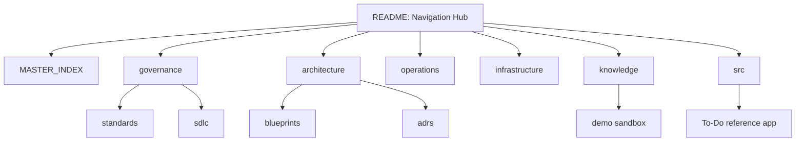

# arc32: Enterprise Progressive Architecture

[]()
[]()
[]()

*The definitive blueprint for resilient, scalable, and AI-augmented enterprise systems.*

[English](./README.md) | [Español](./README.es.md)

---

## Master Index: Start Here

Welcome to **arc32**, an open technical reference for building products that can evolve from a simple monolith to a modular monolith and, when justified, toward sustainable microservices.

Use this page as the main navigation hub. The repository is intentionally broad, so the fastest way to read it is by intent:

| I want to... | Start here | Then read | Outcome |
|---|---|---|---|
| Understand the vision | [Architectural Directives](./governance/standards/vision/architectural-directives.md) | [Evolutionary Strategy Roadmap](./governance/standards/vision/evolutionary-strategy-roadmap.md) | Understand why the architecture evolves progressively |
| Review the reference architecture | [Reference Blueprint](./architecture/blueprints/reference-blueprint.md) | [Tech Stack Summary](./architecture/blueprints/tech-stack-summary.md) | Understand the target architecture and technology choices |
| Explore architectural decisions | [ADR Registry](./architecture/adrs/README.md) | [Core ADRs](./architecture/adrs/core/README.md) | Understand decision context, trade-offs, and consequences |
| Learn the governance model | [Engineering Manifesto](./governance/standards/engineering/engineering-manifesto.md) | [SDLC Framework](./governance/sdlc/README.md) | Understand standards, quality gates, and delivery expectations |
| Run or inspect the demo | [Demo Sandbox](./knowledge/demo/README.md) | [Sandbox Verification Matrix](./knowledge/demo/technical/sandbox-verification.md) | See how patterns are demonstrated in code |
| Operate the platform | [Operations Hub](./operations/README.md) | [Infrastructure Hub](./infrastructure/README.md) | Understand observability, runbooks, and local infrastructure |
| Navigate everything | [Global Master Index](./MASTER_INDEX.md) | [Repository Taxonomy](./governance/standards/repository-taxonomy.md) | Find every major artifact without browsing randomly |

---

## Recommended Reading by Role

Do not explore directories at random. Pick the row closest to your role and follow the path from left to right.

| Role | Recommended path | Why this path matters |
|---|---|---|
| **Executive / Sponsor** | [Architectural Directives](./governance/standards/vision/architectural-directives.md) -> [Evolutionary Roadmap](./governance/standards/vision/evolutionary-strategy-roadmap.md) -> [Maturity Matrix](./governance/standards/vision/maturity-matrix.md) | Frames business value, risk reduction, and architectural maturity |
| **Product Owner / PM** | [Demo PRD](./knowledge/demo/project/01-prd-demo-sandbox.md) -> [Business Glossary](./knowledge/demo/functional/business-glossary.md) -> [Backlog and Epics](./knowledge/demo/project/02-backlog-and-epics.md) | Connects product intent with scope, language, and delivery planning |
| **Software Architect** | [Reference Blueprint](./architecture/blueprints/reference-blueprint.md) -> [ADR Registry](./architecture/adrs/README.md) -> [Microservice Extraction Criteria](./architecture/adrs/core/0045-microservice-extraction-readiness-criteria.md) | Shows the decision model behind progressive architecture |
| **Principal / Staff Engineer** | [Tech Stack Summary](./architecture/blueprints/tech-stack-summary.md) -> [Tactical Design Patterns](./architecture/adrs/core/0019-tactical-design-patterns-future-proofing.md) -> [Simplicity Checklist](./architecture/blueprints/simplicity-checklist-phase-01.md) | Helps validate implementation choices and avoid accidental complexity |
| **Backend Developer** | [Engineering Manifesto](./governance/standards/engineering/engineering-manifesto.md) -> [Clean Architecture ADR](./architecture/adrs/nodejs/0002-clean-architecture-nestjs.md) -> [Demo Technical Matrix](./knowledge/demo/technical/sandbox-verification.md) | Explains boundaries, use cases, adapters, and code expectations |
| **Frontend Developer** | [Frontend Resilience ADR](./architecture/adrs/nodejs/0004-frontend-offline-resilience.md) -> [BFF Evolution ADR](./architecture/adrs/nodejs/0008-progressive-multimodule-evolution-gateway-bff.md) -> [Demo App](./src/apps/todo-web/README.md) | Connects UX implementation with integration, resilience, and API evolution |
| **DevOps / SRE** | [Infrastructure Hub](./infrastructure/README.md) -> [Operations Hub](./operations/README.md) -> [Observability ADR](./architecture/adrs/nodejs/0007-observability-telemetry-loki-opentelemetry.md) | Covers local infrastructure, observability, and operational readiness |
| **QA / SDET** | [Testing Pyramid ADR](./architecture/adrs/core/0018-testing-pyramid-quality-gates.md) -> [Contract Testing Guideline](./governance/standards/engineering/contract-testing-guideline.md) -> [Integration and E2E Testing ADR](./architecture/adrs/core/0053-integration-e2e-testing-strategy.md) | Defines quality strategy, test boundaries, and automation focus |
| **Security Engineer** | [Vendor Risk Assessment](./governance/standards/engineering/vendor-risk-assessment.md) -> [Multi-Tenancy ADR](./architecture/adrs/core/0010-multi-tenancy-architecture-strategy.md) -> [Immutable Audit Trail ADR](./architecture/adrs/core/0016-immutable-business-audit-trail.md) | Surfaces security, tenancy, auditability, and compliance concerns |
| **AI Contributor** | [AI-Augmented Standards](./governance/standards/ai-augmented/README.md) -> [Harness Rules](./.harness/rules/global-rules.md) -> [AI ADRs](./governance/standards/ai-augmented/06-adrs/README.md) | Explains how AI-assisted engineering is governed in the repo |
| **New Joiner** | [Product Quick Start](./governance/standards/onboarding/product-quick-start.md) -> [Repository Taxonomy](./governance/standards/repository-taxonomy.md) -> [Global Master Index](./MASTER_INDEX.md) | Gives the shortest path to understand the repository without getting lost |

---

## Architecture Journey

arc32 is built around one practical principle:

> Separate conceptually before separating physically.

The repository is organized around a progressive architecture path:

| Stage | Purpose | Primary references |
|---|---|---|
| **Simple Monolith** | Start small, reduce operational cost, validate product and domain | [Simplicity Checklist](./architecture/blueprints/simplicity-checklist-phase-01.md), [Engineering Manifesto](./governance/standards/engineering/engineering-manifesto.md) |
| **Modular Monolith** | Establish internal boundaries, ports/adapters, and domain ownership | [Reference Blueprint](./architecture/blueprints/reference-blueprint.md), [Tactical Design Patterns](./architecture/adrs/core/0019-tactical-design-patterns-future-proofing.md) |
| **Distributed Modules** | Introduce contracts, events, resilience, and observability | [Outbox ADR](./architecture/adrs/core/0033-transactional-outbox-pattern.md), [Message Bus ADR](./architecture/adrs/core/0036-message-bus-delivery-strategy-fifo-dlq.md), [Observability ADR](./architecture/adrs/nodejs/0007-observability-telemetry-loki-opentelemetry.md) |
| **Microservices** | Extract services only when ownership, deployment, or scalability require it | [Microservice Extraction Criteria](./architecture/adrs/core/0045-microservice-extraction-readiness-criteria.md), [Dapr Transition ADR](./architecture/adrs/core/0006-future-microservices-transition-dapr.md) |

---

## Repository Map

| Area | Purpose | Entry point |
|---|---|---|
| `architecture/` | Blueprints, ADRs, topology, and architecture decisions | [Architecture Blueprints](./architecture/blueprints/README.md) |
| `governance/` | Standards, SDLC, onboarding, and engineering rules | [Governance Standards](./governance/standards/README.md) |
| `operations/` | Operations, observability, and runtime support | [Operations Hub](./operations/README.md) |
| `infrastructure/` | Local infrastructure, gateway, and container orchestration | [Infrastructure Hub](./infrastructure/README.md) |
| `knowledge/` | Demo documentation, research, examples, and learning material | [Demo Sandbox](./knowledge/demo/README.md) |
| `src/` | Reference implementation and executable sandbox | [To-Do Web App](./src/apps/todo-web/README.md) |



---

## Quick Access

| Module | Link | Description |
|---|---|---|
| **Architecture** | [ADR Registry](./architecture/adrs/README.md) | Decisions, blueprints, technology choices, and architecture evolution |
| **Governance** | [Standards](./governance/standards/README.md) | Engineering rules, documentation standards, onboarding, and AI governance |
| **SDLC** | [SDLC Framework](./governance/sdlc/README.md) | Delivery lifecycle, construction discipline, and documentation practices |
| **Demo** | [To-Do Sandbox](./knowledge/demo/README.md) | Lightweight demonstrator for architectural patterns |
| **Operations** | [Operations Hub](./operations/README.md) | Observability, runtime support, and operational documentation |
| **Infrastructure** | [Infrastructure Hub](./infrastructure/README.md) | Docker, gateway, and local platform setup |
| **Full Index** | [Global Master Index](./MASTER_INDEX.md) | Complete repository navigation |

---

## Quick Start: Sandbox

Run the reference sandbox locally:

```bash
# 1. Clone and install
git clone https://github.com/beyondnetcode/arc32_progresive_monolith.git
cd arc32_progresive_monolith/src
npm install

# 2. Start local infrastructure
docker-compose -f ../infrastructure/docker-compose.yml up -d

# 3. Start development
npm run dev
```

If you only want to inspect the architectural documentation, start with the [Master Index](./MASTER_INDEX.md).

---

## Contribution and Quality

- **BMAD-METHOD:** Spec-driven, documentation-first engineering.
- **Gitflow:** Branching strategy documented in [ADR-0050](./architecture/adrs/core/0050-gitflow-branching-strategy.md).
- **Docs-as-code:** Architecture, governance, operations, and implementation are versioned together.
- **Quality gates:** Contributions should preserve link integrity, taxonomy, and architectural consistency.

---

## License

This project is published as an open technical reference under the repository license.

---

<div align="center">
  <sub>© 2026 arc32 Ecosystem | Enabled by BMAD-METHOD | AI-Augmented Engineering</sub>
</div>
