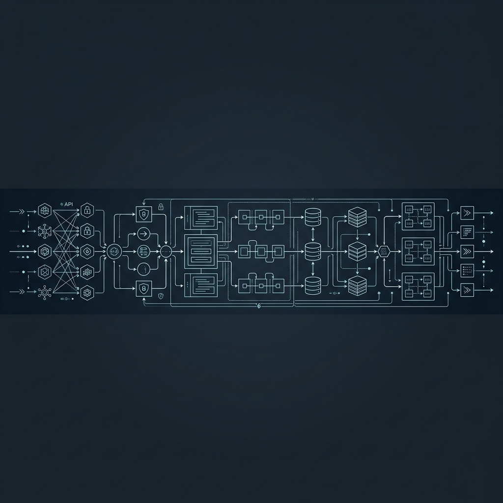
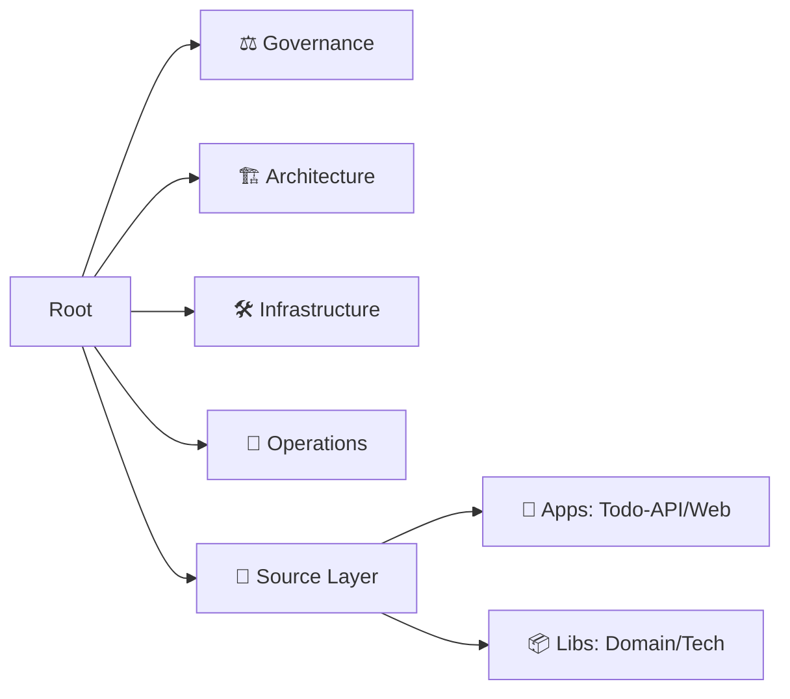

<div align="center">
  

  # 🌐 arc32: Progressive Architecture Ecosystem
  
  []()
  []()
  []()
  []()

  ### *The canonical blueprint for enterprise systems scaling from Monolith to Cloud.*

  [🇺🇸 English](./README.md) | [🇪🇸 Español](./README.es.md)
</div>

---

## 🎯 Mission Vision
**arc32** is a polyglot reference architecture designed to maximize **technical agnosticism** and **data sovereignty**. It implements a **Progressive Monolith** model, allowing business domains to evolve independently without the premature operational costs of distributed microservices.

---

## 🧭 Master Navigation Hub
Do not explore directories at random. Select your profile to access your mandatory reading path.

<table align="center">
  <tr>
    <td align="center" width="200">
      <a href="./MASTER_INDEX.md">
        <br />
        
        <br />
        <strong>Master Index</strong>
      </a>
    </td>
    <td align="center" width="200">
      <a href="./governance/standards/README.md">
        <br />
        
        <br />
        <strong>Governance</strong>
      </a>
    </td>
    <td align="center" width="200">
      <a href="./architecture/adrs/README.md">
        <br />
        
        <br />
        <strong>ADR Registry</strong>
      </a>
    </td>
  </tr>
</table>

---

## 🏗️ Repository Anatomy (Taxonomy v3.0)
This repository follows a two-layer structure to separate **Governance** from **Implementation**.



---

## ⚡ Quick Start (Demo Mode)
Experience the architecture in action with our **Todo List** system (Clean Architecture).

```bash
# 1. Install monorepo dependencies
cd src/ && npm install

# 2. Spin up infrastructure (Docker)
cd ../infrastructure/ && docker-compose up -d

# 3. Start services (Dev Mode)
cd ../src/ && npm run dev
```

---

## 🛡️ Foundational Pillars
- **Radical Agnosticism:** Infrastructure is a detail. Domain is sacred.
- **Dynamic Security:** Native compliance with ISO 27001 and GDPR.
- **Metric-Driven Evolution:** Transition to microservices guided by the Agnosticism Index ($PI$).
- **Compliance-as-Code:** Automated rules in the CI/CD pipeline.

---

<div align="center">
  <sub>© 2026 arc32 | Enabled by BMAD-METHOD & Augmented AI</sub>
</div>
