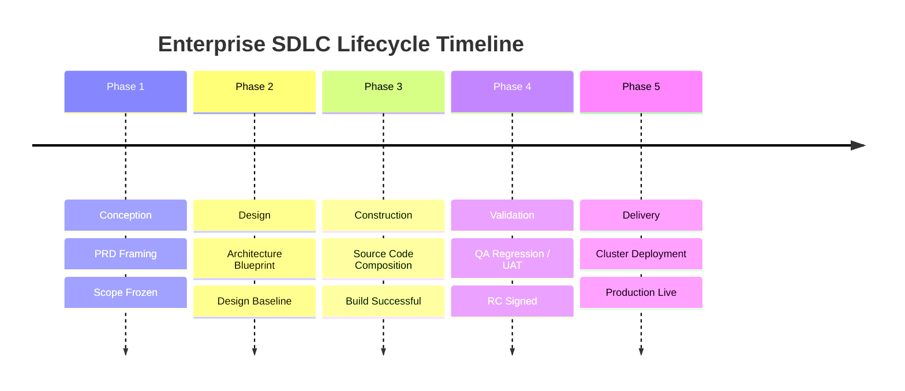
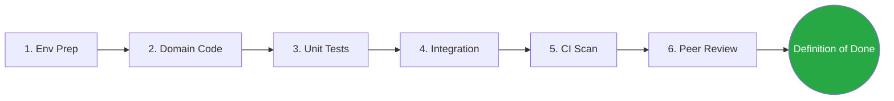

# ⚙️ Construction-Focused SDLC Framework

> 🌍 **Bilingual Navigation:** [🇪🇸 Versión en Español](../../corporate-sdlc-es/02-engineering/construction-focused-sdlc-framework.md)

This normative standard solidifies the governance controlling Software Development Life Cycle progression, establishing hardened phase exits and specialized gating mechanisms for the construction layer.

---

## 📖 1. Core Glossary (Key Terminology)

*   **Milestone:** A discrete target event marking the absolute end of a lifecycle phase.
*   **Artifact:** An immutable physical document, diagram, or system definition resulting from phase activities.
*   **Definition of Done (DoD):** The non-negotiable checklist that any deliverable MUST satisfy before it can legally transition to the subsequent phase.
*   **Gate Review:** Formal verification step assessing quality metrics before enabling deployment progression.

---

## 🗺️ 2. High-Level SDLC Lifecycle (Enterprise Matrix)

| Phase Name | Key Activities | Primary Artifacts | Exit Gate (Milestone) |
| :--- | :--- | :--- | :--- |
| **1. Conception & Discovery** | Market fit validation, user Persona profiling, scope bounding. | Product Requirements (PRD), OKRs Map. | **Business Sign-Off** (Scope Frozen). |
| **2. Design & Architecture** | Pattern selection, database schematic definition, API contract wiring. | System Blueprint (arc42), ADR Registry. | **Architecture Approval** (Design Baseline). |
| **3. Construction** | Coding, sub-component composition, internal integration. | Source Code, Automated Tests, Code Docs. | **Successful Build** (PR Merge Authorized). |
| **4. Validation & QA** | Regression verification, penetration testing, UAT workflows. | Test Summary Report, QA Acceptance Sign-Off. | **Release Candidate** (RC) Stamped. |
| **5. Delivery & Ops** | Cluster orchestration deployment, performance monitoring. | Release Notes, Observability Dashboard. | **Production Live** (Monitoring Nominal). |

---

## 🏗️ 3. Deep-Dive: Construction Stage Governance

The construction stage is the absolute engineering heartbeat. To avoid structural regression, it mandates compliance with continuous feedback sub-loops.

### 🔄 3.1 Construction Sub-Phases (Inner Loop)

1.  **Environment Preparation:** Establishing branch strategies (GitFlow/Trunk), securing local environment secrets, and finalizing Mock API servers.
2.  **Domain Composition:** Encoding pure business entities and enforcing strict validation before connecting infrastructure.
3.  **Automated Test Unit Harvesting:** Parallel creation of isolated test assertions ensuring core logic behaves natively as designed.
4.  **Integration Convergence:** Merging infrastructural persistence adapters, binding to database schemas, and running wired subsystem evaluations.
5.  **Continuous Integration (CI) Triggering:** Automated push execution validating linting, code style enforcement, and regression sanity checks.
6.  **Peer Code Review:** Strict human evaluation cross-checking for security leaks, antipattern adoption, and adherence to architecture guidelines.

### 📊 3.2 Quality Threshold Metrics

Code progression enforces mathematical gating to halt unstable shipping cycles:

| Metric | Minimal Acceptable Threshold | Rationale |
| :--- | :--- | :--- |
| **Code Coverage** | $\ge 80\%$ of business logic pathways. | Safeguard critical decision forks. |
| **Cyclomatic Complexity** | $\le 15$ per method/function. | Guarantees logic remains maintainable. |
| **Vulnerability Index** | **Zero** High/Critical CVE flags tolerated. | Hard security perimeter enforcement. |
| **Technical Debt** | Ratio $< 5\%$ of total project volume. | Immediate refactoring gatekeeper. |

---

## ✅ 4. Engineering Definition of Done (DoD) Checklist

A construction iteration is ONLY considered legitimately finalized when all markers obtain validation:

*   [ ] **Automated Coverage:** Code has been instrumented with tests and passes threshold validation locally and in CI.
*   [ ] **Stateless Analysis:** Code passed ESLint/Prettier and SonarQube static scanning without critical smell exceptions.
*   [ ] **Review Sign-off:** Minimum one (1) approval received from a Lead or designated Peer developer.
*   [ ] **Internal Documentation:** Explicit functions include inline annotation docs, and corresponding external ADR or guides are updated.
*   [ ] **Observability Native:** New handlers include basic telemetry counters and structured logging outputs.
*   [ ] **Clean Build:** The binary container compiles successfully without intermittent environment warnings.
