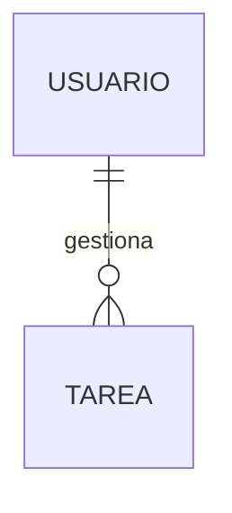
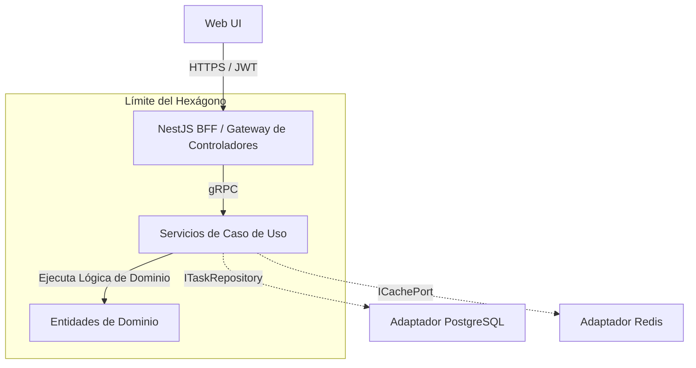

# 🏆 Especificación Maestra de Auditoría, Alineación y Referencia BMAD (v3.1.0)

Este documento maestro sirve como la alineación final para el **Esqueleto de Referencia Classic To-Do**, validando su arquitectura bajo el **Método bMAD (Business, Models, Architecture, Delivery)**.

---

## 🧭 1. Dimensión de Negocio (B) — Alineación Estratégica y Gobernanza

### 1.1 Alineación de la Visión del Producto
El sistema proporciona una plantilla libre de distracciones que demuestra ingeniería de backend de alto nivel. Optimiza la Experiencia del Desarrollador (DX) y la reproducibilidad del andamiaje arquitectónico en lugar de la monetización del negocio.

### 1.2 Objetivos Estratégicos del Producto (OKRs)
*   **Objetivo 1: Cumplimiento al 100% de Arquitectura Limpia**
    *   *KR 1.1*: Asegurar cero filtraciones de módulos externos hacia dominios `core` usando `dependency-cruiser`.
*   **Objetivo 2: Eficiencia en la Configuración del Desarrollador**
    *   *KR 2.1*: Aprovisionar un entorno local completamente funcional (Docker + API + Caché) en menos de 5 minutos.
*   **Objetivo 3: Puertas de Prueba Robustas**
    *   *KR 3.1*: Mantener estrictas puertas de cobertura mínima del 80% en la Lógica de Dominio y Aplicación.

---

## 🗃️ 2. Dimensión de Modelos (M) — Modelos Lógicos de Dominio

### 2.1 Modelo de Entidades de Dominio
Ver [conceptual-data-model.md](../01-requirements/conceptual-data-model.md) para atributos.

### 2.2 Modelos de Eventos (Intra-Dominio)
Utilizados para demos de procesamiento asíncrono (ej. emisor de eventos local o Redis PubSub):
*   `TaskCreatedEvent`: `{ "taskId": "uuid", "userId": "uuid", "timestamp": "ISO" }`
*   `TaskCompletedEvent`: `{ "taskId": "uuid", "completedAt": "ISO" }`

---

## 🏛️ 3. Dimensión de Arquitectura (A) — Especificaciones Empresariales

Los componentes imponen **Arquitectura Hexagonal (Ports & Adapters)**.

### 3.1 Diagrama de Contenedores C4 (Nivel 2)

---

## 🚀 4. Dimensión de Entrega (D) — Ingeniería y Operaciones

### 4.1 Estrategia DevSecOps
*   **Nx Monorepo**: El almacenamiento en caché avanzado de tareas acelera la verificación de CI.
*   **Observabilidad**: OpenTelemetry integrado envía extensiones a objetivos de recopilación centralizados para la depuración de trazas.
*   **Pact JS**: Pruebas de contrato base implementadas para asegurar la evolución desacoplada Frontend-Backend.

---

## 🏁 5. Estado de Verificación Arquitectónica y Cumplimiento
**ESTADO: TOTALMENTE CUMPLIDO**
Verificado a través de la **Ejecución del Plan Pivot (Mayo 2026)**. Toda la sobrecarga legada de Enterprise IAM ha sido purgada, entregando un blueprint de referencia ligero y de alto rendimiento.
