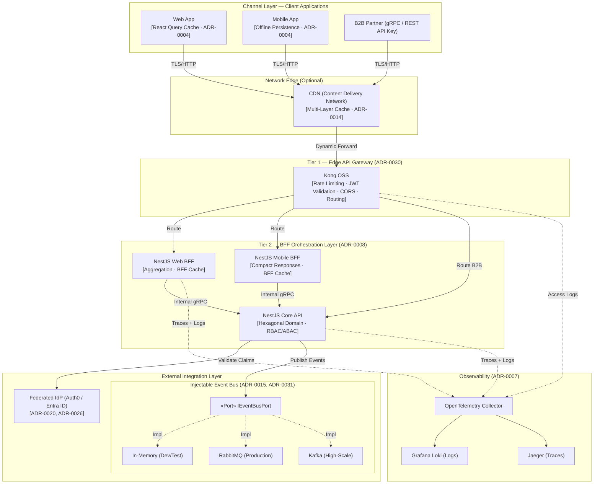
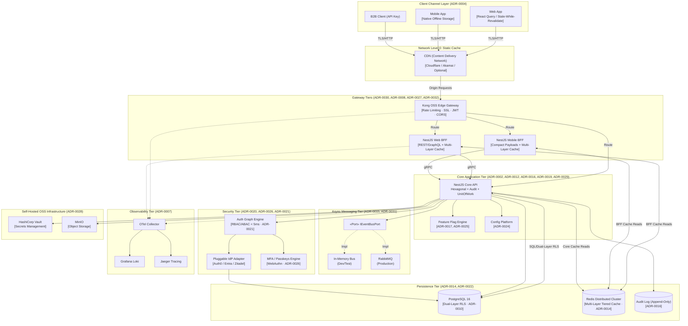
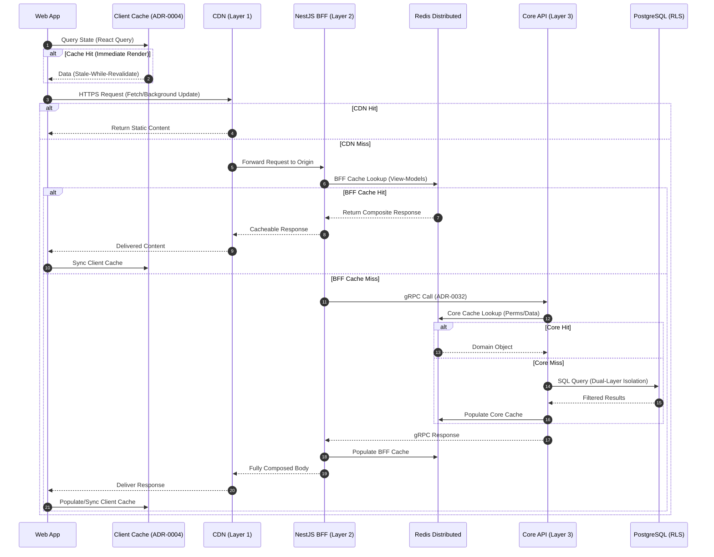
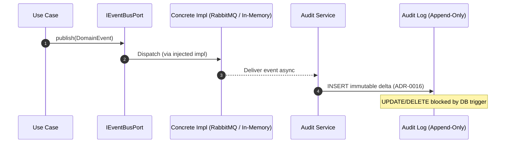
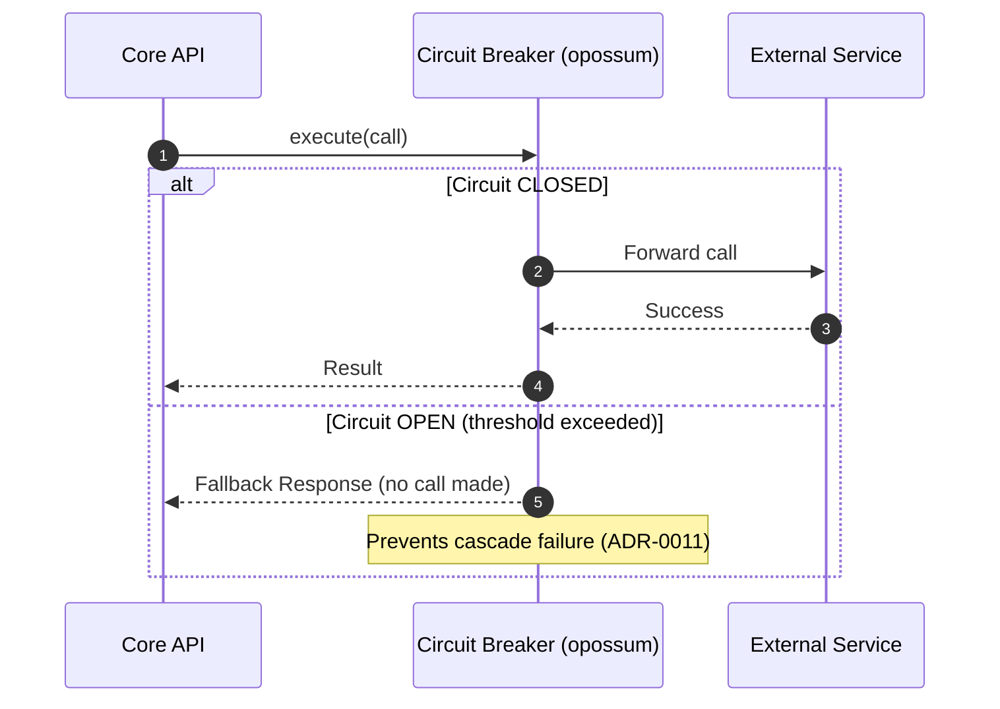
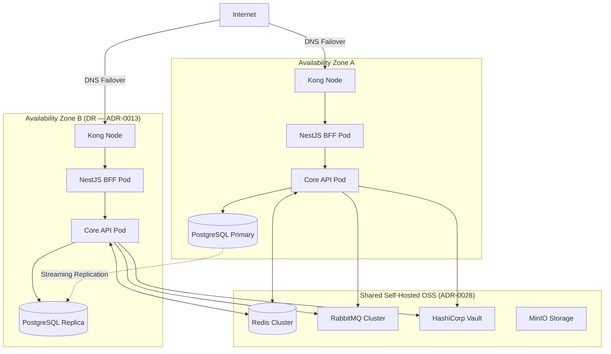

# 🏛️ Corporate Reference Architecture (Multi-Runtime / arc42)

> [!IMPORTANT]
> **Unified Corporate Reference Blueprint**: This document defines the global standard for software architecture across the organization. While the canonical physical implementation uses Node.js, the architectural constraints and design principles are agnostic and applicable to approved runtimes (.NET / Android) for diverse workloads.

---

## 1. Introduction and Goals

This reference architecture provides a standardized blueprint for building modern, highly scalable systems.

### 1.1 Purpose and Applicability
This pattern is designed specifically for systems that:
*   Have a strong orientation towards **intensive API utilization** with multi-channel clients (Web, Mobile, B2B).
*   Require native **SaaS multi-tenant isolation** at the database engine level.
*   Must support **progressive evolution** from Modular Monolith to Distributed Microservices.

### 1.2 Corporate Multi-Runtime Strategy (Políglota)
The organization promotes a deliberate polyglot architecture where runtimes are chosen strictly based on workload suitability, validated via ADR:

| Runtime | Canonical Role | Typical Use Case |
| :--- | :--- | :--- |
| **Node.js / TypeScript** | Principal Runtime | REST/gRPC APIs, BFF Orchestration, Transacional Web Services, Frontend SSR. |
| **.NET (C#)** | High Processing | Batch compute, ETL pipelines, Heavy computational tasks, Legacy interoperability. |
| **Android (Kotlin/Java)** | Native Mobile Client | Industrial operative apps, offline capture, hardware scan/GPS integration. |

> **Rule of Contracts**: Communication between distinct runtimes MUST strictly utilize explicit, versioned contract definitions (OpenAPI for HTTP, Protobuf for gRPC, AsyncAPI for Messaging) guaranteeing absolute implementation opacity.

### 1.3 Mandatory Quality Attributes
| Quality Attribute | Source ADR | Target |
| :--- | :--- | :--- |
| **Progressive Evolution** | ADR-0006, ADR-0008 | Zero-refactoring path to microservices via Dapr |
| **SaaS Multi-Tenancy** | ADR-0010 | Dual-Layer Isolation (ORM + PostgreSQL RLS) |
| **Strict Decoupling** | ADR-0002, ADR-0003 | ESLint boundary enforcement |
| **Resilience** | ADR-0011 | Distributed Circuit Breakers (Redis + Kong) |
| **Security** | ADR-0005, ADR-0012, ADR-0020, ADR-0026 | Zero-trust perimeter + RBAC/ABAC |
| **Internal API Latency** | ADR-0014, ADR-0021 | 4-Tier Cache (Client + CDN + BFF + Core) |
| **Observability** | ADR-0007 | OTel + Loki + distributed tracing |
| **Immutable Auditing** | ADR-0016 | Append-only audit ledger |
| **Tech Sovereignty** | ADR-0002, ADR-0028 | 100% Swappable Infra/AOP without logic impact |

#### 🔍 Supplemental Strategic Frameworks
To deeply understand the mathematical and risk posture of this architecture, consult:
*   👉 **[Design Maturity & Patterns Evaluation](../00-vision/maturity-evaluation.md)**
*   👉 **[CAP Theorem Strategic Analysis](./cap-strategic-analysis.md)**

---

## 2. Architecture Constraints and Baseline Pillars

Any system based on this blueprint must adhere to the following non-negotiable pillars:

*   **Stack Governance (ADR-0001)**: Nx Monorepo + npm Workspaces for centralized dependency governance.
*   **bMAD Engineering Mandate (ADR-0002, ADR-0003)**: SOLID, Clean Code, Hexagonal Architecture, strict TypeScript.
*   **Dependency Safety (ADR-0009)**: All dependency versions pinned. No `^` or `~` ranges. Automated vulnerability scanning in CI.
*   **Quality Gates (ADR-0018)**: Automated testing pyramid. Minimum 70% coverage enforced in CI.
*   **Infrastructure Portability (ADR-0028)**: Self-hosted OSS (MinIO, RabbitMQ, Vault) prioritized over cloud lock-in.

---

## 3. Context and Scope (Operational Model)

### 3.1 General Context Pattern — Full Stack with Gateway Tiers and Injectable Event Bus

This diagram captures the complete system context. It reflects:
- **ADR-0030**: Two-Tier Gateway (Kong Edge + NestJS BFF)
- **ADR-0008**: Progressive Multi-Module evolution with dedicated BFF per client channel
- **ADR-0015**: Injectable `IEventBusPort` abstraction (In-Memory → RabbitMQ → Kafka)
- **ADR-0020**: Pluggable Identity Provider via Strategy Pattern
- **ADR-0007**: OpenTelemetry tracing across all tiers

---

## 4. Solution Strategy

### 4.1 Hexagonal Architecture — Ports & Adapters (ADR-0002)
All business logic in the Domain and Application layers has **zero runtime dependencies** on frameworks, ORMs, or cloud services. The infrastructure layer implements pure TypeScript Ports.

### 4.2 SaaS Multi-Tenancy Strategy (ADR-0010)
Employs **Dual-Layer Isolation Defense**. (Layer 1) Persistence adapters automatically append `tenant_id` filtering to generic queries. (Layer 2) Shared PostgreSQL **Row-Level Security (RLS)** policies enforce strict session containment at the SQL engine level as an absolute failsafe.

### 4.3 Two-Tier Gateway Pattern (ADR-0030)
| Tier | Technology | Responsibility |
| :--- | :--- | :--- |
| **Tier 1 — Edge** | Kong OSS (NGINX/OpenResty) | Rate Limiting, JWT validation, SSL termination, Routing |
| **Tier 2 — BFF** | NestJS | Data aggregation, payload shaping, client-specific logic |

### 4.4 Injectable Event Bus (ADR-0015)
The domain never imports a concrete message broker. All async communication is routed through `IEventBusPort`. The concrete implementation (In-Memory / RabbitMQ / Kafka) is injected by the NestJS DI container at startup, controlled by an environment variable.

### 4.5 Progressive Evolution Route (ADR-0006)
1.  **Milestone 1 — Modular Monolith**: Single process, logically isolated domain modules.
2.  **Milestone 2 — Service Extraction**: Critical domains extracted as Nx micro-projects with isolated DBs, consumed via gRPC/Dapr.
3.  **Milestone 3 — Full Microservices Mesh**: Dapr Sidecars, Service Mesh, Kong as unified API surface.

---

## 5. Technical Building Blocks — Full Container View

This C4 Level-2 Container diagram reflects **all active ADRs** in their physical runtime positions.

---

## 6. Runtime View — Request Flow Patterns

### 6.1 Authenticated Request Flow (ADR-0030, ADR-0008, ADR-0021, ADR-0014)

### 6.2 Asynchronous Event Flow — Injectable Bus (ADR-0015, ADR-0016)

### 6.3 Resilience Flow — Circuit Breaker (ADR-0011)

---

## 7. Deployment View — Target Cloud Infrastructure (ADR-0013, ADR-0028)

---

## 8. Transversal Corporate Concepts — Full ADR Matrix

| Architectural Concern | Implementing ADR(s) | Pattern / Technology | Diagram Section |
| :--- | :--- | :--- | :--- |
| **Monorepo Governance** | ADR-0001 | Nx + npm workspaces | §2 |
| **Hexagonal Architecture** | ADR-0002 | Ports & Adapters | §4.1, §5 |
| **TypeScript Standards** | ADR-0003 | Strict mode + ESLint Boundaries | §2 |
| **Frontend Resilience** | ADR-0004 | React Query offline cache | §3.1 |
| **CI/CD Security** | ADR-0005 | CodeQL + GitHub Actions | §2 |
| **Microservices Path** | ADR-0006 | Dapr Sidecar migration triggers | §4.5 |
| **Observability** | ADR-0007 | OpenTelemetry + Loki + Jaeger | §3.1, §5, §6 |
| **BFF Gateway Pattern** | ADR-0008 | NestJS BFF per client channel | §3.1, §4.3, §5 |
| **Dependency Pinning** | ADR-0009 | Exact versions + `npm audit` | §2 |
| **Multi-Tenancy (SaaS)** | ADR-0010 | PostgreSQL RLS + AsyncLocalStorage | §4.2, §5, §6.1 |
| **Circuit Breakers** | ADR-0011 | `opossum` + Exponential Backoff | §5, §6.3 |
| **RBAC/ABAC Authorization** | ADR-0012 | JWT Claims + NestJS Guards | §5 |
| **Cloud DR Topology** | ADR-0013 | Multi-AZ + Streaming Replication | §7 |
| **Distributed Caching** | ADR-0014 | Multi-Layer Tiered Cache behind `ICachePort` | §5, §6.1 |
| **Event-Driven (Injectable Bus)** | ADR-0015 | `IEventBusPort` → In-Mem / RabbitMQ | §3.1, §4.4, §5, §6.2 |
| **Immutable Audit Trail** | ADR-0016 | Append-only table + DB trigger | §5, §6.2 |
| **Feature Flagging** | ADR-0017 | `IFeatureFlagPort` (Unleash/ConfigCat) | §5 |
| **Testing Pyramid** | ADR-0018 | Unit + Contract (Pact) + E2E | §2 |
| **Result / Functional Patterns** | ADR-0019 | `Result<T,E>` instead of exceptions | §4.1 |
| **Identity Provider Abstraction** | ADR-0020 | Strategy Pattern → Auth0/Entra/Zitadel | §3.1, §5 |
| **Auth Graph Compilation** | ADR-0021 | Redis-cached permission graph < 5ms | §5 |
| **Pluggable Projections** | ADR-0022 | Context-aware read projections | §5 |
| **Centralized Auth Kernel** | ADR-0023 | Shared authorization core kernel | §5 |
| **Config & Feature Platform** | ADR-0024 | Multi-IdP parameter engine | §5 |
| **Feature Flag Abstraction** | ADR-0025 | `IFeatureFlagPort` pluggable providers | §5 |
| **MFA & Passkeys** | ADR-0026 | WebAuthn + Passkeys + TOTP + Adaptive | §5 |
| **Dual Protocol REST/gRPC** | ADR-0027 | REST (external) + gRPC (internal) | §3.1 |
| **Self-Hosted OSS Infra** | ADR-0028 | MinIO + RabbitMQ + Vault OSS | §5, §7 |
| **Tactical DDD Primitives** | ADR-0029 | `@nestjslatam/ddd` via barrel re-exports | §4.1 |
| **Two-Tier Gateway** | ADR-0030 | Kong (Edge) + NestJS BFF (Aggregation) | §3.1, §4.3, §5, §6.1 |
| **Domain Event Catalog** | ADR-0031 | Multi-schema extraction + Async Contracts | §5, §6.2 |
| **Protocol Selection** | ADR-0032 | gRPC (Int) vs REST (Ext) vs GraphQL | §3.1, §5, §6.1 |
| **Transactional Outbox** | ADR-0033 | Atomic DB + Event atomic guarantee | §6.2 |
| **CQRS Separation** | ADR-0034 | Evaluation Matrix for Read/Write Models | §5, §6.1 |
| **Distributed Sagas** | ADR-0035 | Compensating Transaction Strategy | §6.2 |
| **Messaging Strategy** | ADR-0036 | FIFO vs Fire & Forget vs DLQ Policies | §6.2 |
| **Performance Testing** | ADR-0037 | K6 Load + Pact Contract Verification | §5, §6.3 |
| **Error Management** | ADR-0038 | Result Pattern + Unified Boundaries | §5, §6.3 |
| **Deployment Switcher** | ADR-0039 | Factory-based Topology Abstraction | §7 |
| **Polyglot Selection** | ADR-0040 | Workload Matrix & Type-Safe Contracts | §1.2 |
| **.NET Arch Canonical** | ADR-0041 | Clean Arch C# / Minimal APIs | §1.2 |
| **Android Arch Canonical** | ADR-0042 | Native Kotlin / Compose / Offline | §1.2 |

---

## 9. Quality Requirements (NFR Benchmark)

| Metric | Target | Enforcing ADR(s) |
| :--- | :--- | :--- |
| **API Latency (P95)** | < 50ms | ADR-0014, ADR-0021 |
| **Auth Graph Resolution** | < 5ms | ADR-0021 |
| **SAST Vulnerabilities** | 0 High/Critical | ADR-0005, ADR-0009 |
| **Test Coverage** | ≥ 70% | ADR-0018 |
| **Memory Footprint** | Low idle (microservice density) | ADR-0002, ADR-0006 |
| **Tenant Data Bleed** | Zero tolerance | ADR-0010 (Dual-Layer Isolation) |

---

## 10. Canonical Reference Implementation

👉 **[Back to Project Root & Quick Start](../../README.md)**

Implemented using:
- **Framework**: NestJS (v10) with strict Hexagonal boundaries.
- **ORM**: TypeORM with native PostgreSQL RLS support.
- **Gateway**: Kong OSS (DB-less YAML) + NestJS BFF layers.
- **Event Bus**: `IEventBusPort` defaulting to In-Memory, injectable with RabbitMQ.
- **Testing**: Jest (unit/integration) + Pact (contract tests).

---

## 11. Risks and Technical Debt

Strategic tracking of current design limitations and acknowledged system risks.

### 11.1 Inherent Risks
| Risk ID | Description | Mitigation Strategy | Severity |
| :--- | :--- | :--- | :--- |
| **R-01** | **Shared DB Performance** | Physical DB packing creates single failure domain. | Enforce strict read replication and query timeout ceilings. | Medium |
| **R-02** | **RabbitMQ Overflow** | In-memory message spikes during outage. | Mandatory **ADR-0036** Flow Control / Quotas. | High |
| **R-03** | **gRPC Polyglot Coupling** | Non-backward compatible proto changes. | Mandatory **Pact JS** Contract verification in CI. | High |

### 11.2 Known Technical Debt
*   **Monorepo Bloat**: As library counts exceed 200+, Nx cache management will require migration from Local to Cloud caching.
*   **Zero-Day Library Vulnerability**: Fast update cycles imposed by strict dependency pinning (ADR-0009) may consume 5-10% dev bandwidth monthly.

---

## 12. Glossary of Architectural Concepts

Reference nomenclature used by this blueprint.

*   **ACL (Anti-Corruption Layer)**: Isolates internal domain model from foreign schemas/contracts.
*   **BFF (Backend for Frontend)**: Single-purpose edge API optimizing payloads for a specific client.
*   **Bounded Context**: Strategic logic boundary owning its private database schema.
*   **Clean Architecture**: Design paradigm where control flow always points inward toward dependencies.
*   **Distributed Circuit Breaker**: Mechanism to halt request delivery to failing upstreams sharing state across pods via Redis.
*   **Hexagonal Architecture**: See *Ports & Adapters*.
*   **Port**: Explicit contract (Interface) that the application requires to talk to external systems.
*   **RLS (Row-Level Security)**: Native DB engine security constraining table rows to active session user.
*   **Saga Pattern**: Managing distributed transactional consistency via compensating events.
