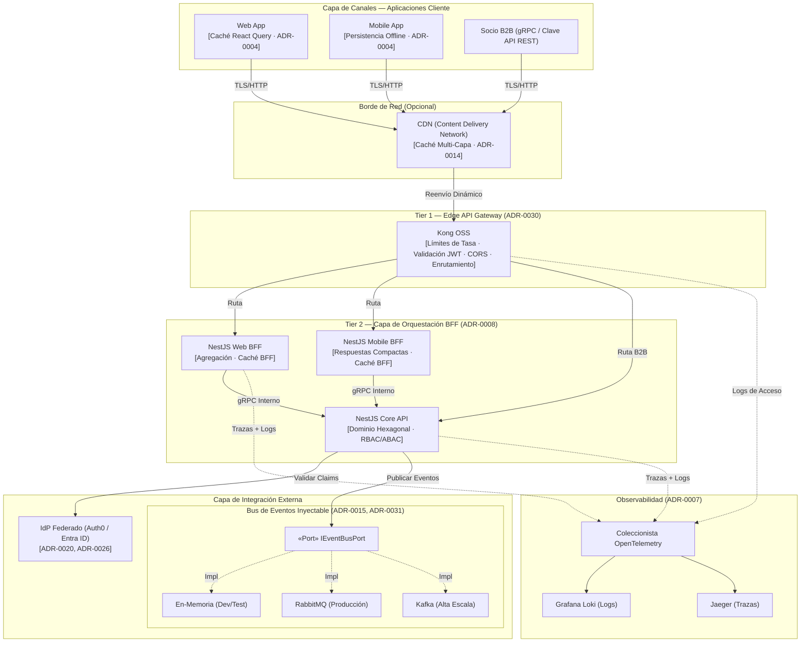
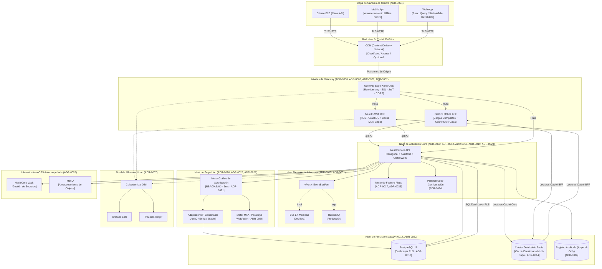
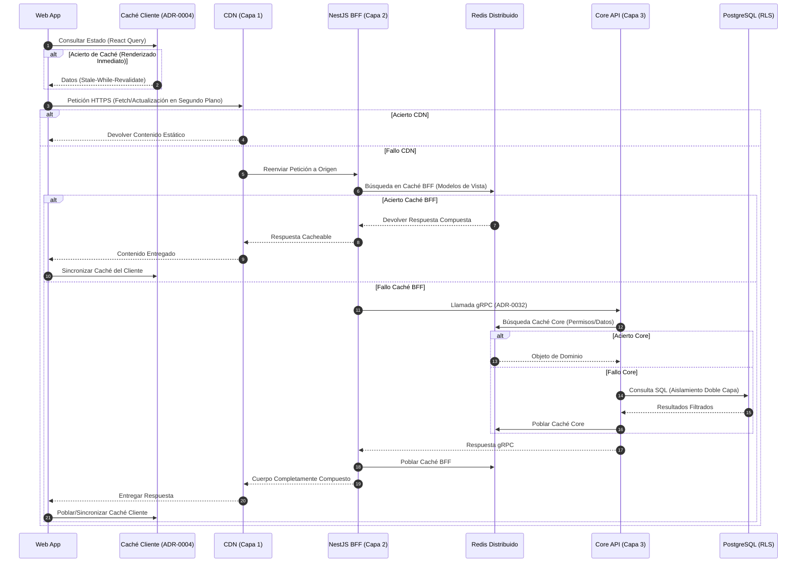
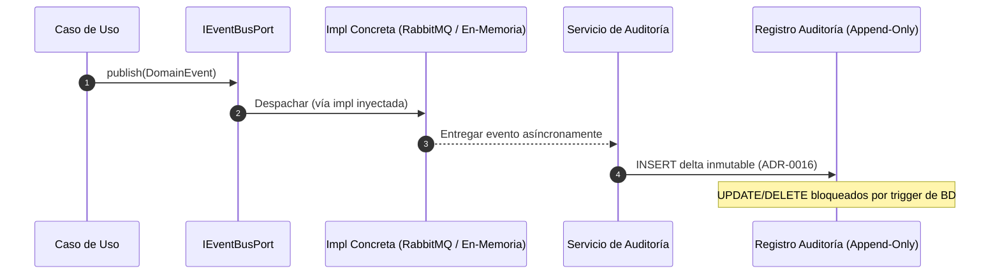
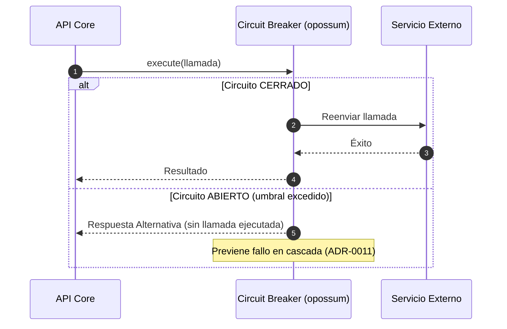
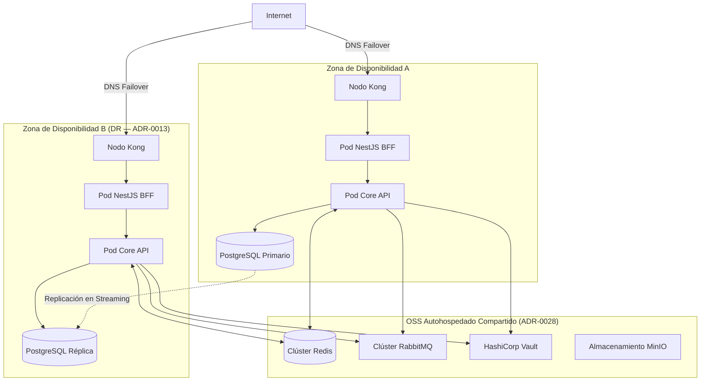

# 🏛️ Arquitectura de Referencia Corporativa (Multi-Runtime / arc42)

> [!IMPORTANT]
> **Blueprint de Referencia Corporativo Unificado**: Este documento define el estándar global para la arquitectura de software en toda la organización. Si bien la implementación física canónica utiliza Node.js, las restricciones arquitectónicas y los principios de diseño son agnósticos y aplicables a los entornos de ejecución aprobados (.NET / Android) para diversas cargas de trabajo.

---

## 1. Introducción y Metas

Esta arquitectura de referencia proporciona un plano estandarizado para construir sistemas modernos y altamente escalables.

### 1.1 Propósito y Aplicabilidad
Este patrón está diseñado específicamente para sistemas que:
*   Tienen una fuerte orientación hacia la **utilización intensiva de APIs** con clientes multi-canal (Web, Móvil, B2B).
*   Requieren **aislamiento SaaS multi-tenant** nativo a nivel del motor de base de datos ([ADR-0010](../02-adrs/core/0010-multi-tenancy-architecture-strategy.md)).
*   Deben soportar una **evolución progresiva** desde un Monolito Modular hacia Microservicios Distribuidos.

### 1.2 Estrategia Corporativa Multi-Runtime (Políglota)
La organización promueve una arquitectura políglota deliberada donde los entornos de ejecución se eligen estrictamente en función de la idoneidad para la carga de trabajo, validados vía ADR:

| Runtime | Rol Canónico | Caso de Uso Típico |
| :--- | :--- | :--- |
| **Node.js / TypeScript** | Runtime Principal | APIs REST/gRPC, Orquestación BFF, Servicios Web Transaccionales, Frontend SSR. |
| **.NET (C#)** | Alto Procesamiento | Computación por lotes, pipelines ETL, Tareas computacionales pesadas, interoperabilidad Legada. |
| **Android (Kotlin/Java)** | Cliente Móvil Nativo | Apps operativas industriales, captura offline, integración de hardware de escaneo/GPS. |

> **Regla de Contratos**: La comunicación entre distintos runtimes DEBE utilizar estrictamente definiciones de contrato explícitas y versionadas (OpenAPI para HTTP, Protobuf para gRPC, AsyncAPI para Mensajería) garantizando absoluta opacidad de la implementación.

### 1.3 Atributos de Calidad Obligatorios
| Atributo de Calidad | Origen ADR | Objetivo |
| :--- | :--- | :--- |
| **Evolución Progresiva** | [ADR-0006](../02-adrs/core/0006-future-microservices-transition-dapr.md), [ADR-0008](../02-adrs/nodejs/0008-progressive-multimodule-evolution-gateway-bff.md) | Camino de cero refactorización hacia microservicios vía Dapr |
| **Multi-Tenancy SaaS** | [ADR-0010](../02-adrs/core/0010-multi-tenancy-architecture-strategy.md) | Aislamiento de Doble Capa (ORM + PostgreSQL RLS) |
| **Desacoplamiento Estricto** | [ADR-0002](../02-adrs/nodejs/0002-clean-architecture-nestjs.md), [ADR-0003](../02-adrs/nodejs/0003-strict-typescript-standards.md) | Aplicación de límites vía ESLint |
| **Resiliencia** | [ADR-0011](../02-adrs/core/0011-fault-tolerance-resiliency-patterns.md) | Circuit Breakers Distribuidos (Redis + Kong) |
| **Seguridad** | [ADR-0005](../02-adrs/core/0005-ci-cd-quality-codeql.md), [ADR-0012](../02-adrs/nodejs/0012-advanced-authorization-rbac-abac.md), [ADR-0020](../02-adrs/core/0020-identity-provider-abstraction-strategy.md), [ADR-0026](../02-adrs/nodejs/0026-mfa-passwordless-adaptive-authentication.md) | Perímetro Zero-trust + RBAC/ABAC |
| **Latencia de API Interna** | [ADR-0014](../02-adrs/core/0014-distributed-caching-strategy-redis.md), [ADR-0021](../02-adrs/nodejs/0021-high-performance-auth-and-graph-compilation.md) | Caché de 4 Niveles (Cliente + CDN + BFF + Core) |
| **Observabilidad** | [ADR-0007](../02-adrs/nodejs/0007-observability-telemetry-loki-opentelemetry.md), [ADR-0046](../02-adrs/core/0046-dapr-observabilidad-unificada.md) | OTel + Loki + trazado distribuido |
| **Auditoría Inmutable** | [ADR-0016](../02-adrs/core/0016-immutable-business-audit-trail.md) | Registro de auditoría de solo adición |
| **Soberanía Tecnológica** | [ADR-0002](../02-adrs/nodejs/0002-clean-architecture-nestjs.md), [ADR-0028](../02-adrs/core/0028-self-hosted-hybrid-infrastructure-on-premise.md) | Infra/AOP 100% intercambiable sin impacto en la lógica |

#### 🔍 Marcos Estratégicos Complementarios
Para comprender profundamente la postura matemática y de riesgo de esta arquitectura, consulte:
*   👉 **[Evaluación de Madurez y Patrones de Diseño](../00-vision/maturity-evaluation.md)**
*   👉 **[Análisis Estratégico del Teorema CAP](./cap-strategic-analysis.md)**
*   👉 **[Escenarios de Despliegue Multi-Cloud](./multi-cloud-deployment-scenarios.md)**

---

## 2. Restricciones de Arquitectura y Pilares Base

Cualquier sistema basado en este blueprint debe adherirse a los siguientes pilares no negociables:

*   **Gobernanza del Stack ([ADR-0001](../02-adrs/core/0001-monorepo-orchestration-nx.md))**: Nx Monorepo + npm Workspaces para una gobernanza centralizada de dependencias.
*   **Mandato de Ingeniería bMAD ([ADR-0002](../02-adrs/nodejs/0002-clean-architecture-nestjs.md), [ADR-0003](../02-adrs/nodejs/0003-strict-typescript-standards.md))**: SOLID, Código Limpio, Arquitectura Hexagonal, TypeScript estricto.
*   **Seguridad de Dependencias ([ADR-0009](../02-adrs/core/0009-strict-dependency-pinning-vulnerability-management.md))**: Todas las versiones de dependencias fijadas. Sin rangos `^` o `~`. Escaneo automatizado de vulnerabilidades en CI.
*   **Puertas de Calidad ([ADR-0018](../02-adrs/core/0018-testing-pyramid-quality-gates.md))**: Pirámide de pruebas automatizada. Mínimo 70% de cobertura obligatoria en CI.
*   **Portabilidad de Infraestructura ([ADR-0028](../02-adrs/core/0028-self-hosted-hybrid-infrastructure-on-premise.md))**: Prioridad de OSS autohospedado (MinIO, RabbitMQ, Vault) sobre el bloqueo de nube.

---

## 3. Contexto y Alcance (Modelo Operativo)

### 3.1 Patrón de Contexto General — Stack Completo con Niveles de Gateway y Bus de Eventos Inyectable

Este diagrama captura el contexto completo del sistema. Refleja:
- **[ADR-0030](../02-adrs/core/0030-api-gateway-kong-vs-nestjs.md)**: Gateway de Dos Niveles (Kong Edge + NestJS BFF)
- **[ADR-0008](../02-adrs/nodejs/0008-progressive-multimodule-evolution-gateway-bff.md)**: Evolución Progresiva Multi-Módulo con BFF dedicado por canal de cliente
- **[ADR-0015](../02-adrs/core/0015-event-driven-architecture-intra-domain.md)**: Abstracción Inyectable `IEventBusPort` (En Memoria → RabbitMQ → Kafka)
- **[ADR-0020](../02-adrs/core/0020-identity-provider-abstraction-strategy.md)**: Proveedor de Identidad Conectable vía Patrón Strategy
- **[ADR-0007](../02-adrs/nodejs/0007-observability-telemetry-loki-opentelemetry.md)**: Trazado OpenTelemetry en todos los niveles

---

## 4. Estrategia de Solución

### 4.1 Arquitectura Hexagonal — Puertos y Adaptadores ([ADR-0002](../02-adrs/nodejs/0002-clean-architecture-nestjs.md))
Toda la lógica de negocio en las capas de Dominio y Aplicación tiene **cero dependencias en tiempo de ejecución** de frameworks, ORMs o servicios en la nube. La capa de infraestructura implementa Puertos de TypeScript puros.

### 4.2 Estrategia de Multi-Tenancy SaaS ([ADR-0010](../02-adrs/core/0010-multi-tenancy-architecture-strategy.md))
Emplea **Defensa de Aislamiento de Doble Capa**. (Capa 1) Los adaptadores de persistencia añaden automáticamente el filtro `tenant_id` a las consultas genéricas. (Capa 2) Las políticas de **Row-Level Security (RLS)** de PostgreSQL compartido imponen una contención estricta de la sesión a nivel del motor SQL como mecanismo infalible absoluto.

### 4.3 Patrón de Gateway de Dos Niveles ([ADR-0030](../02-adrs/core/0030-api-gateway-kong-vs-nestjs.md))
| Nivel | Tecnología | Responsabilidad |
| :--- | :--- | :--- |
| **Tier 1 — Edge** | Kong OSS (NGINX/OpenResty) | Rate Limiting, validación JWT, terminación SSL, Enrutamiento |
| **Tier 2 — BFF** | NestJS | Agregación de datos, formateo de cargas útiles, lógica específica del cliente |

### 4.4 Bus de Eventos Inyectable ([ADR-0015](../02-adrs/core/0015-event-driven-architecture-intra-domain.md))
El dominio nunca importa un bróker de mensajes concreto. Toda la comunicación asíncrona se enruta a través de `IEventBusPort`. La implementación concreta (En Memoria / RabbitMQ / Kafka) es inyectada por el contenedor DI de NestJS al inicio, controlada por una variable de entorno.

### 4.5 Ruta de Evolución Progresiva ([ADR-0006](../02-adrs/core/0006-future-microservices-transition-dapr.md))
1.  **Hito 1 — Monolito Modular**: Proceso único, módulos de dominio lógicamente aislados.
2.  **Hito 2 — Extracción de Servicios**: Dominios críticos extraídos como microproyectos Nx con BDs aisladas, consumidos vía gRPC/Dapr.
3.  **Hito 3 — Malla Completa de Microservicios**: Dapr Sidecars, Malla de Servicios, Kong como superficie de API unificada.

---

## 5. Bloques de Construcción Técnica — Vista Completa de Contenedores

Este diagrama de Contenedor Nivel-2 de C4 refleja **todos los ADRs activos** en sus posiciones físicas de tiempo de ejecución.

---

## 6. Vista de Tiempo de Ejecución — Patrones de Flujo de Petición

### 6.1 Flujo de Petición Autenticada ([ADR-0030](../02-adrs/core/0030-api-gateway-kong-vs-nestjs.md), [ADR-0008](../02-adrs/nodejs/0008-progressive-multimodule-evolution-gateway-bff.md), [ADR-0021](../02-adrs/nodejs/0021-high-performance-auth-and-graph-compilation.md), [ADR-0014](../02-adrs/core/0014-distributed-caching-strategy-redis.md))

### 6.2 Flujo de Eventos Asíncronos — Bus Inyectable ([ADR-0015](../02-adrs/core/0015-event-driven-architecture-intra-domain.md), [ADR-0016](../02-adrs/core/0016-immutable-business-audit-trail.md))

### 6.3 Flujo de Resiliencia — Circuit Breaker ([ADR-0011](../02-adrs/core/0011-fault-tolerance-resiliency-patterns.md))

---

## 7. Vista de Despliegue — Infraestructura Cloud Objetivo ([ADR-0013](../02-adrs/core/0013-cloud-infrastructure-topology-dr.md), [ADR-0028](../02-adrs/core/0028-self-hosted-hybrid-infrastructure-on-premise.md))

---

## 8. Conceptos Corporativos Transversales — Matriz ADR Completa

| Preocupación Arquitectónica | ADR(s) Implementado(s) | Patrón / Tecnología | Sección del Diagrama |
| :--- | :--- | :--- | :--- |
| **Gobernanza de Monorepo** | [ADR-0001](../02-adrs/core/0001-monorepo-orchestration-nx.md) | Nx + npm workspaces | §2 |
| **Arquitectura Hexagonal** | [ADR-0002](../02-adrs/nodejs/0002-clean-architecture-nestjs.md) | Puertos y Adaptadores | §4.1, §5 |
| **Estándares de TypeScript** | [ADR-0003](../02-adrs/nodejs/0003-strict-typescript-standards.md) | Modo estricto + ESLint Boundaries | §2 |
| **Resiliencia en Frontend** | [ADR-0004](../02-adrs/nodejs/0004-frontend-offline-resilience.md) | Caché offline de React Query | §3.1 |
| **Seguridad CI/CD** | [ADR-0005](../02-adrs/core/0005-ci-cd-quality-codeql.md) | CodeQL + GitHub Actions | §2 |
| **Camino a Microservicios** | [ADR-0006](../02-adrs/core/0006-future-microservices-transition-dapr.md) | Triggers de migración Dapr Sidecar | §4.5 |
| **Observabilidad** | [ADR-0007](../02-adrs/nodejs/0007-observability-telemetry-loki-opentelemetry.md) | OpenTelemetry + Loki + Jaeger | §3.1, §5, §6 |
| **Patrón de Gateway BFF** | [ADR-0008](../02-adrs/nodejs/0008-progressive-multimodule-evolution-gateway-bff.md) | NestJS BFF por canal de cliente | §3.1, §4.3, §5 |
| **Fijación de Dependencias** | [ADR-0009](../02-adrs/core/0009-strict-dependency-pinning-vulnerability-management.md) | Versiones exactas + `npm audit` | §2 |
| **Multi-Tenancy (SaaS)** | [ADR-0010](../02-adrs/core/0010-multi-tenancy-architecture-strategy.md) | PostgreSQL RLS + AsyncLocalStorage | §4.2, §5, §6.1 |
| **Circuit Breakers** | [ADR-0011](../02-adrs/core/0011-fault-tolerance-resiliency-patterns.md) | `opossum` + Exponential Backoff | §5, §6.3 |
| **Autorización RBAC/ABAC** | [ADR-0012](../02-adrs/nodejs/0012-advanced-authorization-rbac-abac.md) | JWT Claims + NestJS Guards | §5 |
| **Topología Cloud DR** | [ADR-0013](../02-adrs/core/0013-cloud-infrastructure-topology-dr.md) | Multi-AZ + Replicación en Streaming | §7 |
| **Caché Distribuida** | [ADR-0014](../02-adrs/core/0014-distributed-caching-strategy-redis.md) | Caché Escalonada Multi-Capa tras `ICachePort` | §5, §6.1 |
| **Orientado a Eventos (Bus Inyectable)** | [ADR-0015](../02-adrs/core/0015-event-driven-architecture-intra-domain.md) | `IEventBusPort` → En-Mem / RabbitMQ | §3.1, §4.4, §5, §6.2 |
| **Pista de Auditoría Inmutable** | [ADR-0016](../02-adrs/core/0016-immutable-business-audit-trail.md) | Tabla append-only + trigger de BD | §5, §6.2 |
| **Feature Flagging** | [ADR-0017](../02-adrs/core/0017-feature-flagging-strategy.md) | `IFeatureFlagPort` (Unleash/ConfigCat) | §5 |
| **Pirámide de Pruebas** | [ADR-0018](../02-adrs/core/0018-testing-pyramid-quality-gates.md) | Unitarias + Contrato (Pact) + E2E | §2 |
| **Patrones Funcionales / Result** | [ADR-0019](../02-adrs/core/0019-tactical-design-patterns-future-proofing.md) | `Result<T,E>` en lugar de excepciones | §4.1 |
| **Abstracción de Proveedor Identidad** | [ADR-0020](../02-adrs/core/0020-identity-provider-abstraction-strategy.md) | Strategy Pattern → Auth0/Entra/Zitadel | §3.1, §5 |
| **Compilación de Gráfico de Auth** | [ADR-0021](../02-adrs/nodejs/0021-high-performance-auth-and-graph-compilation.md) | Gráfico de permisos en caché Redis < 5ms | §5 |
| **Proyecciones Conectables** | [ADR-0022](../02-adrs/nodejs/0022-contextual-auth-and-pluggable-projections.md) | Proyecciones de lectura conscientes del contexto | §5 |
| **Núcleo de Autenticación Centralizado** | [ADR-0023](../02-adrs/nodejs/0023-centralized-ums-vs-decentralized-access.md) | Núcleo compartido de autorización | §5 |
| **Plataforma de Config & Features** | [ADR-0024](../02-adrs/core/0024-configuration-feature-management-platform.md) | Motor de parámetros multi-IdP | §5 |
| **Abstracción de Feature Flags** | [ADR-0025](../02-adrs/core/0025-feature-flag-provider-abstraction.md) | Proveedores conectables de `IFeatureFlagPort` | §5 |
| **MFA y Passkeys** | [ADR-0026](../02-adrs/nodejs/0026-mfa-passwordless-adaptive-authentication.md) | WebAuthn + Passkeys + TOTP + Adaptativo | §5 |
| **Protocolo Dual REST/gRPC** | [ADR-0027](../02-adrs/nodejs/0027-dual-protocol-rest-grpc-api-gateway.md) | REST (externo) + gRPC (interno) | §3.1 |
| **Infraestructura OSS Autohospedada** | [ADR-0028](../02-adrs/core/0028-self-hosted-hybrid-infrastructure-on-premise.md) | MinIO + RabbitMQ + Vault OSS | §5, §7 |
| **Primitivas DDD Tácticas** | [ADR-0029](../02-adrs/nodejs/0029-tactical-ddd-primitives-library.md) | `@nestjslatam/ddd` vía re-exportaciones | §4.1 |
| **Gateway de Dos Niveles** | [ADR-0030](../02-adrs/core/0030-api-gateway-kong-vs-nestjs.md) | Kong (Edge) + NestJS BFF (Agregación) | §3.1, §4.3, §5, §6.1 |
| **Catálogo de Eventos de Dominio** | [ADR-0031](../02-adrs/core/0031-schema-per-context-domain-event-catalog.md) | Extracción multi-esquema + Contratos Asíncronos | §5, §6.2 |
| **Selección de Protocolo** | [ADR-0032](../02-adrs/core/0032-api-protocol-decision-matrix-rest-grpc-graphql.md) | gRPC (Int) vs REST (Ext) vs GraphQL | §3.1, §5, §6.1 |
| **Transactional Outbox** | [ADR-0033](../02-adrs/core/0033-transactional-outbox-pattern.md) | DB Atómica + Garantía atómica de eventos | §6.2 |
| **Separación CQRS** | [ADR-0034](../02-adrs/core/0034-cqrs-pattern-applicability-matrix.md) | Matriz de Evaluación para Modelos de Lectura/Escritura | §5, §6.1 |
| **Sagas Distribuidas** | [ADR-0035](../02-adrs/core/0035-distributed-saga-pattern-strategy.md) | Estrategia de Transacción Compensatoria | §6.2 |
| **Estrategia de Mensajería** | [ADR-0036](../02-adrs/core/0036-message-bus-delivery-strategy-fifo-dlq.md) | Políticas FIFO vs Disparar y Olvidar vs DLQ | §6.2 |
| **Pruebas de Rendimiento** | [ADR-0037](../02-adrs/core/0037-performance-concurrency-chaos-strategy.md) | Carga K6 + Verificación de Contratos Pact | §5, §6.3 |
| **Gestión de Errores** | [ADR-0038](../02-adrs/nodejs/0038-error-handling-result-pattern-strategy.md) | Patrón Result + Límites Unificados | §5, §6.3 |
| **Selector de Despliegue** | [ADR-0039](../02-adrs/core/0039-deployment-topology-abstraction-switcher.md) | Abstracción de Topología basada en Factory | §7 |
| **Selección Políglota** | [ADR-0040](../02-adrs/core/0040-multi-runtime-selection-contracts.md) | Matriz de Carga de Trabajo y Contratos Type-Safe | §1.2 |
| **Arquitectura Canónica .NET** | [ADR-0041](../02-adrs/dotnet/0041-canonical-dotnet-backend-architecture.md) | Clean Arch C# / Minimal APIs | §1.2 |
| **Arquitectura Canónica Android** | [ADR-0042](../02-adrs/android/0042-canonical-android-mobile-architecture.md) | Kotlin Nativo / Compose / Offline | §1.2 |

---

## 9. Requisitos de Calidad (NFR Benchmark)

| Métrica | Objetivo | ADR(s) Aplicables |
| :--- | :--- | :--- |
| **Latencia de API (P95)** | < 50ms | [ADR-0014](../02-adrs/core/0014-distributed-caching-strategy-redis.md), [ADR-0021](../02-adrs/nodejs/0021-high-performance-auth-and-graph-compilation.md) |
| **Resolución de Gráfico de Auth** | < 5ms | [ADR-0021](../02-adrs/nodejs/0021-high-performance-auth-and-graph-compilation.md) |
| **Vulnerabilidades SAST** | 0 Altas/Críticas | [ADR-0005](../02-adrs/core/0005-ci-cd-quality-codeql.md), [ADR-0009](../02-adrs/core/0009-strict-dependency-pinning-vulnerability-management.md) |
| **Cobertura de Pruebas** | ≥ 70% | [ADR-0018](../02-adrs/core/0018-testing-pyramid-quality-gates.md) |
| **Huella de Memoria** | Baja inactividad (densidad de microservicios) | [ADR-0002](../02-adrs/nodejs/0002-clean-architecture-nestjs.md), [ADR-0006](../02-adrs/core/0006-future-microservices-transition-dapr.md) |
| **Filtración de Datos de Tenencia** | Tolerancia cero | [ADR-0010](../02-adrs/core/0010-multi-tenancy-architecture-strategy.md) (Aislamiento Doble Capa) |

---

## 10. Implementación de Referencia Canónica

👉 **[Volver a la Raíz del Proyecto y Guía de Inicio](../../README.md)**

Implementado usando:
- **Framework**: NestJS (v10) con límites estrictamente hexagonales.
- **ORM**: TypeORM con soporte nativo de PostgreSQL RLS.
- **Gateway**: Kong OSS (YAML sin BD) + capas de NestJS BFF.
- **Bus de Eventos**: `IEventBusPort` por defecto en Memoria, inyectable con RabbitMQ.
- **Pruebas**: Jest (unitarias/integración) + Pact (pruebas de contrato).

---

## 11. Riesgos y Deuda Técnica

Seguimiento estratégico de las limitaciones actuales del diseño y riesgos del sistema reconocidos.

### 11.1 Riesgos Inherentes
| ID del Riesgo | Descripción | Estrategia de Mitigación | Severidad |
| :--- | :--- | :--- | :--- |
| **R-01** | **Rendimiento de BD Compartida** | El empaquetamiento físico de la BD crea un dominio de fallo único. | Imponer replicación de lectura estricta y techos de tiempo de espera de consulta. | Media |
| **R-02** | **Desbordamiento de RabbitMQ** | Picos de mensajes en memoria durante interrupciones. | Control de Flujo / Cuotas obligatorias según **[ADR-0036](../02-adrs/core/0036-message-bus-delivery-strategy-fifo-dlq.md)**. | Alta |
| **R-03** | **Acoplamiento Políglota gRPC** | Cambios de protocolo no compatibles con versiones anteriores. | Verificación obligatoria de contratos **Pact JS** en CI. | Alta |

### 11.2 Deuda Técnica Conocida
*   **Hinchazón de Monorepo**: A medida que el conteo de librerías supere las 200+, la gestión de caché Nx requerirá la migración de almacenamiento en caché local a la nube.
*   **Vulnerabilidad de Librería de Día Cero**: Los ciclos de actualización rápidos impuestos por la fijación estricta de dependencias ([ADR-0009](../02-adrs/core/0009-strict-dependency-pinning-vulnerability-management.md)) pueden consumir entre el 5% y 10% del ancho de banda de desarrollo mensual.

---

## 12. Glosario de Conceptos Arquitectónicos

Nomenclatura de referencia utilizada por este blueprint.

*   **ACL (Anti-Corruption Layer)**: Aísla el modelo de dominio interno de esquemas/contratos externos.
*   **BFF (Backend for Frontend)**: API de borde de un solo propósito que optimiza las cargas útiles para un cliente específico.
*   **Bounded Context**: Límite estratégico de lógica propietario de su propio esquema de base de datos privado.
*   **Arquitectura Limpia**: Paradigma de diseño donde el flujo de control siempre apunta hacia adentro, hacia las dependencias.
*   **Circuit Breaker Distribuido**: Mecanismo para detener la entrega de peticiones a servicios aguas arriba con fallas compartiendo el estado entre pods vía Redis.
*   **Arquitectura Hexagonal**: Ver *Puertos y Adaptadores*.
*   **Puerto**: Contrato explícito (Interfaz) que requiere la aplicación para comunicarse con sistemas externos.
*   **RLS (Row-Level Security)**: Seguridad nativa del motor de BD que restringe las filas de la tabla al usuario de la sesión activa.
*   **Patrón Saga**: Gestión de la consistencia transaccional distribuida a través de eventos de compensación.
