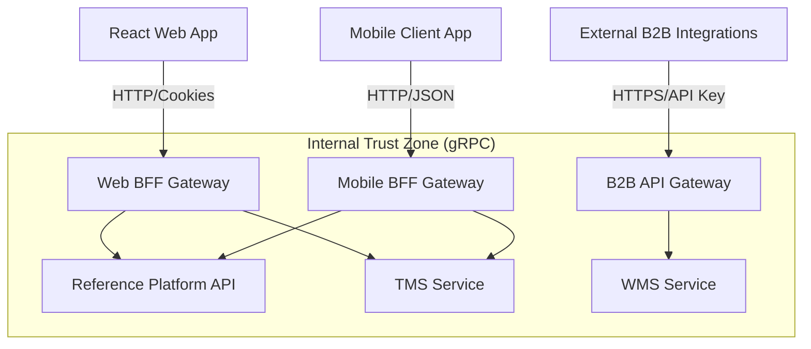

# ADR 0008: Progressive Multi-Module Evolution with API Gateway and BFF Patterns

## Status
Approved

## Date
2026-05-08

## Context
Currently, the Reference Platform repository operates as a modular monolith. However, the platform is intended to scale into a unified portal for multiple future corporate modules (Transport Management - TMS, Warehouse Management - WMS). These must be independent, decoupled services with isolated databases.

Without a Backend For Frontend (BFF) layer, diverse clients (rich web, low-bandwidth mobile, B2B) would force generic endpoints, leading to over-fetching and rigid client state management. We need a structure to support diverse client contracts without tightly coupling them to backend microservices.

## Decision
Adopt a **Progressive Multi-Module and Distributed Backend For Frontend (BFF) Gateway Architecture**:

1. **Dedicated BFF Gateways**: Tailor dedicated gateways for each client type rather than sharing one generic entry point:
   - **Web BFF**: Handles cookie-based sessions and aggregates payloads for rich desktop displays.
   - **Mobile BFF**: Compresses data, combines roundtrips for high-latency networks, and translates to mobile-optimized payloads.
   - **B2B API Gateway**: Handles rate-limiting and API Key authentication for external partners.

2. **Downstream Isolation**: Public clients NEVER communicate directly with internal services (TMS, WMS). All traffic flows through assigned BFFs acting as security and composition boundaries.

3. **Protocol Translation**: Allow internal microservice communication via high-speed gRPC while translating to standard HTTP/REST at the BFF edge.

### System Architecture Overview

## Consequences

### Positive
- **Client Performance**: Mobile apps get exactly what they need, reducing data usage and network roundtrips.
- **Independent Scalability**: Scale Mobile BFF independently from Web BFF based on real-time device traffic.
- **Decoupled Contracts**: Modify downstream internal APIs without breaking existing frontend versions.

### Negative
- **Gateway Proliferation**: Managing separate codebases for different BFFs increases CI/CD complexity.
- Requires discipline to keep business logic out of the BFF (it should only orchestrate and compose).

## References
- [ADR-0030: Kong Gateway vs NestJS BFF](./0030-api-gateway-kong-vs-nestjs.md)