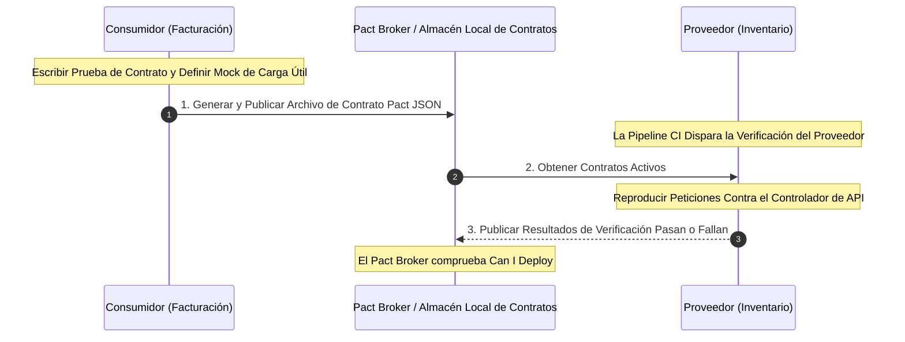

# 🧪 Plan de Pruebas de Contrato de Integración (Especificación Pact)

Este documento establece el plan estratégico y las directrices de integración continua para las **Pruebas de Contrato Dirigidas por el Consumidor** (Consumer-Driven Contract Testing) a través de los dominios de SCM/Esqueleto de Referencia bajo la **estrategia BMAD-METHOD**.

---

## 🏛️ 1. ¿Por qué Pruebas de Contrato?

En un monorepo modular que evoluciona activamente hacia servicios distribuidos, las Pruebas Unitarias estándar son insuficientes para verificar la seguridad de la integración entre módulos, y las pruebas de integración de extremo a extremo (E2E) son lentas, frágiles y costosas.

Resolvemos esto utilizando **Pruebas de Contrato Dirigidas por el Consumidor** (aprovechando **Pact JS**). Las pruebas de contrato aseguran que los cambios en una API o contrato de Evento por parte de un proveedor no rompan a los consumidores activos aguas abajo, desplazando a la izquierda la seguridad de la integración hacia la pipeline CI/CD como se especifica en el **[ADR 0018](../02-adrs/core/0018-testing-pyramid-quality-gates.md)**.

---

## 🔄 2. Flujo de Trabajo de Contrato Dirigido por el Consumidor

Las pruebas de contrato operan bajo un modelo "Dirigido por el Consumidor". El consumidor (ej. Módulo de Facturación) define las cargas útiles esperadas de petición/respuesta, y el proveedor (ej. Módulo de Inventario) debe satisfacer ese contrato antes de fusionar el código.



---

## ⚙️ 3. Ejemplo de Contrato Concreto (Especificación Pact)

El siguiente contrato especifica una interacción activa entre el **Módulo de Facturación (Consumidor)** y el **Módulo de Inventario (Proveedor)**:

### A. La Definición del Contrato (Archivo Pact JSON)
```json
{
  "consumer": { "name": "BillingModule" },
  "provider": { "name": "InventoryModule" },
  "interactions": [
    {
      "description": "A request for verified container weight",
      "request": {
        "method": "GET",
        "path": "/api/v1/containers/CONT-998822/weight"
      },
      "response": {
        "status": 200,
        "headers": { "Content-Type": "application/json" },
        "body": {
          "containerId": "CONT-998822",
          "verifiedWeight": 24500.50,
          "isWeighed": true
        }
      }
    }
  ]
}
```

---

## 🛡️ 4. Integración CI/CD y Puertas de Calidad

Para automatizar la aplicación de contratos y prevenir que los cambios disruptivos lleguen a producción:

1.  **Commit lint y Generación Local**: Cuando un desarrollador modifica código del consumidor (Facturación), las pruebas locales generan un nuevo contrato pact `.json`.
2.  **Verificación del Pact Broker**: La pipeline CI/CD empuja los archivos pact a un Pact Broker interno (o los guarda en una carpeta compartida del espacio de trabajo durante la ejecución del monorepo).
3.  **Puerta de Verificación del Proveedor**: La pipeline CI del Proveedor (Inventario) ejecuta:
    `npm run test:contract:provider`
    Si un desarrollador del proveedor intenta renombrar `verifiedWeight` a `vgm_weight`, la prueba de contrato falla inmediatamente, bloqueando la Pull Request automáticamente antes de que ocurra cualquier despliegue.
4.  **Comprobaciones Can-I-Deploy**: Antes de liberar una versión a producción, la pipeline de liberación consulta al Pact Broker para verificar que la versión específica del consumidor es totalmente compatible con la versión activa del proveedor.
