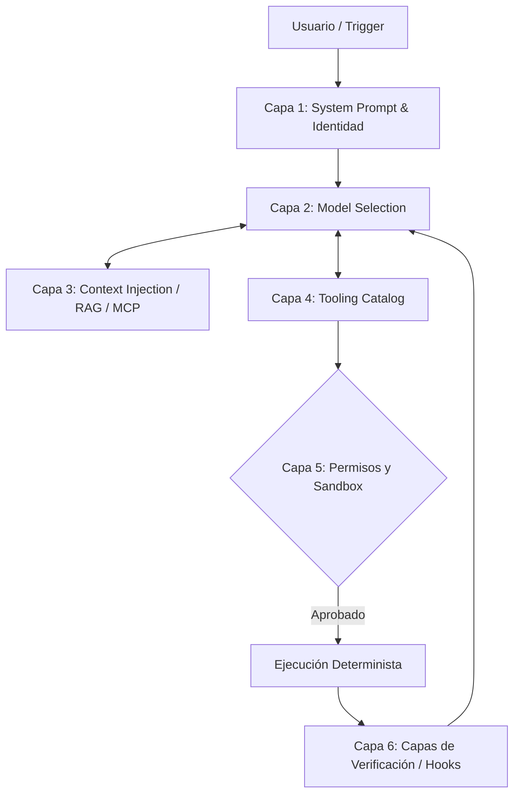

# Harness Reference: La Armadura del Agente

## Definición Formal de Harness
En esta arquitectura corporativa, definimos **Harness** como la infraestructura técnica determinista que envuelve a un modelo probabilístico. Su objetivo es restringir, potenciar y validar las capacidades de razonamiento del LLM, convirtiéndolo en un agente capaz de operar con seguridad en entornos de producción.

No es el "cerebro" (eso es el modelo); es el "sistema nervioso y el exoesqueleto".

## Capas de un Harness Corporativo



## Los Cuatro Pilares de un Harness Robusto

### 1. Documentación como Código (AGENTS.md)
El agente es un "usuario nuevo" permanente. No asume nada. El primer paso del harness es inyectar la verdad fundamental del proyecto: comandos de build, tecnologías, reglas de estilo y dependencias, centralizados en el archivo estandarizado `AGENTS.md`.

### 2. Restricciones Arquitectónicas
Establecer límites legibles por máquinas. En lugar de rogarle al agente que no use una librería vieja, el harness debe configurar herramientas que prevengan el uso de imports no autorizados o usar linters estrictos que fallen si el agente intenta romper las fronteras hexagonales (`eslint-plugin-boundaries`).

### 3. Verificación en Capas
Es inaceptable confiar ciegamente en el output del LLM. El harness debe implementar un ciclo de "Red, Green, Refactor" automatizado:
*   **Hook Post-Tool:** Inmediatamente tras una edición, correr linter.
*   **Pre-commit:** Ejecutar unit tests del área modificada.
*   **CI:** Pruebas de regresión completa.

### 4. Recolección de Basura (Garbage Collection)
Los agentes pueden generar deuda técnica silenciosa, redundancia o archivos fantasma. Un harness avanzado orquesta "agentes de limpieza" (Linter Agents) periódicos cuya única misión es patrullar el código en busca de inconsistencias estilísticas e incongruencias de contexto introducidas por previas pasadas de IA.

---

## El Ciclo Agéntico Base (Pseudocódigo)

El motor de ejecución del harness sigue este patrón de control:

```python
mensajes = [system_prompt, input_usuario]

mientras True:
    # 1. Inferencia del modelo
    respuesta = call_model(mensajes)
    
    # 2. Detección de llamadas a herramientas
    solicitudes_tools = extract_tool_calls(respuesta)
    
    # Si el modelo no quiere usar más tools, el ciclo termina.
    si no solicitudes_tools: 
        retornar respuesta
    
    # 3. Ejecución secuencial o paralela de tools autorizadas
    para cada solicitud en solicitudes_tools:
        si verificar_permisos(solicitud.nombre):
            resultado = execute_tool(solicitud.nombre, solicitud.argumentos)
            
            # Hook de validación inmediata (determinista)
            resultado_validado = run_post_tool_hooks(solicitud.nombre, resultado)
            
            mensajes.append({
                "role": "tool", 
                "tool_call_id": solicitud.id, 
                "content": resultado_validado
            })
        sino:
            mensajes.append({
                "role": "tool", 
                "tool_call_id": solicitud.id, 
                "content": "ERROR: Permiso denegado para ejecutar esta herramienta."
            })
```

> [!WARNING]
> **Advertencia sobre la manipulación del Harness:** El modelo no tiene visibilidad del código fuente de una herramienta a menos que se la des. Solo entiende la **Descripción (Meta-data)** de la herramienta. Descripciones ambiguas generan alucinaciones de uso catastróficas.
