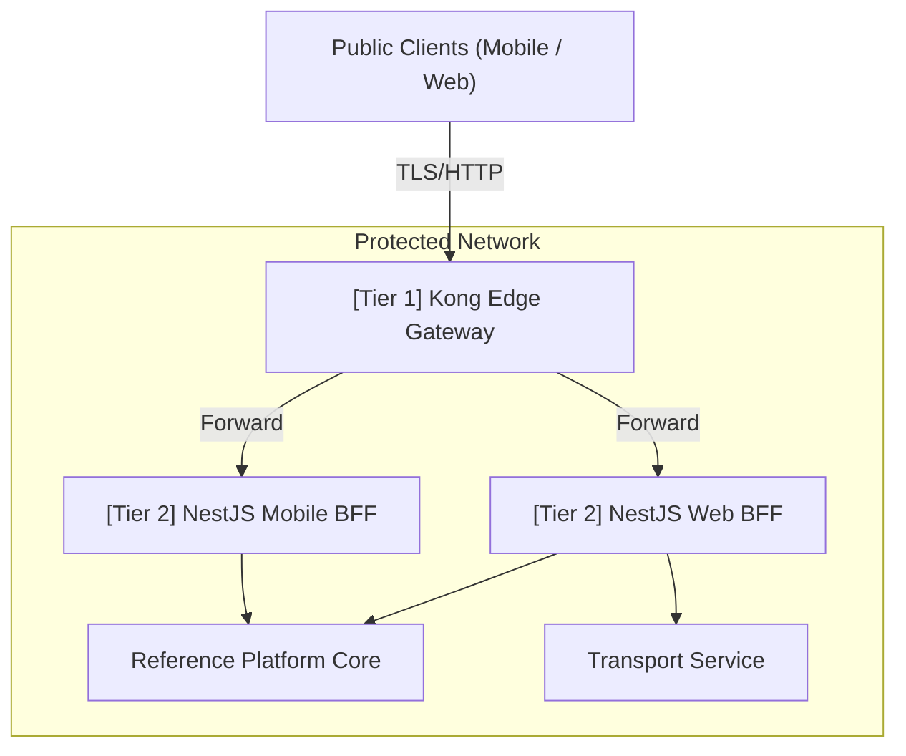

# ADR 0030: API Gateway Strategy - Kong Edge vs NestJS BFF

## Status
Approved

## Date
2026-05-10

## Context
Utilizing Node.js application threads to perform pure network-level infrastructure routing, massive volume rate-limiting, or generic SSL termination wastes single-threaded event loops on overhead, degrading critical application speed. Conversely, pushing complex API payload merges or recursive database aggregates into raw proxy Lua scripts creates operational gridlock.

## Decision
Formalize a rigid **Two-Tier Distributed Gateway Model** to correctly decouple infrastructure from orchestration:

1. **Tier 1 - Edge Gateway (Kong OSS)**: High-throughput NGINX-based barrier. Sits on the literal public cluster perimeter. Manages only non-functional transversal rules: SSL, API key throttling, simple JWT origin signature validation, path forwarding, and WAF rules.
2. **Tier 2 - Application Gateway (NestJS BFF)**: Custom Node logic deployed safely within Tier 1 security zone. Responsible for composing heterogeneous data responses, stripping PII for generic UI formats, tailoring device payloads, and managing user cookie mechanics.

### Updated Two-Tier Architecture

## Consequences

### Positive
- Separates raw binary concerns from logical aggregation. Node doesn't waste cycles blocking DDOS/Spams.
- Extreme throughput scale capability. NGINX core comfortably eats traffic volumes Node alone cannot.
- Improves backend isolation (Tier 1 explicitly shields Tier 2).

### Negative
- Adds a second hop latency variable (typically negligible <1ms overhead if deployed correctly).
- Introduces Kong management operational stack lifecycle.

## References
- [ADR-0008: Progressive BFF Patterns](../02-adrs/nodejs/0008-progressive-multimodule-evolution-gateway-bff.md)
- [ADR-0027: Dual Protocol Edge](../02-adrs/nodejs/0027-dual-protocol-rest-grpc-api-gateway.md)