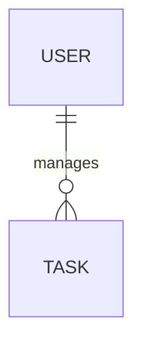
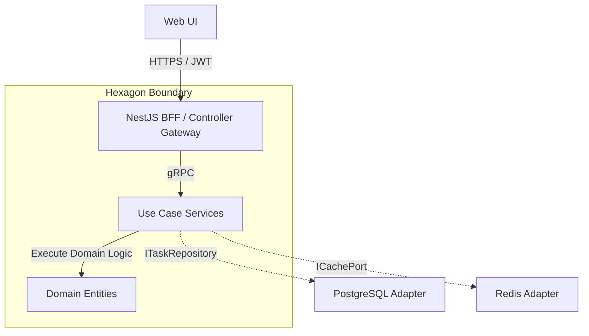

# 🏆 BMAD Master Audit, Alignment & Reference Specification (v3.1.0)

This master document serves as the final alignment for the **Classic To-Do Reference Skeleton**, validating its architecture under the **bMAD (Business, Models, Architecture, Delivery) Method**. 

---

## 🧭 1. Business Dimension (B) — Strategic Alignment & Governance

### 1.1 Product Vision Alignment
The system provides a distraction-free template demonstrating high-tier backend engineering. It optimizes for Developer Experience (DX) and architectural scaffolding reproducibility rather than business monetization.

### 1.2 Strategic Product Objectives (OKRs)
*   **Objective 1: 100% Clean Architecture Compliance**
    *   *KR 1.1*: Ensure zero leaks from external modules into `core` domains using `dependency-cruiser`.
*   **Objective 2: Developer Setup Efficiency**
    *   *KR 2.1*: Provision a fully working local environment (Docker + API + Cache) in under 5 minutes.
*   **Objective 3: Robust Testing Gates**
    *   *KR 3.1*: Maintain strict min 80% coverage gates on Domain & Application Logic.

---

## 🗃️ 2. Models Dimension (M) — Logical Domain Models

### 2.1 Domain Entity Model
See [conceptual-data-model.md](../01-requirements/conceptual-data-model.md) for attributes.

### 2.2 Event Models (Intra-Domain)
Used for asynchronous processing demos (e.g., local event emitter or Redis PubSub):
*   `TaskCreatedEvent`: `{ "taskId": "uuid", "userId": "uuid", "timestamp": "ISO" }`
*   `TaskCompletedEvent`: `{ "taskId": "uuid", "completedAt": "ISO" }`

---

## 🏛️ 3. Architecture Dimension (A) — Enterprise Specifications

The components enforce **Hexagonal Architecture (Ports & Adapters)**.

### 3.1 C4 Container Diagram (Level 2)

---

## 🚀 4. Delivery Dimension (D) — Engineering & Operations

### 4.1 DevSecOps Strategy
*   **Nx Monorepo**: Advanced task caching speeds up CI verification.
*   **Observability**: Integrated OpenTelemetry pushes spans to centralized collector targets for trace debugging.
*   **Pact JS**: Baseline contract testing implemented ensuring decoupled Frontend-Backend evolution.

---

## 🏁 5. Architectural Verification & Compliance Status
**STATUS: FULLY COMPLIANT**
Verified through the **Pivot Plan Execution (May 2026)**. All legacy Enterprise IAM overhead has been purged, delivering a light, performant reference blueprint.
