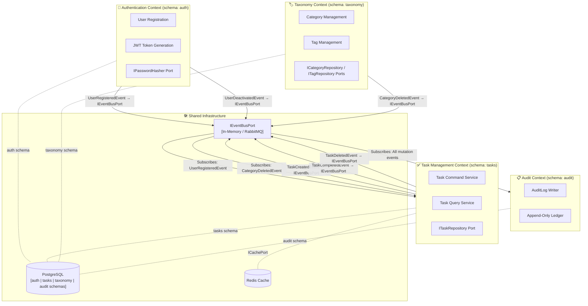

# 🗺️ Bounded Context Map — To-Do Reference Skeleton

This document establishes the formal **Domain-Driven Design (DDD) Bounded Context Map** for the Reference Template. Each context owns its own **PostgreSQL schema** (ADR-0031), enabling zero-migration microservices extraction.

---

## 📐 1. Context Map Overview

---

## 📦 2. Context Definitions

### 🔐 A. Authentication Context — `schema: auth`
**Mission:** Own the identity management primitives and session token issuing.

**Owns:**
- `auth.users` table
- `IPasswordHasher` port
- Auth Controller (Login/Register endpoints)

**Publishes Events:**
- `UserRegisteredEvent` → consumed by Task, Audit
- `UserDeactivatedEvent` → consumed by Task, Audit

---

### ✅ B. Task Management Context — `schema: tasks`
**Mission:** Coordinate all operations related to atomic workflow tasks.

**Owns:**
- `tasks.task` table
- `tasks.task_tags` bridge table
- `ITaskRepository` port
- Use Cases: `CreateTask`, `ListTasks`, `CompleteTask`, `DeleteTask`

**Integration Contract:**
- Reads `userId` from JWT (injected by Auth context via token claim — no direct DB cross-schema reads)
- Subscribes to: `UserRegisteredEvent`, `CategoryDeletedEvent`

**Publishes Events:**
- `TaskCreatedEvent`, `TaskCompletedEvent`, `TaskDeletedEvent`

---

### 🏷️ C. Taxonomy Context — `schema: taxonomy`
**Mission:** Manage the classification vocabulary (Categories and Tags) available to the tenant.

**Owns:**
- `taxonomy.category` table
- `taxonomy.tag` table
- `ICategoryRepository`, `ITagRepository` ports

**Publishes Events:**
- `CategoryDeletedEvent` → consumed by Task (nullify orphaned category_id references)

---

### 📋 D. Audit Context — `schema: audit`
**Mission:** Maintain an immutable, append-only record of all significant domain state changes.

**Owns:**
- `audit.audit_log` table (database-level INSERT-only trigger enforced per ADR-0016)

**Subscribes to:** All events from all contexts.

**Does NOT publish events.** The Audit context is a terminal sink.

---

## 🚧 3. Anti-Corruption Layers (ACL)

| Boundary | ACL Mechanism | Reason |
| :--- | :--- | :--- |
| Task ↔ Redis | `ICachePort` | Prevents Redis driver from leaking into domain layer |
| Task ↔ TypeORM | `ITaskRepository` | ORM decorators must not impact core TS entity rules |
| Auth ↔ Bcrypt | `IPasswordHasher` | Decouples crypto algorithm from application workflow |
| Any Context ↔ Event Bus | `IEventBusPort` | Decouples transport (RabbitMQ/Kafka) from domain logic |
| Task ↔ Auth | Domain Events only | Task never reads `auth.users` directly — gets userId from JWT claims |

---

## 🔄 4. Microservices Extraction Map (ADR-0031, ADR-0006)

When the system evolves to microservices, each context extracts cleanly:

| Milestone | Action | DB Impact |
| :--- | :--- | :--- |
| **M1: Monolith** | All contexts share one DB connection | Single PostgreSQL, 4 schemas |
| **M2: Extract Task** | `TaskService` gets its own `DATABASE_URL` → `tasks` schema | No migration — schema already isolated |
| **M3: Extract Taxonomy** | `TaxonomyService` gets its own `DATABASE_URL` → `taxonomy` schema | No migration — schema already isolated |
| **M4: Full Mesh** | Each service on its own PostgreSQL instance | `pg_dump --schema=<name>` per service |
