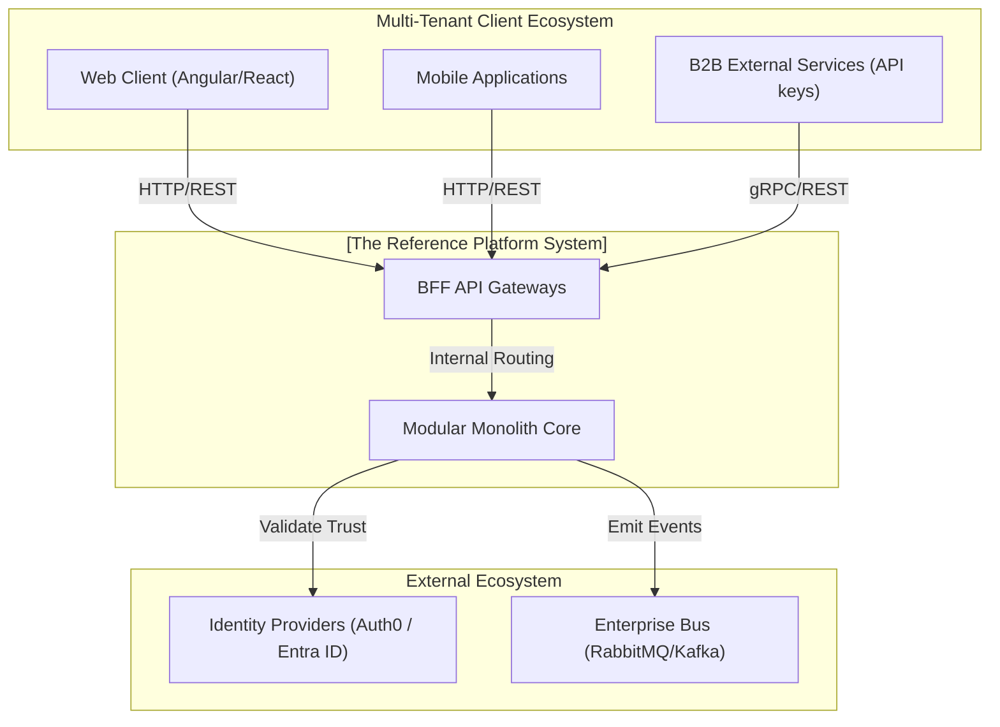
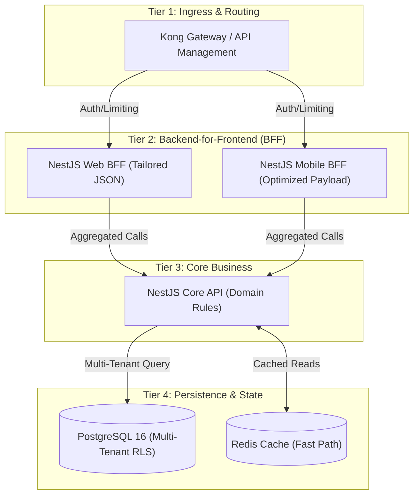
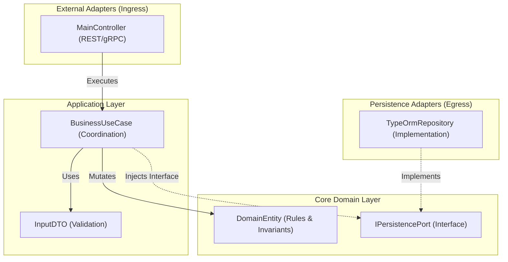

# 🏗️ Architecture Specification & C4 Model Specifications

This document details the rigorous enterprise-grade architectural design for the reference platform, conforming to the **arc42** blueprint standard (ARC32). The design implements an advanced **SaaS Multi-Tenant** ecosystem utilizing **BFF Gateways** to manage client delivery.

---

## 🗺️ 1. System Static Structure (C4 Model)

### Level 1: System Context Diagram
Defines our bounded system within the enterprise ecosystem, its consumers (tenants), and active external actors.

### Level 2: Container Diagram (High-Density Runtime)
Demonstrates the physical segregation of communication entry-points (BFFs) down to the multi-tenant database infrastructure.

### Level 3: API Component Diagram (Hexagonal Architecture)
Explosion of internal coupling inside the **NestJS Core API**.

---

## 📜 2. The Approved Decision Ledger (All 30 ADRs)

As validated by the Principal Architect, all 30 original foundational decisions are **officially Approved** and mandatory for system implementation.

### 🟢 Group A: Core Foundation & Standards
1.  **[ADR 0001: Monorepo Orchestration](../03-adrs/0001-monorepo-orchestration-nx.md)**: Nx and npm workspaces for linear, centralized CI/CD.
2.  **[ADR 0002: Clean Hexagonal Architecture](../03-adrs/0002-clean-architecture-nestjs.md)**: Separation of core logic from framework code.
3.  **[ADR 0003: Strict TypeScript Standards](../03-adrs/0003-strict-typescript-standards.md)**: Absolute typing, no `any`, mandatory ESLint rules.
4.  **[ADR 0005: Zero-Cost Security CodeQL](../03-adrs/0005-ci-cd-quality-codeql.md)**: Automated vulnerability detection inside pipeline.
5.  **[ADR 0009: Strict Dependency Pinning](../03-adrs/0009-strict-dependency-pinning-vulnerability-management.md)**: Blocking dynamic updates to prevent supply-chain breaches.

### 🟠 Group B: SaaS, Scalability & Distribution
6.  **[ADR 0006: Future Microservices transition via Dapr](../03-adrs/0006-future-microservices-transition-dapr.md)**: Decoupling triggers to break monoliths into mesh node networks.
7.  **[ADR 0007: Observability via OpenTelemetry](../03-adrs/0007-observability-telemetry-loki-opentelemetry.md)**: Distributed tracing across BFF, API and DB.
8.  **[ADR 0008: BFF Patterns](../03-adrs/0008-progressive-multimodule-evolution-gateway-bff.md)**: Multi-channel integration via dedicated translation layers.
9.  **[ADR 0010: Multi-Tenancy SaaS Strategy](../03-adrs/0010-multi-tenancy-architecture-strategy.md)**: Implementing physical Row-Level Security (RLS) inside PostgreSQL to guarantee isolation.
10. **[ADR 0011: Fault Tolerance Circut Breakers](../03-adrs/0011-fault-tolerance-resiliency-patterns.md)**: Preventing cascade degradation using `opossum`.
11. **[ADR 0013: Disaster Recovery Topology](../03-adrs/0013-cloud-infrastructure-topology-dr.md)**: Multi-region node design.
12. **[ADR 0014: Distributed Caching](../03-adrs/0014-distributed-caching-strategy-redis.md)**: Offloading the database via centralized Redis.
13. **[ADR 0015: Event Driven Architecture](../03-adrs/0015-event-driven-architecture-intra-domain.md)**: Asynchronous messaging between bounded contexts.
14. **[ADR 0016: Immutable Business Auditing](../03-adrs/0016-immutable-business-audit-trail.md)**: Ledger system recording full transactional state diffs.

### 🔵 Group C: Integration, Identity & Governance
15. **[ADR 0020: Identity Provider Abstraction](../03-adrs/0020-identity-provider-abstraction-strategy.md)**: Port abstraction for Okta/Entra ID/Auth0.
16. **[ADR 0021: High Performance Auth Graphs](../03-adrs/0021-high-performance-auth-and-graph-compilation.md)**: Latency requirements below 5ms.
17. **[ADR 0026: MFA and Adaptive Security](../03-adrs/0026-mfa-passwordless-adaptive-authentication.md)**: WebAuthn and Passkeys support.
18. **[ADR 0027: Dual REST & gRPC Protocols](../03-adrs/0027-dual-protocol-rest-grpc-api-gateway.md)**: Internal performant streaming via gRPC.
19. **[ADR 0030: Kong Gateway vs NestJS Gateway](../03-adrs/0030-api-gateway-kong-vs-nestjs.md)**: Separation of infrastructure proxies from business orchestration.
20. **[ADR 0029: Tactical DDD Primitives](../03-adrs/0029-tactical-ddd-primitives-library.md)**: Mandatory utilization of standardized `@nestjslatam/ddd`.

### 🟣 Group D: Microservices Evolution Readiness
21. **[ADR 0031: Schema-per-Context & Domain Event Catalog](../03-adrs/0031-schema-per-context-domain-event-catalog.md)**: Each bounded context owns a dedicated PostgreSQL schema (`auth` | `tasks` | `taxonomy` | `audit`). All cross-context communication is governed by a formal Domain Event Catalog with typed payload contracts, enabling zero-migration microservices extraction.
