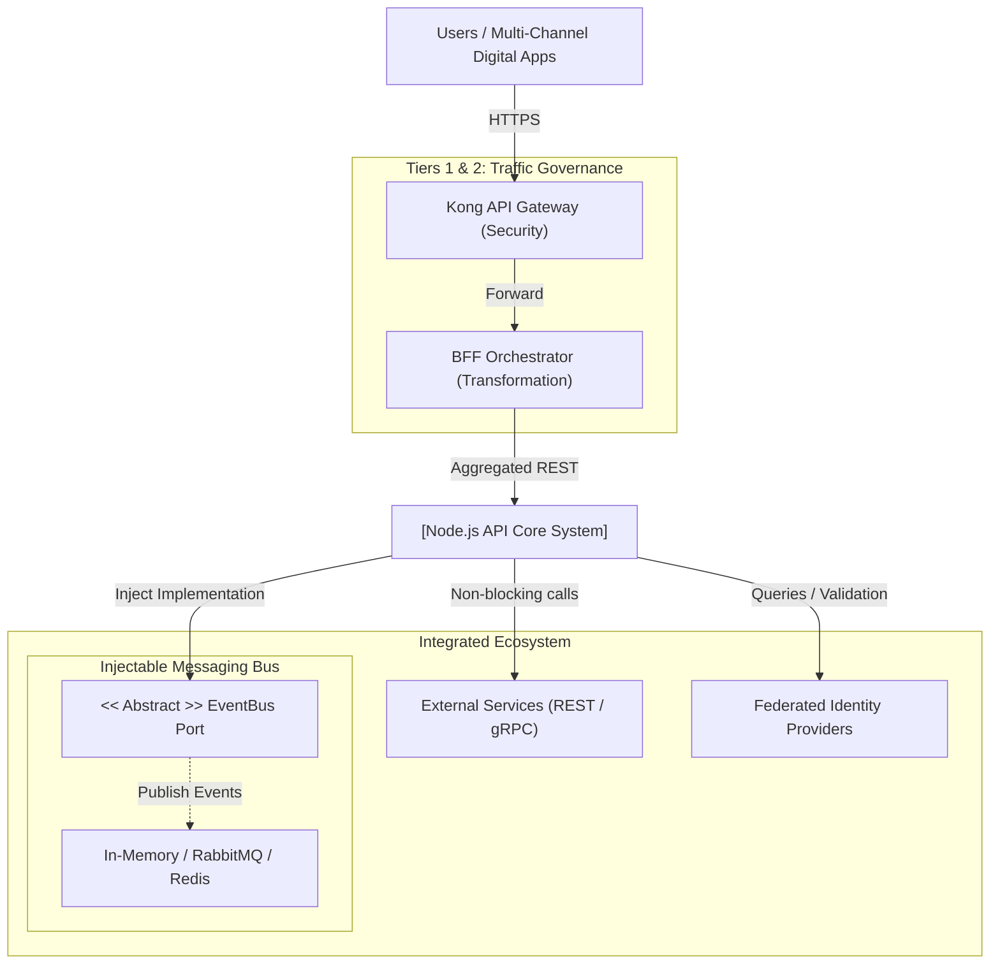
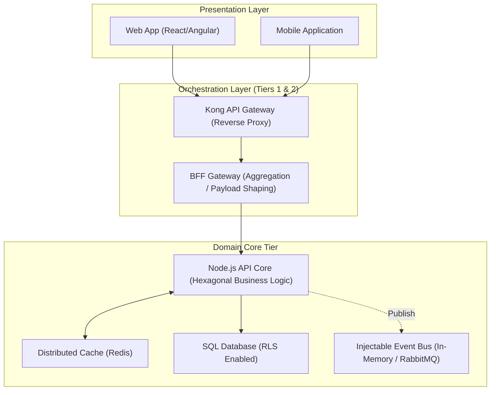

# 🏛️ Evolutionary Reference Architecture for API-Driven Systems (Node.js Stack)

> [!IMPORTANT]
> **Corporate Reference Architecture Blueprint (ARC32 / Arc42)**: This document defines the corporate standard for building highly decoupled applications that start as a **Modular Monolith** and evolve toward **Microservices**. The base project (To-Do Reference) physically implements this international standard.

---

## 1. Introduction and Goals

This reference architecture provides a standardized blueprint for building modern, highly scalable, and modular enterprise systems.

### 1.1 Purpose and Applicability
This pattern is designed specifically for systems that:
*   Have a strong orientation towards **intensive API utilization**.
*   Require native concurrent and asynchronous processing.
*   **Do not** depend heavily on services with constant input/output (I/O) blocking or heavy mathematical processing that locks the main event loop.

### 1.2 Mandatory Quality Attributes
1.  **Progressive Evolution**: "Monolith-First" design enabling future microservices extraction without changing Domain code.
2.  **Strict Decoupling**: Highly cohesive modules with low external coupling enforced via linting boundary rules.
3.  **Resilience**: Native fault-tolerance patterns for standalone or mesh operations.

---

## 2. Architecture Constraints and Baseline Pillars

Any system based on this blueprint must adhere to the following ecosystem pillars:

*   **Stack Governance**: Node.js/TypeScript technology base managed within a modular environment (Nx Monorepo or similar for contract cohesion).
*   **bMAD / Global Engineering Standards Mandate**: Strict application of SOLID, Clean Code, and Hexagonal Architecture principles.
*   **I/O Management**: Leveraging Node.js non-blocking model. Avoid synchronous operations on the main thread.

---

## 3. Context and Scope (Operational Model)

Defines how systems based on this stack interact with the corporate ecosystem.

### 3.1 General Context Pattern
*(Technical Instantiation Example using Reference Skeleton as a reference)*

---

## 4. Solution Strategy

Fundamental invariant technical decisions for this reference architecture are:

### 4.1 Hexagonal Architecture (Ports & Adapters)
Mandatory isolation of business logic (Domain & Application) from input/output details (Infrastructure).
*   **Benefit**: Allows switching the database (e.g., from Postgres to MongoDB) or the framework (e.g., from Express to NestJS or Fastify) without rewriting the system core.

### 4.2 Persistence and Isolation
Preferential use of agnostic persistence strategies. In SQL environments, the use of **Row-Level Security (RLS)** is recommended to delegate multi-tenant security to the DB engine, optimizing Node.js layer performance.

### 4.3 Communication & Integration Strategy
*   **API-First**: All services expose clear contracts.
*   **Backend For Frontend (BFF)**: Mandatory to optimize payloads for client devices and safeguard the core system from presentation logic.

### 4.4 Progressive Evolution Route (Progressive Blueprint)
The physical evolution roadmap follows three key milestones defined in associated ADRs:
1.  **Milestone 1: Modular Monolith (Current State)**: Single physical runtime instance with logically isolated domains via `apps/api` and `libs` sharing the same process.
2.  **Milestone 2: High-Performance Service Extraction**: Move critical domain libraries to dedicated Nx micro-projects, converting them to microservices with their own isolated database, consumed via gRPC/Dapr.
3.  **Milestone 3: Full Microservices Mesh**: Deployment of Sidecars (Dapr) and a complete Service Mesh, where the original Monolith evolves into the orchestrating API Gateway/BFF.

---

## 5. Technical Building Blocks (Container Template)

The recommended physical topology for this ecosystem includes three distribution layers:

---

## 6. Runtime View (Flow Patterns)

To maximize Node.js Event Loop performance:
1.  **Immediate Validation**: Every request is syntactically validated before touching any database or external service.
2.  **Asynchronous Delegation**: Heavy or secondary processes (emails, extended audits) are offloaded to message queues instantly, responding to the client with minimal latency.
3.  **Active Cache Strategy**: High-read/low-mutation data must be resolved in the distributed cache layer (latency < 5ms), freeing the Node thread from heavy queries.

---

## 7. Deployment View (Target Cloud)

Recommended: Docker containerization, Kubernetes (K8s) orchestration, and autoscaling based on CPU/Memory metrics, guaranteeing high availability across multi-zone clusters.

---

## 8. Transversal Corporate Concepts

Regardless of the chosen system, these standards must be integrated:

*   **Centralized Security**: Mandatory implementation of Claim/Scope-based authorization (e.g., RBAC/ABAC).
*   **Native Observability**:
    *   Structured Logging (JSON).
    *   Distributed Tracing (OpenTelemetry) to track requests across network hops.
*   **Error Handling**: Avoid Exception abuse for business flow control; favor functional patterns (Result/Either Type).

---

## 9. Decision Reference Matrix (ADR Baseline)

Any implementation of this stack inherits these strategies by default:

| Design Focus | Technical Strategy | Technical Rationale |
| :--- | :--- | :--- |
| **Internal Governance** | `eslint-plugin-boundaries` | Prevents circular coupling and protects Hexagon layers. |
| **Resilience** | Circuit Breakers (`opossum` or similar) | Prevents cascading failures in API-oriented systems. |
| **Caching** | Distributed Read-Aside Pattern | Shields the DB and optimizes API throughput. |
| **Testing** | Automated Testing Pyramid | Guarantees quality with heavy focus on Unit and Contract tests. |

---

## 10. Stack Quality Requirements (NFR Benchmark)

Target values every stack implementation should certify:
*   **Internal API Latency**: P95 < 50ms.
*   **Security**: 0 "High/Critical" vulnerabilities (SAST scanning).
*   **Efficiency**: Low base memory footprint facilitating high microservice density.

---

## 11. Canonical Reference Implementation

To witness the live application of these concepts in real code and physical architecture, consult the following module:

👉 **[To-Do Reference Template Codebase](./README.md)**

Where these theoretical concepts materialize utilizing:
*   **Framework**: NestJS.
*   **ORM**: TypeORM with native PostgreSQL RLS support.
*   **Testing**: Jest for pure hexagonal logic.
