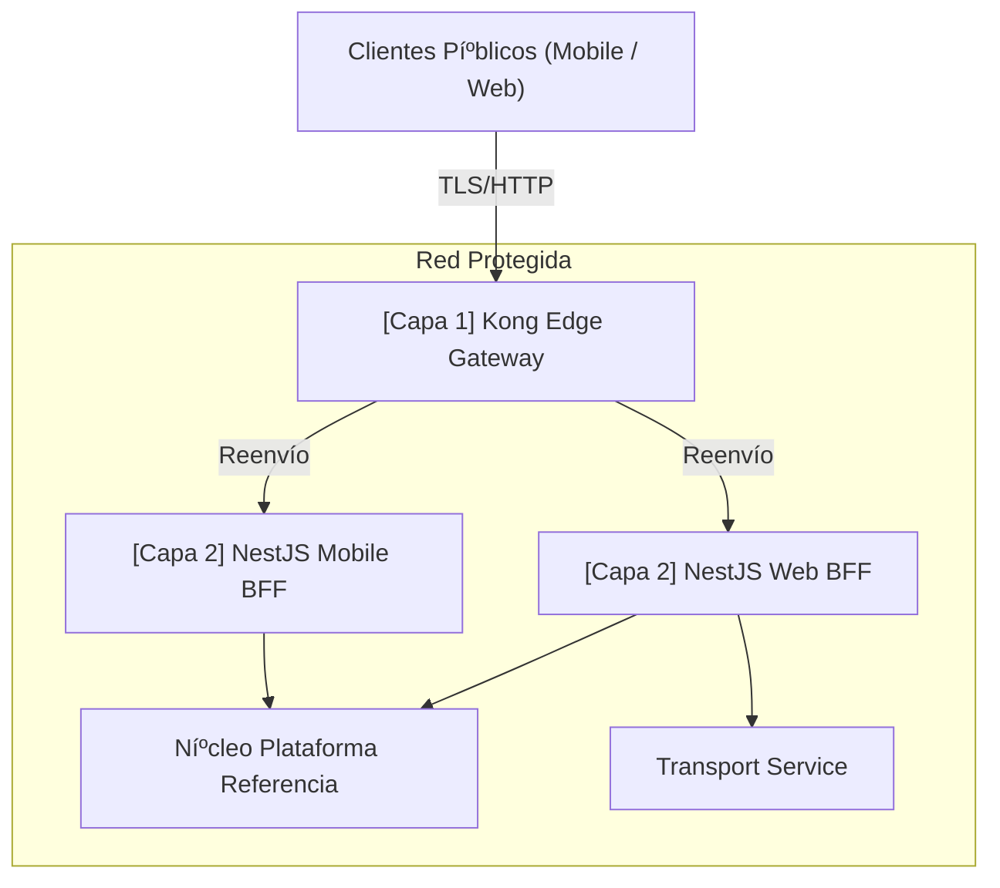

# [ADR 0030](0030-api-gateway-kong-vs-nestjs.md): Estrategia de Gateway de API - Kong Edge vs NestJS BFF

## Estado
Aprobado

## Fecha
2026-05-10

## Contexto
Utilizar hilos de la aplicación Node.js para realizar enrutamiento de infraestructura a nivel de red puro, limitación de tasa de volumen masivo o terminación SSL genérica desperdicia bucles de eventos de un solo hilo en sobrecarga, degradando la velocidad crí­tica de la aplicación. Por el contrario, empujar fusiones complejas de cargas íºtiles de API o agregados recursivos de bases de datos en scripts Lua de proxy sin procesar crea un atasco operativo.

## Decisión
Formalizar un rí­gido **Modelo de Gateway Distribuido de Dos Capas** para desacoplar correctamente la infraestructura de la orquestación:

1. **Capa 1 - Edge Gateway (Kong OSS)**: Barrera de alto rendimiento basada en NGINX. Se sitíºa literalmente en el perí­metro del clíºster píºblico. Gestiona solo reglas transversales no funcionales: SSL, estrangulamiento de claves de API, validación de firma de origen JWT simple, reenví­o de ruta y reglas WAF.
2. **Capa 2 - Gateway de Aplicación (NestJS BFF)**: Lógica de Node personalizada desplegada de forma segura dentro de la zona de seguridad de Capa 1. Responsable de componer respuestas de datos heterogéneos, eliminar PII para formatos de UI genéricos, adaptar las cargas íºtiles del dispositivo y gestionar la mecánica de cookies del usuario.

### Arquitectura Actualizada de Dos Capas

## Consecuencias

### Positivas
- Separa las preocupaciones binarias en bruto de la agregación lógica. Node no desperdicia ciclos bloqueando DDOS/Spams.
- Capacidad de escala de rendimiento extremo. El níºcleo de NGINX devora cómodamente volíºmenes de tráfico que Node solo no puede.
- Mejora el aislamiento del backend (la Capa 1 protege explí­citamente a la Capa 2).

### Negativas
- Aí±ade una variable de latencia de segundo salto (tí­picamente insignificante <1ms de sobrecarga si se despliega correctamente).
- Introduce el ciclo de vida del stack operativo de gestión de Kong.

## Referencias
- [ADR-0008: Patrones Progresivos de BFF](../adrs/nodejs/0008-progressive-multimodule-evolution-gateway-bff.md)
- [ADR-0027: Borde de Protocolo Dual](../adrs/nodejs/0027-dual-protocol-rest-grpc-api-gateway.md)

---
[? Volver al Índice](./README.es.md)
