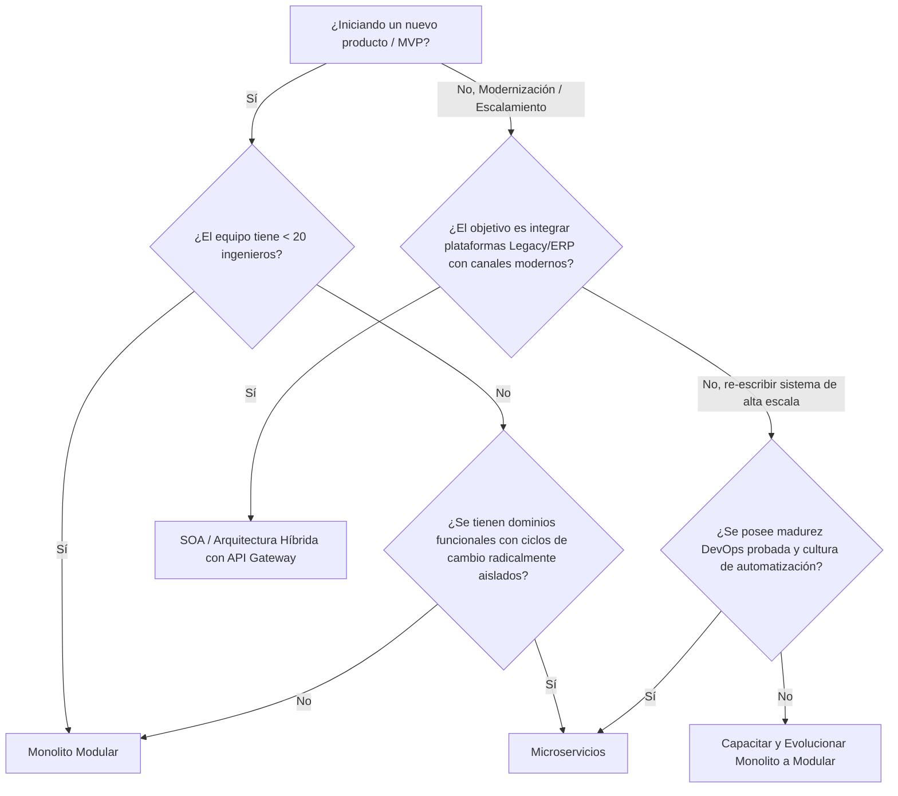
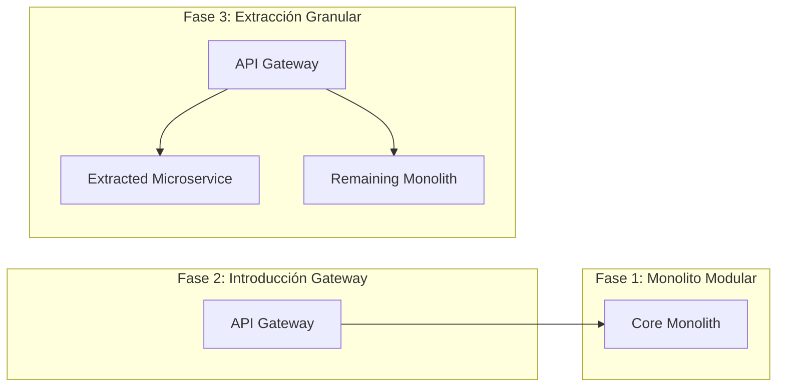

# [ADR 0047](0047-architectural-patterns-monolith-soa-microservices.md): Marco de Selección y Evolución Arquitectónica: Monolito vs. SOA vs. Microservicios

## 1. Metadata
* **ADR ID:** 0047
* **Título:** Marco de Selección y Evolución Arquitectónica: Monolito vs. SOA vs. Microservicios
* **Estado:** Aprobado
* **Autores:** Oficina de Arquitectura Enterprise
* **Revisores:** Junta Arquitectónica Corporativa, Oficina del CTO
* **Fecha:** 2026-05-12
* **Tags:** `Governance`, `Architecture-Patterns`, `Scalability`, `Decision-Framework`
* **ADRs Relacionados:** 
 * [ADR-0006: Transición Futura a Microservicios con Dapr](./0006-future-microservices-transition-dapr.md)
 * [ADR-0032: Matriz de Selección de Protocolos](./0032-api-protocol-decision-matrix-rest-grpc-graphql.md)
 * [ADR-0045: Criterios de Extracción de Microservicios](./0045-microservice-extraction-readiness-criteria.md)

---

## Resumen Ejecutivo (Para el CTO)

La mala elección de un patrón arquitectónico inicial o de transición es la principal fuente de quiebra técnica en organizaciones de tecnología moderna. Adoptar microservicios prematuramente destruye el *Time-to-Market* por sobrecarga operativa, mientras que mantener un monolito acoplado en exceso impide el escalamiento organizacional de equipos distribuidos.

Este ADR establece la postura corporativa: la arquitectura evoluciona simétricamente a la complejidad del negocio y al tamaño de la organización. Se prohíbe la imposición dogmática de arquitecturas distribuidas. Todo sistema nuevo arranca como un **Monolito Modular** protegido por Puertos y Adaptadores, y migra hacia **Microservicios** o **SOA** únicamente cuando los drivers de negocio u operativos lo demanden objetivamente según los umbrales numéricos definidos en este registro.

---

## 2. Contexto del Problema

Las organizaciones se enfrentan a desafíos dinámicos de escalado. La falta de un marco de referencia estándar para decidir el estilo arquitectónico de nuevos productos o la modernización de sistemas legados genera los siguientes escenarios de fracaso corporativo:

1. **Sobre-Ingeniería Prematura en Startups/Nuevas Iniciativas:** Implementación de microservicios con menos de 10 ingenieros, resultando en una parálisis operativa donde el 80% del esfuerzo se consume en infraestructura y redes en lugar de valor de negocio.
2. **Efecto de Gran Bola de Lodo en Medianas Empresas:** Monolitos que iniciaron bien pero perdieron sus límites lógicos, requiriendo ciclos de regresión de semanas y despliegues que fallan constantemente por acoplamiento lateral de código y base de datos.
3. **Parálisis por Integración en Grandes Corporativos (Enterprise):** Ecosistemas híbridos donde decenas de plataformas comerciales (SaaS, ERPs legados) y desarrollos internos intentan comunicarse sin una estrategia clara de contratos, resultando en dependencias en cascada frágiles.

Este documento mitiga dichos riesgos estableciendo reglas de decisión claras, cuantificables y alineadas a la realidad del negocio.

---

## 3. Drivers Arquitectónicos

La evaluación de cada alternativa se pondera contra 15 drivers críticos, priorizados corporativamente:

1. **Time-to-Market (TTM):** Velocidad para llevar una funcionalidad de idea a producción.
2. **Autonomía de Equipos:** Capacidad de un equipo para diseñar, desarrollar y desplegar código sin requerir sincronización con otros equipos.
3. **Complejidad Operacional:** Nivel de especialización técnica en DevOps y plataformas requerida para operar el sistema.
4. **Mantenibilidad:** Facilidad para comprender, depurar y modificar el código fuente.
5. **Escalabilidad (Cómputo/Datos):** Eficiencia para manejar incrementos de carga en funciones específicas del sistema.
6. **Resiliencia / Aislamiento de Fallos:** Capacidad de evitar que el colapso de un dominio tumbe el ecosistema completo.
7. **Integraciones Legacy:** Habilidad para convivir y extraer valor de sistemas antiguos o comerciales preexistentes.
8. **Frecuencia de Despliegue:** Cantidad de despliegues exitosos posibles en un período (diario, semanal, mensual).
9. **Costos Iniciales vs. Operativos:** Eficiencia presupuestaria a corto y largo plazo.
10. **Observabilidad:** Esfuerzo para diagnosticar un error en la interacción del flujo de negocio.
11. **Testing:** Complejidad del ciclo de pruebas unitarias, integración y extremo a extremo (E2E).
12. **Gobernanza de Datos:** Centralización vs. descentralización del ciclo de vida del dato.
13. **Vendor Lock-in:** Grado de acoplamiento a un proveedor Cloud u On-Premise.
14. **Cloud Readiness:** Facilidad de ejecución en arquitecturas Cloud Native vs Servidores tradicionales.
15. **Compliance:** Requisitos de cumplimiento regulatorio de aislamiento físico o regional.

---

## 4. Opciones Evaluadas

### Opción A - Monolito (Con enfoque en Monolito Modular / Hexagonal)

Consiste en un artefacto de despliegue único que aloja toda la lógica de negocio del dominio. El estándar corporativo exige el sub-patrón de **Monolito Modular** con **Arquitectura Hexagonal**, donde el aislamiento es absoluto a nivel de código aunque el proceso de runtime y el esquema de base de datos estén unificados (o separados lógicamente).

* **Ventajas:**
 * Baja latencia intra-proceso (llamadas de memoria).
 * Refactorización trivial.
 * CI/CD directo y de bajo costo operacional.
 * Transaccionalidad ACID nativa garantizada por el motor de base de datos.
 * Pruebas E2E simplificadas sin mocks de red excesivos.
* **Desventajas:**
 * ínico punto de fallo de despliegue (un error fatal en un módulo puede tumbar todo el proceso).
 * Acaparamiento de memoria/CPU heterogéneo (el módulo A escala todo el sistema innecesariamente).
 * Saturación de equipos a partir de >25-30 ingenieros trabajando concurrentemente.
* **Cuándo Usar:** Fase 1 de cualquier producto; validación de mercado (MVP); equipos con <15 ingenieros; dominios altamente transaccionales.
* **Costos y Complejidad:** Mínimos al inicio. El costo escala de forma no lineal solo si se degrada el aislamiento de módulos.

### Opción B - SOA (Service-Oriented Architecture)

Es un paradigma centrado en la integración empresarial. Los sistemas exponen sus capacidades mediante servicios interoperables con contratos estrictos (generalmente SOAP o REST) y gobernados típicamente por un bus de servicios empresarial (ESB). SOA se enfoca en la reutilización de componentes existentes por encima del desarrollo de nuevos servicios modulares.

* **Ventajas:**
 * Excelente para la coexistencia de tecnologías dispares (Mainframes, Java, .NET, SaaS).
 * Contratos de integración rígidos que garantizan consistencia organizacional.
 * Facilita la orquestación compleja de flujos empresariales heterogéneos.
* **Desventajas:**
 * **Efecto Cuello de Botella en ESB:** El bus de servicios tiende a absorber lógica de negocio pesada, volviéndose imposible de escalar o mantener.
 * Sincronización pesada y latencia alta entre servicios.
 * Gobernanza centralizada y burocrática de contratos.
* **Cuándo Usar:** Grandes corporativos que deben unificar plataformas empaquetadas existentes (ERPs, CRMs, Core Bancarios Legacy) con canales digitales modernos.

### Opción C - Microservicios

Descomposición de una aplicación en un conjunto de servicios pequeños, autónomos, desplegables de forma independiente y alineados estrictamente con Bounded Contexts de Domain-Driven Design (DDD). Cada microservicio posee su propio almacenamiento de datos (*Database-per-service*) y se comunica mediante red utilizando protocolos ligeros (REST, gRPC, Pub/Sub).

* **Ventajas:**
 * Autonomía operativa total: Un equipo puede desplegar 50 veces al día sin afectar al resto.
 * Escalabilidad selectiva de recursos.
 * Aislamiento de fallas absoluto: Si el servicio de notificaciones muere, el core de pagos sigue funcionando.
 * Facilidad para adoptar stacks políglotas optimizados por caso de uso.
* **Desventajas:**
 * **Complejidad Distribuida:** Transacciones distribuidas complejas (Patrón Saga), latencia de red inherente.
 * Exige madurez severa en DevOps, CI/CD, Observabilidad y Automatización.
 * Consistencia eventual forzosa de datos.
* **Cuándo Usar:** Sistemas de escala masiva (>1M RPM); organizaciones con múltiples equipos independientes trabajando en sub-dominios paralelos; requerimientos heterogéneos de disponibilidad o seguridad.

---

## 5. Matriz Comparativa

| Característica | Monolito Modular | SOA Tradicional / Corporativo | Microservicios Cloud-Native |
| :--- | :--- | :--- | :--- |
| **Complejidad Inicial** | Muy Baja | ¡ Alta | Crítica |
| **Time-to-Market Inicial**| Inmediato | ¡ Lento | Muy Lento |
| **Autonomía de Equipos** | ¡ Limitada (>25 devs) | ¡ Intermedia | Máxima |
| **Escalabilidad Cómputo**| ¡ Vertical / Homogénea | Horizontal | Granular / Selectiva |
| **Consistencia de Datos**| Fuertemente ACID | Centralizada / Distribuida | Consistencia Eventual |
| **Depuración / Debugging**| Simple (Local) | ¡ Compleja (Remota) | Extremadamente Compleja |
| **Despliegue (DevOps)** | Docker Compose / VM | ¡ Servidores Centralizados | Kubernetes / Service Mesh |
| **Observabilidad** | Estándar Logs/APM | ¡ Seguimiento ESB | Trazado Distribuido W3C |
| **Tolerancia a Fallos** | Nula (Un solo proceso) | ¡ Media | Excelente (Circuit Breaker)|
| **Costo Operativo Base** | Muy Bajo ($) | Alto ($$$) | Crítico ($$$$) |

---

## 6. Framework de Decisión (írbol Lógico y Modelo de Puntuación)

### Diagrama de írbol de Decisión (Mermaid)

### Checklist Crítico para Habilitación de Microservicios
Antes de autorizar la migración a Microservicios, un equipo DEBE poder responder **"Sí"** a un mínimo de 4 de los siguientes 5 puntos (Gobernanza Corporativa):

1. [] **CI/CD Maduro:** ¿Podemos desplegar de forma automatizada en <10 minutos sin interacción humana manual?
2. [] **Monitoreo de Producción:** ¿Tenemos instrumentado logs centralizados y trazado distribuido operacional?
3. [] **Separación de Datos:** ¿Se comprende y acepta el impacto de refactorizar la base de datos compartida a un modelo descentralizado con consistencia eventual?
4. [] **Personal de Plataforma:** ¿Contamos con un equipo de Platform Engineering capaz de operar clústeres K8s, mallas o nubes híbridas?
5. [] **Dolor Real de Escalado:** ¿Hemos identificado empíricamente un cuello de botella en producción que NO puede resolverse con escalado vertical o aislamiento de colas en el monolito?

---

## 7. Señales de Evolución Arquitectónica (Evolución Progresiva)

### Cuándo migrar del Monolito a Microservicios:
* **Saturación de Pull Requests:** Los ingenieros pasan más tiempo resolviendo conflictos de fusión de código o haciendo fila para desplegar que escribiendo código de valor.
* **Escalabilidad Desproporcionada:** Un módulo específico consume el 90% de los recursos y obliga a levantar instancias gigantescas del monolito entero a un costo insostenible.
* **Requisitos de Seguridad/Cumplimiento Divergentes:** Un sub-dominio maneja datos sensibles (ej. PCI DSS) y para no auditar todo el monolito, se requiere extraerlo físicamente.

### « Cuándo NO migrar a Microservicios (Falsos Amigos):
* **"El código es desordenado":** Migrar un monolito espagueti a microservicios resulta en un **Monolito Distribuido Espagueti**, lo cual es exponencialmente peor. Primero se ordena el código como Monolito Modular.
* **"Queremos usar tecnologías de moda":** La arquitectura no debe decidirse por CV-Driven Development (desarrollo impulsado por currículum).
* **"Somos un equipo de 5 personas":** No hay ancho de banda suficiente para mantener la gobernanza y red de microservicios.

---

## 8. Anti-Patterns y Errores Comunes

1. **The Distributed Monolith (Monolito Distribuido):** Servicios que están físicamente separados pero se llaman de manera síncrona y secuencial por HTTP para completar cada transacción sencilla. Rompe la disponibilidad de forma geométrica ($0.99^5 = 0.95$).
2. **Nanoservicios:** Descomposición atómica ridícula (un servicio para "CrearUsuario", otro para "ActualizarUsuario"). Genera una maraña inmanejable de redes y dependencias.
3. **Base de Datos Compartida (Shared DB Integration):** Múltiples microservicios atacando las mismas tablas en la base de datos centralizada. Viola el aislamiento de datos, haciendo que un cambio de schema rompa todos los servicios a la vez.
4. **Gobernanza Inteligente en Red Tonta (Lógica pesada en ESB/API Gateway):** Escribir scripts complejos de transformación de datos y lógica de negocio dentro del Gateway o ESB. Concentra el core business fuera del código de dominio controlado.

---

## 9. Recomendación Arquitectónica por Tipo de Organización

1. **Startups / MVP:** **Monolito Modular (Obligatorio).** Foco absoluto en encontrar el Product-Market Fit. Cero complejidad operativa prematura.
2. **SaaS Multi-Tenant:** **Monolito Modular en Fase Inicial -> Microservicios para el Core de alto cómputo en Madurez.** Permite gestionar el aislamiento RLS nativo eficientemente antes de dispersar la información.
3. **Fintech / E-commerce a Gran Escala:** **Arquitectura Híbrida.** Microservicios impulsados por eventos para el procesamiento de transacciones y cobros (alta disponibilidad y escalabilidad granular), con Monolito Modular para el Back-office Administrativo.
4. **Banca / Corporativos Tradicionales:** **SOA / Integración vía API Gateway.** Convive con el Core Legacy a través de capas de abstracción y expone APIs ligeras hacia el exterior para modernización escalonada.

---

## 10. Estrategia de Evolución Canónica (Metodología Strangler Fig)

La evolución del monolito se ejecuta mediante el patrón **Strangler Fig** gobernado por el API Gateway Corporativo, eliminando el riesgo de "Big Bang rewrite":

1. **Paso 1 (Modularizar):** Refactorizar el Monolito dividiendo en directorios o librerías físicas limpias en el monorepo bajo Puertos y Adaptadores.
2. **Paso 2 (API Gateway):** Colocar Kong/API Gateway enfrente del monolito. Toda comunicación externa viaja por ahí.
3. **Paso 3 (Extraer Datos):** Isolar el esquema de datos del sub-dominio elegido en el motor base.
4. **Paso 4 (Extraer Servicio):** Convertir la librería interna en un proceso de red independiente (Microproyecto Nx), redirigiendo el tráfico en el Gateway de forma transparente.

---

## 11. Consecuencias de la Adopción

### Positivas (Beneficios Esperados):
* **Eficiencia Presupuestaria:** Reducción del 60% de costos de infraestructura iniciales al evitar clústeres sobredimensionados para MVPs.
* **Claridad Organizacional:** Los líderes técnicos saben exactamente bajo qué métricas solicitar la descomposición de un sistema sin discusiones dogmáticas.
* **Baja Deuda Estructural:** Dado que el monolito modular exige Puertos y Adaptadores, la eventual migración a microservicios no requiere reescribir la lógica de negocio central.

### Negativas (Riesgos Aceptados):
* **Resistencia de Ingeniería:** Algunos ingenieros con sesgo Cloud-Native podrían percibir el enfoque "Monolith First" como un paso atrás técnicamente, requiriendo mentoría cultural sobre economía de la arquitectura.
* **Mayor Rigor Interno:** Mantener limpio un Monolito Modular exige el uso riguroso de herramientas de análisis de fronteras estáticas (`eslint-plugin-boundaries` o `ArchUnit`) para evitar filtraciones de capas.

---

## Conclusión Estratégica
No existen balas de plata. El **Monolito** no es una tecnología obsoleta, es un patrón optimizado para velocidad inicial y cohesión. Los **Microservicios** no son la meta, son una herramienta para resolver problemas masivos de concurrencia y autonomía organizacional a costa de una complejidad operativa extrema. **SOA** es el puente que permite a las corporaciones convivir de manera eficiente con sus sistemas legados.

Este ADR define la postura corporativa pragmática: **Modularidad estricta siempre, distribución de red solo cuando duela.**

---
[Volver al Índice](./README.es.md)
