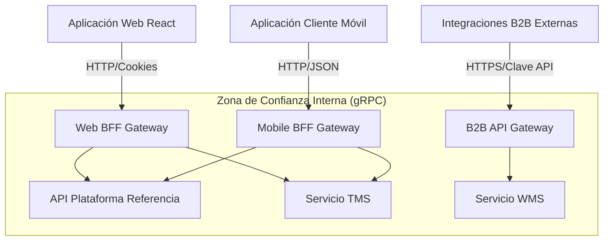

# [ADR 0008](0008-progressive-multimodule-evolution-gateway-bff.md): Evolución Progresiva Multi-Módulo con API Gateway y Patrones BFF

## Estado
Aprobado

## Fecha
2026-05-08

## Contexto
Actualmente, el repositorio de la Plataforma de Referencia opera como un monolito modular. Sin embargo, la plataforma está destinada a escalar hacia un portal unificado para míºltiples módulos corporativos futuros (Gestión de Transporte - TMS, Gestión de Almacén - WMS). Estos deben ser servicios independientes y desacoplados con bases de datos aisladas.

Sin una capa Backend For Frontend (BFF), los clientes diversos (web rica, móvil de bajo ancho de banda, B2B) forzarí­an endpoints genéricos, conduciendo al over-fetching y a una gestión rí­gida del estado del cliente. Necesitamos una estructura para soportar diversos contratos de cliente sin acoplarlos estrechamente a los microservicios del backend.

## Decisión
Adoptar una **Arquitectura de Gateway Backend For Frontend (BFF) Distribuida y Multi-Módulo Progresiva**:

1. **Gateways BFF Dedicados**: Adaptar gateways dedicados para cada tipo de cliente en lugar de compartir un íºnico punto de entrada genérico:
   - **Web BFF**: Maneja sesiones basadas en cookies y agrega cargas íºtiles para visualizaciones de escritorio ricas.
   - **Mobile BFF**: Comprime datos, combina roundtrips para redes de alta latencia y traduce a cargas íºtiles optimizadas para móviles.
   - **B2B API Gateway**: Maneja la limitación de tasa (rate-limiting) y la autenticación con Clave de API para socios externos.

2. **Aislamiento Aguas Abajo**: Los clientes píºblicos NUNCA se comunican directamente con los servicios internos (TMS, WMS). Todo el tráfico fluye a través de los BFFs asignados que actíºan como fronteras de seguridad y composición.

3. **Traducción de Protocolos**: Permitir la comunicación interna de microservicios ví­a gRPC de alta velocidad mientras se traduce a HTTP/REST estándar en el borde del BFF.

### Resumen de la Arquitectura del Sistema

## Consecuencias

### Positivas
- **Rendimiento del Cliente**: Las aplicaciones móviles obtienen exactamente lo que necesitan, reduciendo el uso de datos y los recorridos de red (roundtrips).
- **Escalabilidad Independiente**: Escalar el BFF Móvil independientemente del BFF Web basado en el tráfico de dispositivos en tiempo real.
- **Contratos Desacoplados**: Modificar las APIs internas aguas abajo sin romper las versiones de frontend existentes.

### Negativas
- **Proliferación de Gateways**: Gestionar bases de código separadas para diferentes BFFs incrementa la complejidad de CI/CD.
- Requiere disciplina para mantener la lógica de negocio fuera del BFF (solo deberí­a orquestar y componer).

## Referencias
- [ADR-0030: Kong Gateway vs NestJS BFF](../adrs/core/0030-api-gateway-kong-vs-nestjs.md)

---
[? Volver al Índice](./README.es.md)
