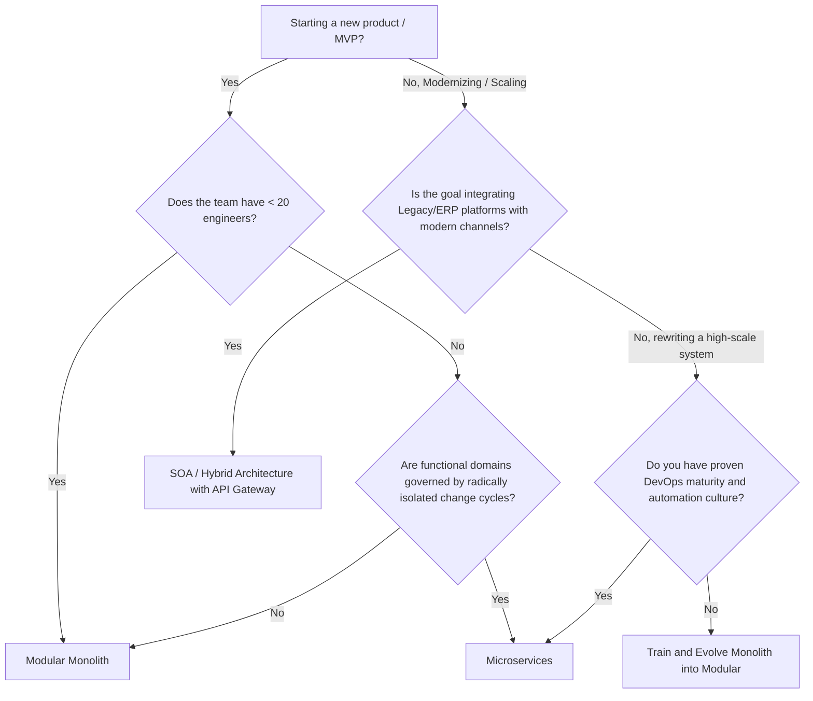
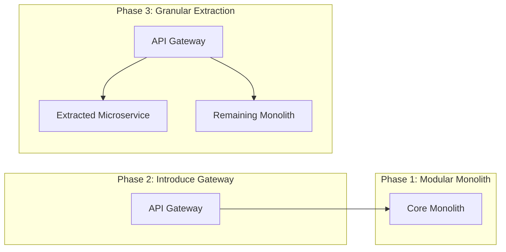

# [ADR 0047](0047-architectural-patterns-monolith-soa-microservices.md): Architectural Selection and Evolution Framework: Monolith vs. SOA vs. Microservices

## 1. Metadata
* **ADR ID:** 0047
* **Title:** Architectural Selection and Evolution Framework: Monolith vs. SOA vs. Microservices
* **Status:** Approved
* **Authors:** Enterprise Architecture Office
* **Reviewers:** Corporate Architecture Board, CTO Office
* **Date:** 2026-05-12
* **Tags:** `Governance`, `Architecture-Patterns`, `Scalability`, `Decision-Framework`
* **Related ADRs:** 
 * [ADR-0006: Future Microservices Transition with Dapr](./0006-future-microservices-transition-dapr.md)
 * [ADR-0032: API Protocol Decision Matrix](./0032-api-protocol-decision-matrix-rest-grpc-graphql.md)
 * [ADR-0045: Microservice Extraction Acceptance Criteria](./0045-microservice-extraction-readiness-criteria.md)

---

## Executive Summary (For the CTO)

Poor selection of an initial or transitional architectural pattern is the primary source of technical bankruptcy in modern engineering organizations. Adopting microservices prematurely destroys *Time-to-Market* through operational overload, while maintaining an excessively coupled monolith prevents organizational scaling across distributed teams.

This ADR establishes the official corporate stance: architecture must evolve symmetrically with business complexity and organizational size. Dogmatic imposition of distributed architectures is strictly forbidden. All new systems shall start as a **Modular Monolith** shielded by Ports & Adapters, migrating toward **Microservices** or **SOA** only when business or operational drivers objectively demand it based on the numerical thresholds defined in this registry.

---

## 2. Problem Context

Organizations face dynamic scaling challenges. The lack of a standard reference framework to decide the architectural style of new products or the modernization of legacy systems generates several corporate failure scenarios:

1. **Premature Over-Engineering in Startups/Greenfield Initiatives:** Implementing microservices with fewer than 10 engineers, resulting in operational paralysis where 80% of effort is consumed by infrastructure and networks instead of delivering business value.
2. **Big Ball of Mud Effect in Mid-sized Enterprises:** Monoliths that started well but lost their logical boundaries, requiring regression cycles spanning weeks, with deployments failing constantly due to side-coupling of code and databases.
3. **Integration Paralysis in Large Corporations (Enterprise):** Hybrid ecosystems where dozens of commercial platforms (SaaS, legacy ERPs) and in-house developments attempt to communicate without a clear contract strategy, resulting in fragile cascading dependencies.

This document mitigates these risks by establishing clear, quantifiable decision rules aligned with business realities.

---

## 3. Architectural Drivers

The evaluation of each alternative is weighted against 15 critical drivers, prioritized corporately:

1. **Time-to-Market (TTM):** The speed of bringing a feature from idea to production.
2. **Team Autonomy:** The ability of a team to design, develop, and deploy code without needing synchronization with other teams.
3. **Operational Complexity:** The level of specialized DevOps and platform engineering skills required to operate the system.
4. **Maintainability:** The ease of understanding, debugging, and modifying source code.
5. **Scalability (Compute/Data):** Efficiency in handling load increases in specific system functions.
6. **Resilience / Fault Isolation:** The ability to prevent a crash in one domain from taking down the entire ecosystem.
7. **Legacy Integration:** The ability to coexist with and extract value from pre-existing legacy or commercial systems.
8. **Deployment Frequency:** The number of successful deployments possible in a given period (daily, weekly, monthly).
9. **Upfront vs. Ongoing Costs:** Budgetary efficiency in both short and long term.
10. **Observability:** The effort to diagnose errors across business flow interactions.
11. **Testing:** Complexity of unit, integration, and end-to-end (E2E) testing cycles.
12. **Data Governance:** Centralization vs. decentralization of the data lifecycle.
13. **Vendor Lock-in:** The degree of coupling to a specific Cloud or On-Premise provider.
14. **Cloud Readiness:** Ease of execution in Cloud Native vs. traditional server architectures.
15. **Compliance:** Regulatory requirements for physical or regional data isolation.

---

## 4. Evaluated Options

### Option A - Monolith (With focus on Modular / Hexagonal Monolith)

Consists of a single deployment artifact hosting all domain business logic. The corporate standard mandates the **Modular Monolith** sub-pattern with **Hexagonal Architecture**, where isolation is absolute at the code level even if the runtime process and database schema are unified (or logically partitioned).

* **Advantages:**
 * Low intra-process latency (in-memory calls).
 * Trivial refactoring.
 * Straightforward CI/CD with low operational overhead.
 * Native ACID transactions guaranteed by the database engine.
 * Simplified E2E testing without excessive network mocking.
* **Disadvantages:**
 * Single point of deployment failure (a fatal bug in one module can crash the entire process).
 * Heterogeneous memory/CPU hogging (scaling module A forces scaling the whole system).
 * Team saturation starting at >25-30 engineers working concurrently.
* **When to Use:** Phase 1 of any product; market validation (MVP); teams with <15 engineers; highly transactional domains.
* **Costs and Complexity:** Minimal at start. Costs scale non-linearly only if module isolation degrades.

### Option B - SOA (Service-Oriented Architecture)

An integration-centric enterprise paradigm. Systems expose capabilities through interoperable services with strict contracts (usually SOAP or REST), typically governed by an Enterprise Service Bus (ESB). SOA focuses on reusing existing components rather than developing new modular services.

* **Advantages:**
 * Excellent for coexisting disparate technologies (Mainframes, Java, .NET, SaaS).
 * Rigid integration contracts that guarantee organizational consistency.
 * Facilitates complex orchestration of heterogeneous enterprise flows.
* **Disadvantages:**
 * **ESB Bottleneck Effect:** The service bus tends to absorb heavy business logic, becoming impossible to scale or maintain.
 * Heavy synchronization and high latency between services.
 * Bureaucratic and highly centralized contract governance.
* **When to Use:** Large enterprises that must unify pre-existing packaged platforms (ERPs, CRMs, legacy Core Banking) with modern digital channels.

### Option C - Microservices

Decomposing an application into a set of small, autonomous, independently deployable services aligned strictly with Domain-Driven Design (DDD) Bounded Contexts. Each microservice possesses its own data storage (*Database-per-service*) and communicates over the network using lightweight protocols (REST, gRPC, Pub/Sub).

* **Advantages:**
 * Complete operational autonomy: One team can deploy 50 times a day without affecting others.
 * Selective resource scaling.
 * Absolute fault isolation: If the notification service dies, the payments core remains functional.
 * Facilitates adopting polyglot stacks optimized per use case.
* **Disadvantages:**
 * **Distributed Complexity:** Complicated distributed transactions (Saga Pattern), inherent network latency.
 * Requires serious DevOps maturity, CI/CD, Observability, and Automation.
 * Forced eventual consistency of data.
* **When to Use:** Massive scale systems (>1M RPM); organizations with multiple independent teams working on parallel sub-domains; heterogeneous availability or security requirements.

---

## 5. Comparative Matrix

| Attribute | Modular Monolith | Traditional Corporate SOA | Cloud-Native Microservices |
| :--- | :--- | :--- | :--- |
| **Initial Complexity** | Very Low | ¡ High | Critical |
| **Initial Time-to-Market**| Immediate | ¡ Slow | Very Slow |
| **Team Autonomy** | ¡ Limited (>25 devs) | ¡ Intermediate | Maximum |
| **Compute Scalability** | ¡ Vertical / Homogeneous | Horizontal | Granular / Selective |
| **Data Consistency** | Strongly ACID | Centralized / Distributed | Eventual Consistency |
| **Debugging / Support** | Simple (Local) | ¡ Complex (Remote) | Extremely Complex |
| **Deployment (DevOps)** | Docker Compose / VM | ¡ Centralized Servers | Kubernetes / Service Mesh |
| **Observability** | Standard Logs/APM | ¡ ESB Tracking | W3C Distributed Tracing |
| **Fault Tolerance** | None (Single process) | ¡ Medium | Excellent (Circuit Breaker)|
| **Base Operating Cost** | Very Low ($) | High ($$$) | Critical ($$$$) |

---

## 6. Decision Framework (Logic Tree & Scoring Model)

### Decision Tree Diagram (Mermaid)

### Critical Checklist for Enabling Microservices
Before authorizing a migration to Microservices, a team MUST be able to answer **"Yes"** to a minimum of 4 of the following 5 items (Corporate Governance):

1. [] **Mature CI/CD:** Can we deploy automatically in <10 minutes without manual human intervention?
2. [] **Production Monitoring:** Do we have centralized logs and operational distributed tracing fully instrumented?
3. [] **Data Separation:** Do we understand and accept the impact of refactoring a shared database into a decentralized model with eventual consistency?
4. [] **Platform Staff:** Do we have a dedicated Platform Engineering team capable of operating K8s clusters, meshes, or hybrid clouds?
5. [] **Real Scaling Pain:** Have we empirically identified a production bottleneck that CANNOT be resolved with vertical scaling or queue isolation within the monolith?

---

## 7. Architectural Evolution Signals (Progressive Evolution)

### When to migrate from Monolith to Microservices:
* **Pull Request Saturation:** Engineers spend more time resolving code merge conflicts or waiting in line to deploy than writing valuable code.
* **Disproportionate Scalability:** A specific module consumes 90% of resources, forcing massive monolith instances to spin up at unsustainable costs.
* **Divergent Security/Compliance Needs:** A sub-domain handles highly sensitive data (e.g., PCI DSS), requiring physical extraction to avoid auditing the entire monolith.

### « When NOT to migrate to Microservices (False Friends):
* **"The code is messy":** Migrating a spaghetti monolith to microservices results in a **Spaghetti Distributed Monolith**, which is exponentially worse. First clean up the code as a Modular Monolith.
* **"We want to use trendy technologies":** Architecture should never be decided via CV-Driven Development.
* **"We are a team of 5 people":** There is insufficient bandwidth to support the microservices network and governance overhead.

---

## 8. Anti-Patterns and Common Errors

1. **The Distributed Monolith:** Services that are physically separated but call each other synchronously and sequentially via HTTP to complete simple transactions. This breaks availability geometrically ($0.99^5 = 0.95$).
2. **Nanoservices:** Ridiculous atomic decomposition (e.g., one service to "CreateUser", another to "UpdateUser"). Generates an unmanageable tangle of networks and dependencies.
3. **Shared Database Integration:** Multiple microservices hitting the same tables in a centralized database. This violates data isolation; a single schema change breaks all services at once.
4. **Smart Pipes, Dumb Endpoints (Heavy Logic in ESB/API Gateway):** Writing complex data transformation scripts and business logic inside the Gateway or ESB. Concentrates core business mechanics outside of controlled domain code.

---

## 9. Architectural Recommendation by Organization Type

1. **Startups / MVP:** **Modular Monolith (Mandatory).** Absolute focus on finding Product-Market Fit. Zero premature operational complexity.
2. **Multi-Tenant SaaS:** **Modular Monolith initially -> Microservices for high-compute Core at Maturity.** Allows efficient native RLS isolation management before dispersing information.
3. **Fintech / High-Scale E-commerce:** **Hybrid Architecture.** Event-driven microservices for transaction and billing processing (high availability and granular scaling), coupled with Modular Monolith for Administrative Back-office tasks.
4. **Banking / Traditional Corporations:** **SOA / API Gateway Integration.** Coexists with the Legacy Core through abstraction layers, exposing lightweight APIs externally for phased modernization.

---

## 10. Canonical Evolution Strategy (Strangler Fig Methodology)

Monolith evolution is executed using the **Strangler Fig** pattern governed by the Corporate API Gateway, eliminating the risk of a "Big Bang rewrite":

1. **Step 1 (Modularize):** Refactor the Monolith by splitting clean physical directories or libraries in the monorepo under Ports and Adapters.
2. **Step 2 (API Gateway):** Position Kong/API Gateway in front of the monolith. All external communication routes through it.
3. **Step 3 (Extract Data):** Isolate the chosen sub-domain's data schema within the primary engine.
4. **Step 4 (Extract Service):** Convert the internal library into an independent network process (Nx Microproject), transparently rerouting traffic at the Gateway.

---

## 11. Adoption Consequences

### Positive (Expected Benefits):
* **Budget Efficiency:** 60% reduction in initial infrastructure costs by avoiding oversized clusters for MVPs.
* **Organizational Clarity:** Technical leaders know exactly what metrics to look for before decomposed architectures are debated, reducing dogmatic friction.
* **Low Structural Debt:** Since the modular monolith mandates Ports & Adapters, eventual microservice migrations require zero core business logic rewrites.

### Negative (Accepted Risks):
* **Engineering Resistance:** Engineers with a strong Cloud-Native bias may perceive "Monolith First" as a technical step backward, necessitating cultural mentorship on the economics of architecture.
* **Greater Internal Rigor:** Keeping a Modular Monolith clean demands rigorous static boundary analysis tooling (`eslint-plugin-boundaries` or `ArchUnit`) to prevent layer leakage.

---

## Strategic Conclusion
There are no silver bullets. The **Monolith** is not an obsolete technology; it is an optimized pattern for initial speed and cohesion. **Microservices** are not the ultimate goal; they are a powerful tool to solve massive concurrency and organizational autonomy issues at the expense of extreme operational complexity. **SOA** is the bridge that enables enterprises to coexist efficiently with legacy estates.

This ADR defines our corporate pragmatic posture: **Strict modularity always, network distribution only when it hurts.**

---
[Back to Index](./README.md)
