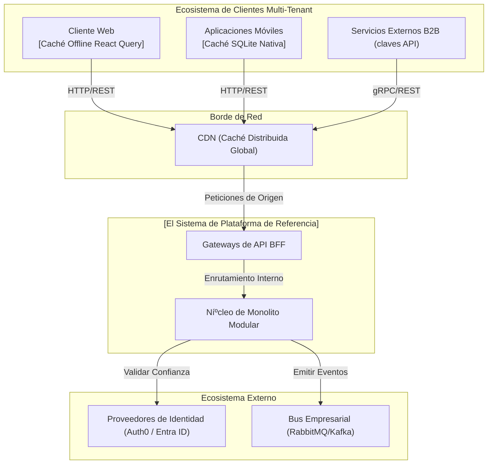
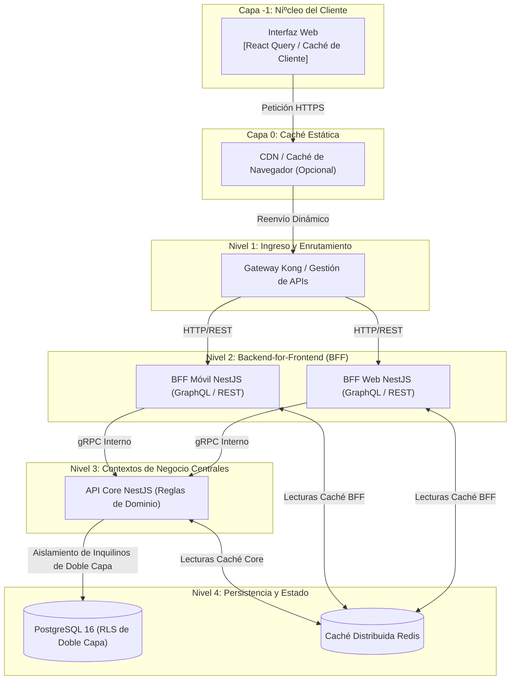
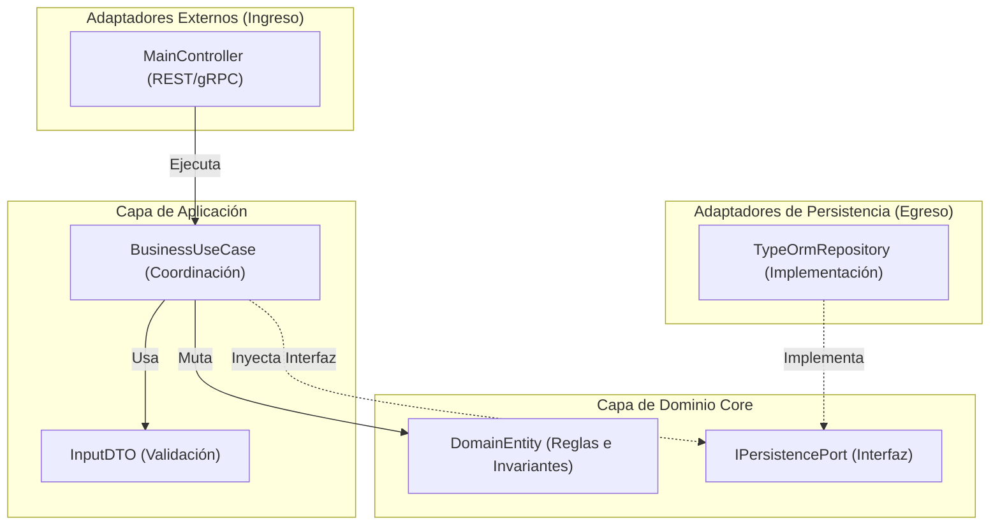

# 🏗️ Especificación de Arquitectura y Especificaciones de Modelado C4

Este documento detalla el riguroso diseí±o arquitectónico de grado empresarial para la plataforma de referencia, conforme al estándar del blueprint **arc42** (ARC32). El diseí±o implementa un ecosistema **SaaS Multi-Tenant** avanzado utilizando **Gateways BFF** para gestionar la entrega a clientes.

---

## 🗺️ 1. Estructura Estática del Sistema (Modelo C4)

### Nivel 1: Diagrama de Contexto del Sistema
Define nuestro sistema delimitado dentro del ecosistema empresarial, sus consumidores (inquilinos) y actores externos activos.

### Nivel 2: Diagrama de Contenedores (Tiempo de Ejecución de Alta Densidad)
Demuestra la segregación fí­sica de los puntos de entrada de comunicación (BFFs) hasta la infraestructura de la base de datos multi-tenant.

### Nivel 3: Diagrama de Componentes de API (Arquitectura Hexagonal)
Desglose del acoplamiento interno dentro de la **API Core de NestJS**.

---

## 📜 2. El Libro de Decisiones Aprobadas (ADRs)

Segíºn lo validado por el Arquitecto Principal, estas decisiones fundacionales están **oficialmente Aprobadas** y son obligatorias para la implementación del sistema.

### 🟢 Grupo A: Fundamentos y Estándares Core
1.  **[ADR 0001: Orquestación de Monorepo](../adrs-es/core/0001-monorepo-orchestration-nx.md)**: Nx y espacios de trabajo npm para un CI/CD lineal y centralizado.
2.  **[ADR 0002: Arquitectura Hexagonal Limpia](../adrs-es/nodejs/0002-clean-architecture-nestjs.md)**: Separación de la lógica core del código del framework.
3.  **[ADR 0003: Estándares Estrictos de TypeScript](../adrs-es/nodejs/0003-strict-typescript-standards.md)**: Tipado absoluto, sin `any`, reglas de ESLint obligatorias.
4.  **[ADR 0005: Seguridad Cero-Costo CodeQL](../adrs-es/core/0005-ci-cd-quality-codeql.md)**: Detección automatizada de vulnerabilidades dentro de la pipeline.
5.  **[ADR 0009: Fijación Estricta de Dependencias](../adrs-es/core/0009-strict-dependency-pinning-vulnerability-management.md)**: Bloqueo de actualizaciones dinámicas para prevenir brechas en la cadena de suministro.

### 🟠 Grupo B: SaaS, Escalabilidad y Distribución
6.  **[ADR 0006: Transición futura a Microservicios ví­a Dapr](../adrs-es/core/0006-future-microservices-transition-dapr.md)**: Desacoplamiento de activadores para romper monolitos en redes de nodos de malla.
7.  **[ADR 0007: Observabilidad ví­a OpenTelemetry](../adrs-es/nodejs/0007-observability-telemetry-loki-opentelemetry.md)**: Trazado distribuido a través de BFF, API y BD.
8.  **[ADR 0008: Patrones BFF](../adrs-es/nodejs/0008-progressive-multimodule-evolution-gateway-bff.md)**: Integración multi-canal a través de capas de traducción dedicadas.
9.  **[ADR 0010: Estrategia de Arquitectura Multi-Tenancy SaaS](../adrs-es/core/0010-multi-tenancy-architecture-strategy.md)**: Implementación de Seguridad a Nivel de Fila (RLS) fí­sica dentro de PostgreSQL para garantizar el aislamiento.
10. **[ADR 0011: Circuit Breakers de Tolerancia a Fallos](../adrs-es/core/0011-fault-tolerance-resiliency-patterns.md)**: Prevención de degradación en cascada utilizando `opossum`.
11. **[ADR 0013: Topologí­a de Recuperación ante Desastres](../adrs-es/core/0013-cloud-infrastructure-topology-dr.md)**: Diseí±o de nodos multi-región.
12. **[ADR 0014: Caché Distribuida](../adrs-es/core/0014-distributed-caching-strategy-redis.md)**: Aliviar la base de datos a través de Redis centralizado.
13. **[ADR 0015: Arquitectura Dirigida por Eventos](../adrs-es/core/0015-event-driven-architecture-intra-domain.md)**: Mensajerí­a así­ncrona entre contextos delimitados.
14. **[ADR 0016: Auditorí­a de Negocio Inmutable](../adrs-es/core/0016-immutable-business-audit-trail.md)**: Sistema de registro que graba diffs de estado transaccional completos.

### 🔵 Grupo C: Integración, Identidad y Gobernanza
15. **[ADR 0020: Abstracción de Proveedor de Identidad](../adrs-es/core/0020-identity-provider-abstraction-strategy.md)**: Abstracción de puerto para Okta/Entra ID/Auth0.
16. **[ADR 0021: Gráficos de Auth de Alto Rendimiento](../adrs-es/nodejs/0021-high-performance-auth-and-graph-compilation.md)**: Requisitos de latencia por debajo de 5ms.
17. **[ADR 0026: MFA y Seguridad Adaptativa](../adrs-es/nodejs/0026-mfa-passwordless-adaptive-authentication.md)**: Soporte para WebAuthn y Passkeys.
18. **[ADR 0027: Protocolos Duales REST y gRPC](../adrs-es/nodejs/0027-dual-protocol-rest-grpc-api-gateway.md)**: Streaming interno de alto rendimiento ví­a gRPC.
19. **[ADR 0030: Kong Gateway vs NestJS Gateway](../adrs-es/core/0030-api-gateway-kong-vs-nestjs.md)**: Separación de proxies de infraestructura de la orquestación de negocio.
20. **[ADR 0029: Primitivas DDD Tácticas](../adrs-es/nodejs/0029-tactical-ddd-primitives-library.md)**: Utilización obligatoria de `@nestjslatam/ddd` estandarizado.
21. **[ADR 0032: Matriz de Decisión de Protocolo de API](../adrs-es/core/0032-api-protocol-decision-matrix-rest-grpc-graphql.md)**: Marco de evaluación que impone REST para exposición píºblica, gRPC para backbones internos y GraphQL para la agregación optimizada de BFF.

### 🟣 Grupo D: Preparación para la Evolución a Microservicios
22. **[ADR 0031: Esquema por Contexto y Catálogo de Eventos de Dominio](../adrs-es/core/0031-schema-per-context-domain-event-catalog.md)**: Cada contexto delimitado posee un esquema PostgreSQL dedicado (`auth` | `tasks` | `taxonomy` | `audit`). Toda la comunicación entre contextos se rige por un Catálogo formal de Eventos de Dominio con contratos de carga íºtil tipados, permitiendo la extracción de microservicios sin migración.

---
[? Volver al Índice](./README.es.md)
