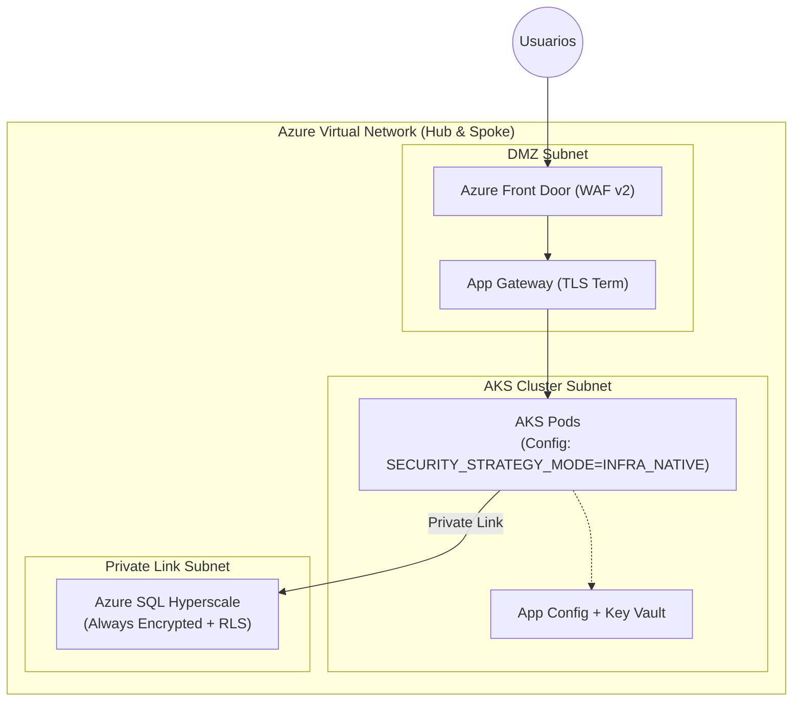
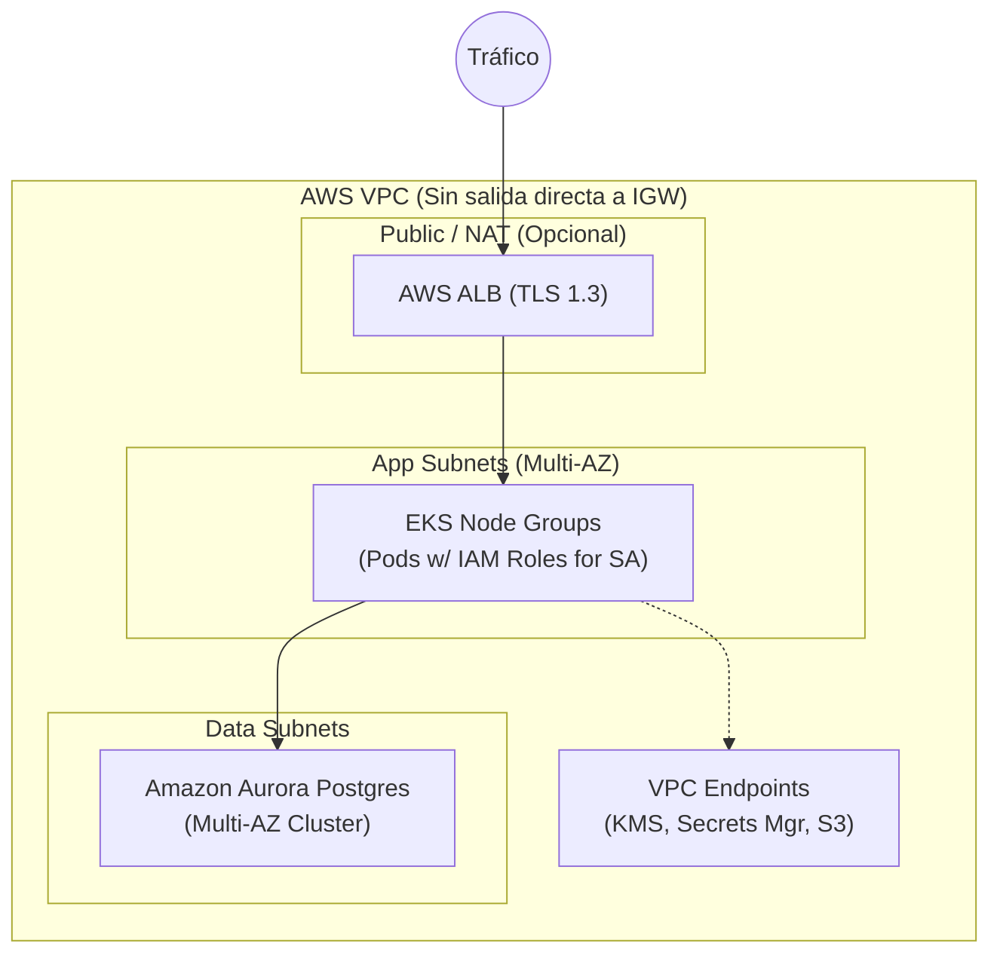
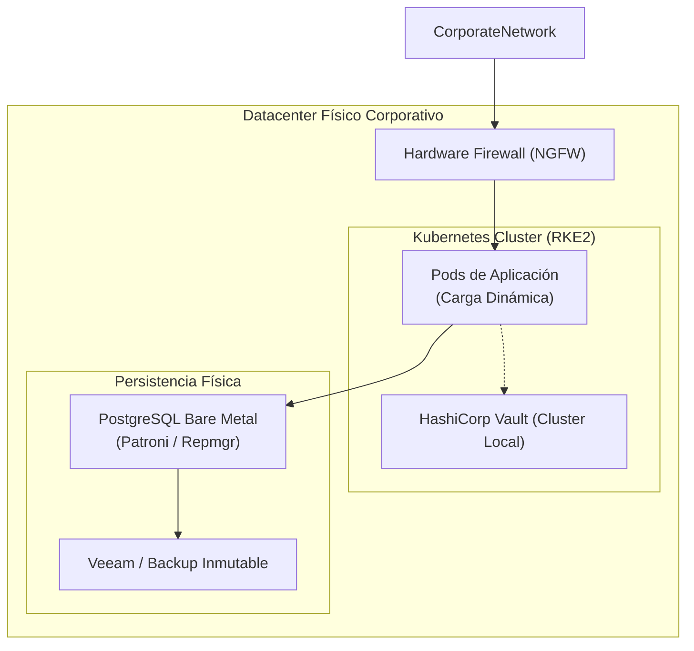
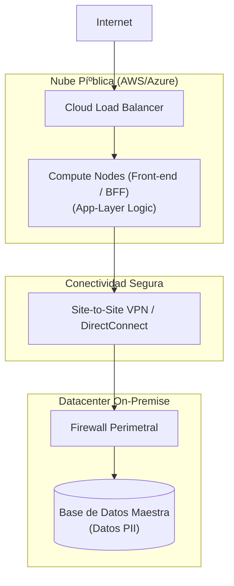

# 🗺️ Escenarios de Despliegue Multi-Nube y Cumplimiento

> 🌍 **Navegación Bilingí¼e:** [🇺🇸 English Version](../../standards/architecture/multi-cloud-deployment-scenarios.md)

Este documento detalla las arquitecturas de despliegue aprobadas para la Arquitectura Corporativa, considerando controles rigurosos de soberaní­a de datos, seguridad y la adaptabilidad del selector de estrategia de seguridad (`SECURITY_STRATEGY_MODE`).

---

## 🌐 1. Introducción al Cumplimiento Operativo

Cualquier implementación fí­sica de la arquitectura debe satisfacer las directrices del **RGPD** (Reglamento General de Protección de Datos) y la norma **ISO/IEC 27001:2022**, especí­ficamente en los dominios de A.8 (Seguridad de los Activos) y A.10 (Criptografí­a).

| Vector de Control | Estándar Corporativo | Enfoque en Arquitectura Hexagonal |
| :--- | :--- | :--- |
| **Soberaní­a** | Restricción geográfica fí­sica. | Adaptadores de persistencia especí­ficos por región legal. |
| **Cifrado** | En reposo (AES-256) y tránsito (TLS 1.3). | Terminado en TLS de Gateway, encriptación nativa de BD. |
| **Segregación** | Control de Acceso Basado en Atributos (ABAC). | Lógica delegada al Selector (`INFRA_NATIVE` vs `APP_AGNOSTIC`). |

---

## 🔵 2. Escenario AZURE: Cumplimiento Estricto Empresarial

Orientado a sectores altamente regulados (Banca, Salud) que requieren auditorí­a exhaustiva y cifrado "hardware-backed".

### 2.1 Blueprint de Red y Seguridad


### 2.2 Implementación de Seguridad
- **Modo:** `INFRA_NATIVE` forzoso. La seguridad a nivel de fila se delega a polí­ticas de SQL Server nativas, asegurando que incluso los administradores de DB sin la clave maestra no vean datos de inquilinos.
- **Gestión de Flag:** Las etiquetas de entorno en **Azure App Configuration** inyectan dinámicamente el valor al contenedor en tiempo de arranque.

### 2.3 Infraestructura como Código (Bicep Sample)
```bicep
// Habilitación de RLS y Cifrado Avanzado en Azure SQL
resource sqlServer 'Microsoft.Sql/servers@2023-05-01-preview' = {
  name: 'sql-bmad-prod'
  location: 'westeurope' // Cumplimiento de Región UE
  properties: {
    administratorLogin: 'sysadmin'
    // Restringir a Microsoft Entra Auth solo
    minimalTlsVersion: '1.2'
    publicNetworkAccess: 'Disabled'
  }
}

resource sqlDB 'Microsoft.Sql/servers/databases@2023-05-01-preview' = {
  parent: sqlServer
  name: 'sqldb-tenants'
  location: 'westeurope'
  sku: {
    name: 'GP_Gen5_4'
  }
  properties: {
    zoneRedundant: true
  }
}

// Azure Policy para restringir Regiones (Soberaní­a)
resource policyAssignment 'Microsoft.Authorization/policyAssignments@2023-04-01' = {
  name: 'restrict-to-europe'
  properties: {
    policyDefinitionId: '/providers/Microsoft.Authorization/policyDefinitions/e56962a6-4747-49cd-b67b-bf8b01975c4c'
    parameters: {
      listOfAllowedLocations: {
        value: [
          'westeurope'
          'northeurope'
        ]
      }
    }
  }
}
```

### 2.4 Matrices Operativas
**Matriz de Cumplimiento:**
| Control ISO 27001 | Requisito | Solución Azure |
| :--- | :--- | :--- |
| **A.10.1.1** | Polí­tica Criptográfica | Cifrado Determiní­stico Always Encrypted gestionado en Key Vault. |
| **A.8.1.3** | Uso Aceptable de Activos | Azure Policy impide aprovisionar recursos fuera de fronteras de la UE. |

**Análisis CAP:**
- **Resultado:** **CP** (Consistencia y Tolerancia a Particiones).
- **Impacto:** Azure SQL con redundancia de zona garantiza consistencia fuerte en transacciones concurrentes, a costa de latencia imperceptible en escrituras sí­ncronas inter-zona.

---

## 🟠 3. Escenario AWS: Resiliencia Global y Privacidad Total

Orientado a escalado global con aislamiento total de red, donde las llaves de cifrado pertenecen y son rotadas exclusivamente por el cliente (CMK).

### 3.1 Blueprint de Red y Seguridad


### 3.2 Implementación de Seguridad
- **Privacidad de Red:** Los pods de la aplicación no tienen acceso directo a Internet. Toda comunicación con servicios AWS (KMS para llaves de cifrado) se realiza mediante **VPC Endpoint Services (PrivateLink)**.
- **Estrategia Hí­brida:** Permite rotar a `APP_AGNOSTIC` para bases de datos secundarias NoSQL (como DynamoDB) donde RLS no sea nativo, manteniendo el cifrado transparente ví­a CMK.

### 3.3 Infraestructura como Código (Terraform Sample)
```hcl
# Definición de Cluster Aurora con CMK de Cliente
resource "aws_kms_key" "db_encryption_key" {
  description             = "KMS Key for Customer Data Compliance"
  deletion_window_in_days = 7
  enable_key_rotation     = true # ISO 27001 A.10.1.2
}

resource "aws_rds_cluster" "aurora_cluster" {
  cluster_identifier      = "bmad-aurora-cluster"
  engine                 = "aurora-postgresql"
  database_name          = "corporate_db"
  master_username        = "admin"
  master_password        = var.db_password
  
  storage_encrypted      = true
  kms_key_id            = aws_kms_key.db_encryption_key.arn
  
  vpc_security_group_ids = [aws_security_group.data_sg.id]
  db_subnet_group_name   = aws_db_subnet_group.private_subnets.name
  
  # Resiliencia Multi-AZ
  availability_zones     = ["us-east-1a", "us-east-1b", "us-east-1c"]
  backtrack_window       = 259200 # 72 Horas de recuperación de desastres
}
```

### 3.4 Matrices Operativas
**Matriz de Cumplimiento:**
| Control ISO 27001 | Requisito | Solución AWS |
| :--- | :--- | :--- |
| **A.13.1.1** | Controles de Red | El tráfico no cruza Internet Píºblica gracias a PrivateLink Endpoints. |
| **RGPD Art. 32** | Seudonimización | Separación fí­sica de llaves KMS y datos PostgreSQL encriptados. |

**Análisis CAP:**
- **Resultado:** **AP** (Disponibilidad y Tolerancia a Particiones).
- **Impacto:** Configurado con Aurora Reader Endpoints, el sistema prioriza responder lecturas desde cualquier AZ activa, manejando una réplica eventual sub-10ms.

---

## 🟢 4. Escenario ON-PREMISE: Control Total y Soberaní­a Extrema

Diseí±ado para implementaciones gubernamentales o instalaciones locales aisladas (Air-Gapped) donde la soberaní­a fí­sica es absoluta.

### 4.1 Blueprint de Red y Seguridad


### 4.2 Implementación de Seguridad
- **Modo:** Generalmente configurado en `APP_AGNOSTIC` inyectado mediante **HashiCorp Vault**, ya que permite una auditorí­a criptográfica de accesos en capas superiores antes de llegar a motores DB que puedan no soportar RLS dinámico corporativo avanzado.
- **Respaldo:** Estrategia de backups inmutables con retención estricta de 5 aí±os localmente para cumplir con leyes de auditorí­a de datos financieros.

### 4.3 Infraestructura como Código (Terraform for Vault)
```hcl
# Configuración de inyección de secretos y Flags mediante Vault
resource "vault_mount" "kvv2" {
  path        = "secret"
  type        = "kv"
  options     = { version = "2" }
  description = "Secret storage for App Settings"
}

resource "vault_kv_secret_v2" "app_config" {
  mount = vault_mount.kvv2.path
  name  = "production/application-settings"
  
  data_json = jsonencode({
    SECURITY_STRATEGY_MODE = "APP_AGNOSTIC"
    DB_ENCRYPTION_KEY      = var.master_onprem_key
  })
}

# Regla de acceso para el Pod ServiceAccount
resource "vault_policy" "app_reader" {
  name   = "app-policy"
  policy = <<EOT
path "secret/data/production/application-settings" {
  capabilities = ["read"]
}
EOT
}
```

### 4.4 Matrices Operativas
**Matriz de Cumplimiento:**
| Requisito Legal | Control | Solución On-Premise |
| :--- | :--- | :--- |
| **Soberaní­a Absoluta** | Localización Fí­sica | Los datos nunca salen de la propiedad fí­sica de la empresa. |
| **ISO 27001 A.12.3** | Respaldos | Estrategia de Respaldo en Cinta / Almacenamiento Objeto S3 Local Inmutable. |

**Análisis CAP:**
- **Resultado:** **CP** (Foco extremo en consistencia local).
- **Impacto:** Latencias ultrabajas (< 1ms) al estar la computación y los datos en la misma red fí­sica cableada. Riesgo de disponibilidad ante desastres naturales a menos que se despliegue un sitio de réplica DR secundario.

---

## 🟣 5. Escenario HíBRIDO: Emergencia y Transición Elástica

Orientado a absorber picos de tráfico repentinos o cuando la regulación permite computación en nube pero exige persistencia local (Leyes de Protección de Datos restrictivas).

### 5.1 Blueprint de Red y Seguridad


### 5.2 Flujo de Datos y Optimización de Latencia
Al operar en un entorno hí­brido, la latencia de red introduce cuellos de botella significativos en el intercambio de datos SQL.

**Optimización bajo `APP_AGNOSTIC`:**
1.  El adaptador de infraestructura de la aplicación en la nube **no** realiza consultas genéricas seguidas de filtrado en memoria (lo cual inundarí­a la VPN con datos innecesarios).
2.  El selector inyecta el contexto de seguridad (`tenant_id`, `user_roles`) directamente en la cláusula `WHERE` de la sentencia SQL enviada.
3.  **Beneficio de Latencia:** Solo viaja por la VPN el set de datos estrictamente filtrado y autorizado. La auditorí­a se realiza en la capa de aplicación Cloud y se escribe así­ncronamente a un log local redundante.

### 5.3 Matrices Operativas
**Matriz de Cumplimiento:**
| Control ISO 27001 | Requisito | Solución Hí­brida |
| :--- | :--- | :--- |
| **RGPD Art. 44** | Transferencias Internacionales | Los datos residen en territorio nacional (On-Prem), solo se procesan volatilmente en la nube mediante tíºneles IPSec. |

**Análisis CAP:**
- **Impacto de Red:** El sistema está altamente expuesto a la **P** (Partición de red). Una caí­da de la conexión DirectConnect/VPN deja inoperativa la nube.
- **Estrategia de Mitigación:** Se requiere un patrón de Circuit Breaker local en la nube con caché distribuida de solo-lectura (ej. Valkey/Redis) para mantener la disponibilidad degradada ante caí­das de enlace.

---

## 📜 6. Resumen Directivo para la Toma de Decisiones

| Variable | Azure | AWS | On-Premise | Hí­brido |
| :--- | :--- | :--- | :--- | :--- |
| **Complejidad Ops** | Media | Media-Alta | Alta | Máxima |
| **Flexibilidad de Flag** | Recomendado `INFRA` | Mixto | Recomendado `APP` | Recomendado `APP` |
| **Agilidad de Escala** | Máxima | Máxima | Limitada | Alta (Compute) |
| **Compliance Overhead** | Bajo (Out-of-the-box) | Medio | Alto (Manual) | Muy Alto |

---
[? Volver al Índice](./README.es.md)
