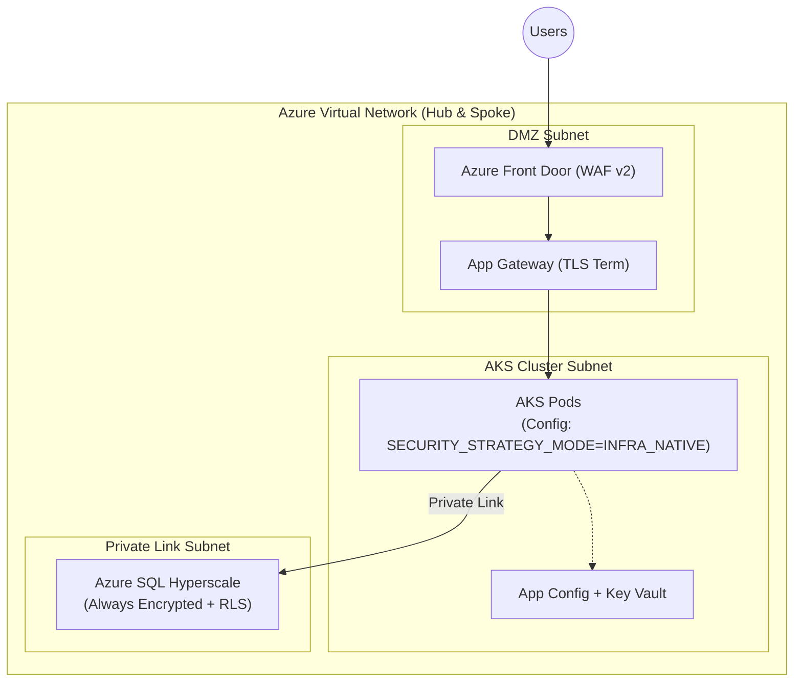
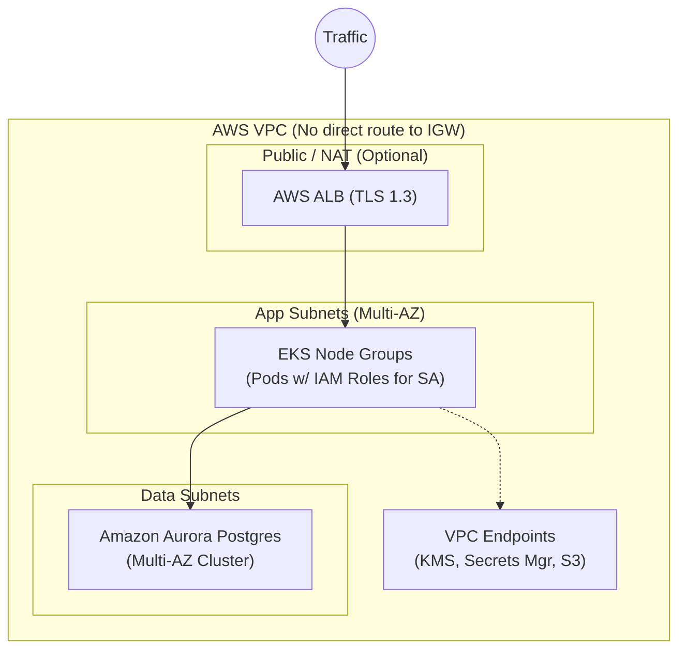
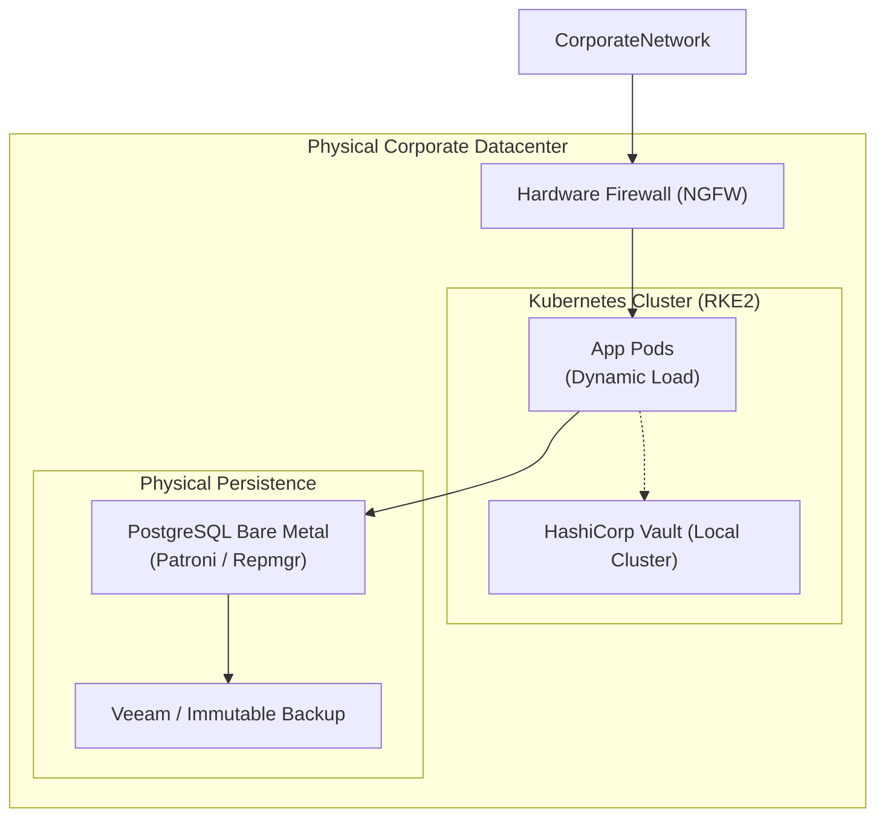
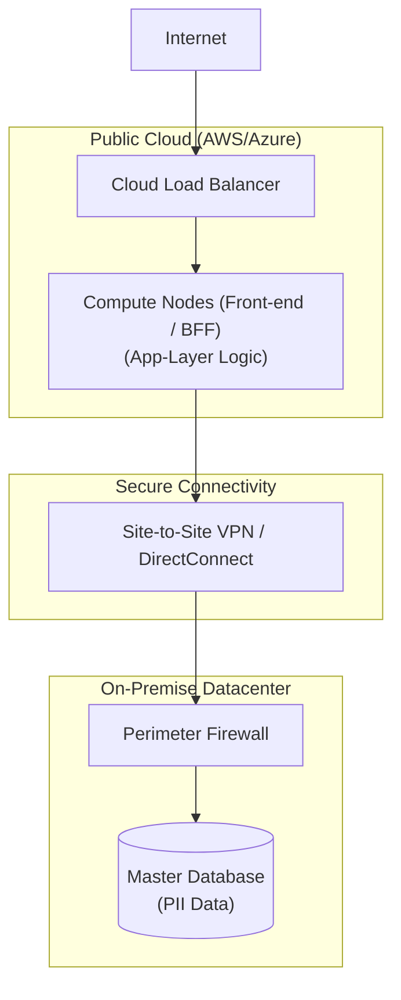

# 🗺️ Multi-Cloud Deployment and Compliance Scenarios

> 🌍 **Bilingual Navigation:** [🇪🇸 Versión en Espaí±ol](../../standards-es/architecture/multi-cloud-deployment-scenarios.md)

This document details the approved deployment architectures for the Corporate Architecture, considering rigorous controls for data sovereignty, security, and the adaptability of the security strategy selector (`SECURITY_STRATEGY_MODE`).

---

## 🌐 1. Introduction to Operational Compliance

Any physical implementation of the architecture must satisfy the guidelines of the **GDPR** (General Data Protection Regulation) and the **ISO/IEC 27001:2022** standard, specifically in domains A.8 (Asset Security) and A.10 (Cryptography).

| Control Vector | Corporate Standard | Hexagonal Architecture Focus |
| :--- | :--- | :--- |
| **Sovereignty** | Physical geographic restriction. | Region-specific legal persistence adapters. |
| **Encryption** | At rest (AES-256) and in transit (TLS 1.3). | Terminated at the Gateway TLS, native DB encryption. |
| **Segregation** | Attribute-Based Access Control (ABAC). | Logic delegated to the Selector (`INFRA_NATIVE` vs `APP_AGNOSTIC`). |

---

## 🔵 2. AZURE Scenario: Strict Enterprise Compliance

Geared towards highly regulated sectors (Banking, Healthcare) requiring exhaustive auditing and hardware-backed encryption.

### 2.1 Network and Security Blueprint


### 2.2 Security Implementation
- **Mode:** Enforced `INFRA_NATIVE`. Row-level security is delegated to native SQL Server policies, ensuring that even DB administrators without the master key cannot view tenant data.
- **Flag Management:** Environment tags in **Azure App Configuration** dynamically inject the value into the container at startup time.

### 2.3 Infrastructure as Code (Bicep Sample)
```bicep
// Enabling RLS and Advanced Encryption in Azure SQL
resource sqlServer 'Microsoft.Sql/servers@2023-05-01-preview' = {
  name: 'sql-bmad-prod'
  location: 'westeurope' // EU Region Compliance
  properties: {
    administratorLogin: 'sysadmin'
    // Restrict to Microsoft Entra Auth only
    minimalTlsVersion: '1.2'
    publicNetworkAccess: 'Disabled'
  }
}

resource sqlDB 'Microsoft.Sql/servers/databases@2023-05-01-preview' = {
  parent: sqlServer
  name: 'sqldb-tenants'
  location: 'westeurope'
  sku: {
    name: 'GP_Gen5_4'
  }
  properties: {
    zoneRedundant: true
  }
}

// Azure Policy to restrict Regions (Sovereignty)
resource policyAssignment 'Microsoft.Authorization/policyAssignments@2023-04-01' = {
  name: 'restrict-to-europe'
  properties: {
    policyDefinitionId: '/providers/Microsoft.Authorization/policyDefinitions/e56962a6-4747-49cd-b67b-bf8b01975c4c'
    parameters: {
      listOfAllowedLocations: {
        value: [
          'westeurope'
          'northeurope'
        ]
      }
    }
  }
}
```

### 2.4 Operational Matrices
**Compliance Matrix:**
| ISO 27001 Control | Requirement | Azure Solution |
| :--- | :--- | :--- |
| **A.10.1.1** | Cryptographic Policy | Always Encrypted Deterministic Encryption managed via Key Vault. |
| **A.8.1.3** | Acceptable Use of Assets | Azure Policy prevents provisioning resources outside of EU borders. |

**CAP Analysis:**
- **Result:** **CP** (Consistency and Partition Tolerance).
- **Impact:** Azure SQL with zone redundancy guarantees strong consistency across concurrent transactions at the cost of negligible latency in synchronous inter-zone writes.

---

## 🟠 3. AWS Scenario: Global Resilience and Total Privacy

Aimed at global scaling with complete network isolation, where encryption keys belong to and are rotated exclusively by the customer (CMK).

### 3.1 Network and Security Blueprint


### 3.2 Security Implementation
- **Network Privacy:** Application pods lack direct internet access. All communication with AWS services (KMS for encryption keys) is conducted via **VPC Endpoint Services (PrivateLink)**.
- **Hybrid Strategy:** Allows rotating to `APP_AGNOSTIC` for secondary NoSQL databases (e.g., DynamoDB) where RLS might not be natively available, keeping transparent encryption via CMK.

### 3.3 Infrastructure as Code (Terraform Sample)
```hcl
# Defining Aurora Cluster with Customer CMK
resource "aws_kms_key" "db_encryption_key" {
  description             = "KMS Key for Customer Data Compliance"
  deletion_window_in_days = 7
  enable_key_rotation     = true # ISO 27001 A.10.1.2
}

resource "aws_rds_cluster" "aurora_cluster" {
  cluster_identifier      = "bmad-aurora-cluster"
  engine                 = "aurora-postgresql"
  database_name          = "corporate_db"
  master_username        = "admin"
  master_password        = var.db_password
  
  storage_encrypted      = true
  kms_key_id            = aws_kms_key.db_encryption_key.arn
  
  vpc_security_group_ids = [aws_security_group.data_sg.id]
  db_subnet_group_name   = aws_db_subnet_group.private_subnets.name
  
  # Multi-AZ Resilience
  availability_zones     = ["us-east-1a", "us-east-1b", "us-east-1c"]
  backtrack_window       = 259200 # 72 Hours for disaster recovery
}
```

### 3.4 Operational Matrices
**Compliance Matrix:**
| ISO 27001 Control | Requirement | AWS Solution |
| :--- | :--- | :--- |
| **A.13.1.1** | Network Controls | Traffic never crosses the Public Internet due to PrivateLink Endpoints. |
| **GDPR Art. 32** | Pseudonymisation | Physical separation of KMS keys and encrypted PostgreSQL data. |

**CAP Analysis:**
- **Result:** **AP** (Availability and Partition Tolerance).
- **Impact:** Configured with Aurora Reader Endpoints, the system prioritizes serving reads from any active AZ, handling a sub-10ms eventual replication.

---

## 🟢 4. ON-PREMISE Scenario: Total Control and Extreme Sovereignty

Designed for government implementations or isolated (Air-Gapped) local facilities where physical sovereignty is absolute.

### 4.1 Network and Security Blueprint


### 4.2 Security Implementation
- **Mode:** Generally configured in `APP_AGNOSTIC` injected via **HashiCorp Vault**, permitting high-level cryptographic access auditing before requests hit DB engines that may not support dynamic advanced corporate RLS.
- **Backups:** Strict local immutable backup strategy with 5-year retention to satisfy financial data auditing laws.

### 4.3 Infrastructure as Code (Terraform for Vault)
```hcl
# Vault Secret Injection for App Config
resource "vault_mount" "kvv2" {
  path        = "secret"
  type        = "kv"
  options     = { version = "2" }
  description = "Secret storage for App Settings"
}

resource "vault_kv_secret_v2" "app_config" {
  mount = vault_mount.kvv2.path
  name  = "production/application-settings"
  
  data_json = jsonencode({
    SECURITY_STRATEGY_MODE = "APP_AGNOSTIC"
    DB_ENCRYPTION_KEY      = var.master_onprem_key
  })
}

# Pod ServiceAccount Access Rule
resource "vault_policy" "app_reader" {
  name   = "app-policy"
  policy = <<EOT
path "secret/data/production/application-settings" {
  capabilities = ["read"]
}
EOT
}
```

### 4.4 Operational Matrices
**Compliance Matrix:**
| Legal Requirement | Control | On-Premise Solution |
| :--- | :--- | :--- |
| **Absolute Sovereignty** | Physical Location | Data never leaves the company's physical ownership. |
| **ISO 27001 A.12.3** | Backups | Tape Backup Strategy / In-House Immutable S3 Object Storage. |

**CAP Analysis:**
- **Result:** **CP** (Extreme focus on local consistency).
- **Impact:** Ultra-low latency (< 1ms) as computation and data share the same wired physical network. Availability risk against natural disasters unless a secondary disaster recovery site is implemented.

---

## 🟣 5. HYBRID Scenario: Emergency and Elastic Transition

Oriented towards absorbing sudden traffic spikes or when regulatory compliance permits cloud computing but demands local data persistence.

### 5.1 Network and Security Blueprint


### 5.2 Data Flow and Latency Optimization
Operating in a hybrid environment introduces network latency that can severely bottleneck SQL data exchange.

**Optimization under `APP_AGNOSTIC`:**
1.  The cloud application infrastructure adapter **does not** perform general queries followed by memory filtering (which would flood the VPN pipe with unneeded data).
2.  The selector injects security context (`tenant_id`, `user_roles`) directly into the SQL statement's `WHERE` clause.
3.  **Latency Benefit:** Only the strictly filtered, authorized dataset traverses the VPN. The audit is run synchronously at the Cloud application level and dumped asynchronously to redundant local logging.

### 5.3 Operational Matrices
**Compliance Matrix:**
| ISO 27001 Control | Requirement | Hybrid Solution |
| :--- | :--- | :--- |
| **GDPR Art. 44** | International Transfers | Data resides in national territory (On-Prem); it's processed volatilely in the cloud via IPSec Tunnels. |

**CAP Analysis:**
- **Network Impact:** The system is highly exposed to **P** (Network Partitioning). A drop in DirectConnect/VPN connection makes the cloud front-end cluster practically inert.
- **Mitigation Strategy:** Implements a local Circuit Breaker pattern in the cloud utilizing a Distributed Read-Only Cache (e.g., Valkey/Redis) to maintain degraded read availability during linkage downtime.

---

## 📜 6. Executive Summary for Decision Makers

| Metric | Azure | AWS | On-Premise | Hybrid |
| :--- | :--- | :--- | :--- | :--- |
| **Ops Complexity** | Medium | Medium-High | High | Maximum |
| **Flag Flexibility** | Recommended `INFRA` | Mixed | Recommended `APP` | Recommended `APP` |
| **Scale Agility** | Maximum | Maximum | Limited | High (Compute) |
| **Compliance Overhead**| Low (Out-of-the-box) | Medium | High (Manual) | Very High |

---
[? Back to Index](./README.md)
