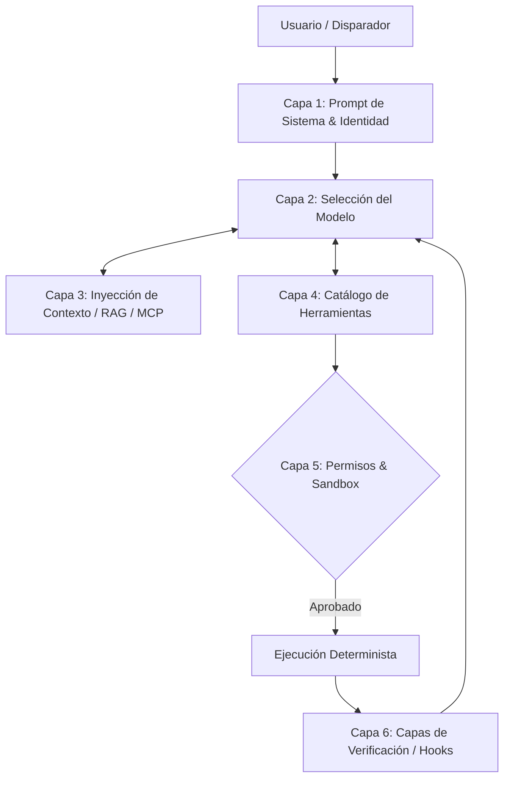

# Referencia del Harness: La Armadura del Agente

## Definición Formal de Harness
En esta arquitectura corporativa, definimos el **Harness** (Arnés) como la infraestructura técnica determinista que envuelve a un modelo probabilístico. Su objetivo es restringir, potenciar y validar las capacidades de razonamiento del LLM, convirtiéndolo en un agente capaz de operar de forma segura en entornos productivos.

No es el "cerebro" (ese es el modelo); es el "sistema nervioso y el exoesqueleto".

## Capas de un Harness Corporativo



## Los Cuatro Pilares de un Harness Robusto

### 1. Documentación como Código (AGENTS.md)
Un agente es un "usuario nuevo" permanente. No asume nada. El primer paso del harness es inyectarle la verdad fundacional del proyecto: comandos de construcción, tecnologías, reglas de estilo y dependencias, centralizadas en el archivo estandarizado `AGENTS.md`.

### 2. Restricciones Arquitectónicas
Establecer límites legibles por máquina. En lugar de rogarle al agente que no use una librería obsoleta, el harness debe configurar herramientas que prevengan importaciones no autorizadas o usar linters estrictos que fallen si el agente intenta romper los límites hexagonales (`eslint-plugin-boundaries`).

### 3. Verificación por Capas
Confiar ciegamente en la salida del LLM es inaceptable. El harness debe implementar un ciclo automatizado de "Red, Green, Refactor":
* **Hook Post-Herramienta:** Inmediatamente después de una edición, ejecutar el linter.
* **Pre-commit:** Ejecutar pruebas unitarias para el área modificada.
* **CI:** Suite de pruebas de regresión completa.

### 4. Recolección de Basura (Garbage Collection)
Los agentes pueden generar silenciosamente deuda técnica, redundancia o archivos fantasma. Un harness avanzado orquesta "agentes limpiadores" periódicos (Linter Agents) cuya única misión es patrullar el código buscando inconsistencias estilísticas e incongruencias de contexto introducidas por pasadas previas de IA.

---

## Ciclo Agéntico Base (Pseudocódigo)

El motor de ejecución del harness sigue este patrón de control:

```python
messages = [system_prompt, user_input]

while True:
 # 1. Inferencia del modelo
 response = call_model(messages)
 
 # 2. Detección de llamadas a herramientas
 tool_requests = extract_tool_calls(response)
 
 # Si el modelo no desea usar más herramientas, el ciclo termina.
 if not tool_requests: 
 return response
 
 # 3. Ejecución secuencial o paralela de herramientas autorizadas
 for request in tool_requests:
 if check_permissions(request.name):
 result = execute_tool(request.name, request.args)
 
 # Hook de validación inmediata (determinista)
 validated_result = run_post_tool_hooks(request.name, result)
 
 messages.append({
 "role": "tool", 
 "tool_call_id": request.id, 
 "content": validated_result
 })
 else:
 messages.append({
 "role": "tool", 
 "tool_call_id": request.id, 
 "content": "ERROR: Permiso denegado para ejecutar esta herramienta."
 })
```

> [!WARNING]
> **Advertencia sobre la Manipulación del Harness:** El modelo no tiene visibilidad del código fuente de una herramienta a menos que se le provea específicamente. Solo entiende la **Descripción (Metadatos)** de la misma. Descripciones ambiguas generan alucinaciones de uso catastróficas.

---
[Volver al Índice](./README.es.md)
