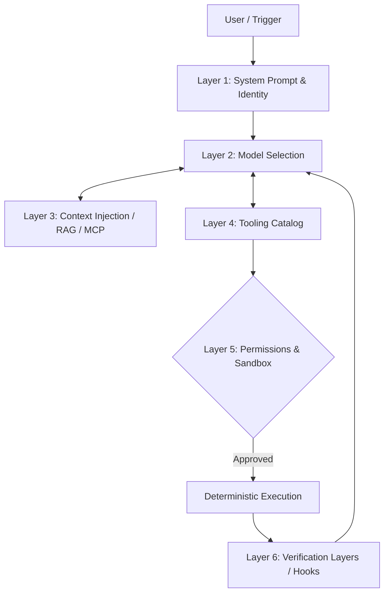

# Harness Reference: The Agent's Armor

## Formal Definition of Harness
In this corporate architecture, we define **Harness** as the deterministic technical infrastructure that wraps a probabilistic model. Its objective is to restrict, enhance, and validate the LLM's reasoning capabilities, turning it into an agent capable of operating safely in production environments.

It is not the "brain" (that is the model); it is the "nervous system and the exoskeleton."

## Layers of a Corporate Harness



## The Four Pillars of a Robust Harness

### 1. Documentation as Code (AGENTS.md)
An agent is a permanent "new user." It assumes nothing. The first harness step is injecting the project's foundational truth: build commands, technologies, style rules, and dependencies, centralized in the standardized `AGENTS.md` file.

### 2. Architectural Constraints
Establish machine-readable boundaries. Instead of begging the agent not to use an outdated library, the harness must configure tools preventing unauthorized imports or use strict linters that fail if the agent tries to break hexagonal boundaries (`eslint-plugin-boundaries`).

### 3. Layered Verification
Blindly trusting LLM output is unacceptable. The harness must implement an automated "Red, Green, Refactor" cycle:
* **Post-Tool Hook:** Immediately after an edit, run the linter.
* **Pre-commit:** Execute unit tests for the modified area.
* **CI:** Full regression testing suite.

### 4. Garbage Collection
Agents may silently generate technical debt, redundancy, or ghost files. An advanced harness orchestrates periodic "cleaner agents" (Linter Agents) whose sole mission is patrolling code for stylistic inconsistencies and context incongruities introduced by previous AI passes.

---

## Base Agentic Cycle (Pseudocode)

The harness execution engine follows this control pattern:

```python
messages = [system_prompt, user_input]

while True:
 # 1. Model inference
 response = call_model(messages)
 
 # 2. Tool call detection
 tool_requests = extract_tool_calls(response)
 
 # If the model does not wish to use more tools, the cycle terminates.
 if not tool_requests: 
 return response
 
 # 3. Sequential or parallel execution of authorized tools
 for request in tool_requests:
 if check_permissions(request.name):
 result = execute_tool(request.name, request.args)
 
 # Immediate (deterministic) validation hook
 validated_result = run_post_tool_hooks(request.name, result)
 
 messages.append({
 "role": "tool", 
 "tool_call_id": request.id, 
 "content": validated_result
 })
 else:
 messages.append({
 "role": "tool", 
 "tool_call_id": request.id, 
 "content": "ERROR: Permission denied to execute this tool."
 })
```

> [!WARNING]
> **Warning on Harness Manipulation:** The model has no visibility of a tool's source code unless specifically provided. It only understands the **Description (Metadata)** of the tool. Ambiguous descriptions generate catastrophic usage hallucinations.

---
[Back to Index](./README.md)
