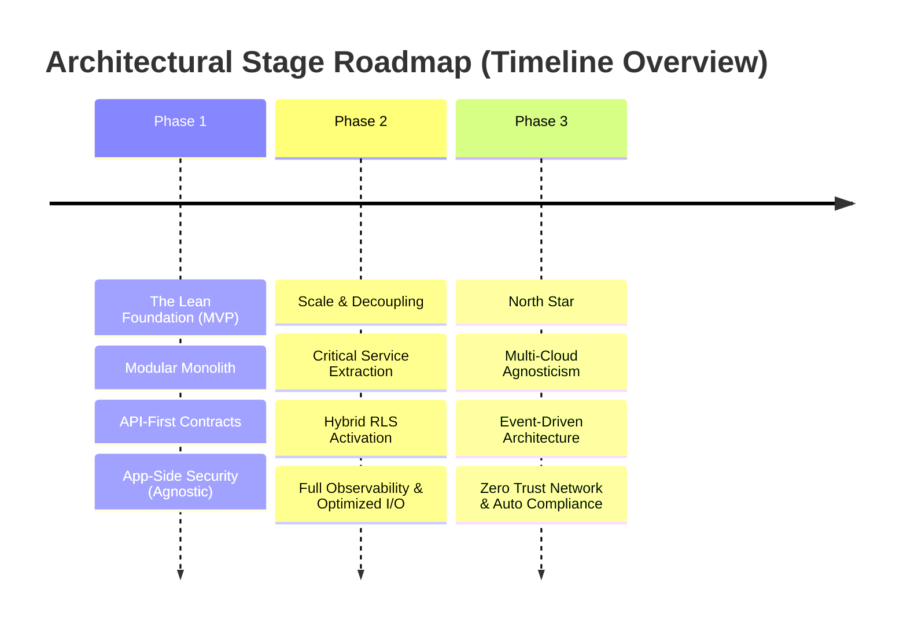

# Evolutionary Strategy and Architectural Dashboard

> **Bilingual Navigation:** [Versión en Español](../../standards-es/vision/evolutionary-strategy-roadmap.md)

This document establishes the strategic roadmap driven by Corporate Architecture to transform the ecosystem from its foundational steps into a highly resilient, provider-agnostic global platform.

---

## 1. Vision and Technical Pillars

Our core vision states that **Infrastructure is an Implementation Detail**, asserting sovereign control over Core Business Rules.

* **Core Architecture:** Hexagonal (Ports & Adapters). Domain is centralized, fully isolated from persistence layers and frameworks.
* **Absolute Priority:** Aggressive decoupling. Tying application logic to specific cloud vendor syntax is strictly prohibited.
* **Dynamic Security:** Leveraging the `SECURITY_STRATEGY_MODE` selector to adjust isolation logic according to target runtime capabilities.
* **Native Compliance:** Governed from day one by strict GDPR sovereignty constraints and the ISO/IEC 27001:2022 regulatory standard.

---

## 2. Evolutionary Stage Roadmap



### Phase 1: The Lean Foundation (MVP) - Short Term
**Focus:** Time-to-Market with Uncompromised Domain Integrity.

| Dimension | Strategy |
| :--- | :--- |
| **Architecture** | Modular Monolith with strongly enforced boundaries ([ADR-0047](../../../architecture/adrs/core/0047-architectural-patterns-monolith-soa-microservices.md)). |
| **Persistence** | Single relational instance. Application-side enforced security (`APP_AGNOSTIC`). |
| **Critical Focus** | Rigid API-First contract definition and comprehensive validation of core business rules without infrastructure noise. |

### ¡ Phase 2: Scale & Decoupling - Medium Term
**Focus:** Operational Efficiency and Component Segregation.

| Dimension | Strategy |
| :--- | :--- |
| **Architecture** | Selective extraction of critical components triggered by quantitative metrics ([ADR-0045](../../../architecture/adrs/core/0045-microservice-extraction-readiness-criteria.md)). |
| **Persistence** | Activation of Hybrid Mode. Deploying native RLS (`INFRA_NATIVE`) to production for database speed, maintaining safe codebase fallbacks for test harness suites. |
| **Critical Focus** | Comprehensive Observability (distributed tracing + structured logs) and aggressive reduction of I/O persistence latency. |

### Phase 3: North Star (Resilience & Sovereignty) - Long Term
**Focus:** Total Cloud Agnosticism and Hardened Data Sovereignty.

| Dimension | Strategy |
| :--- | :--- |
| **Architecture** | Full Multi-Cloud orchestration layered atop a robust Event-Driven Architecture (EDA). |
| **Persistence** | Ability to switch cloud persistence vendors in record time (< 24h). Total abstraction. |
| **Critical Focus** | Absolute Zero-Trust networking and automated Compliance-as-Code baked into every CI Pipeline pull request. |

---

## 3. Observability Dashboard & KPIs (Architectural Metrics)

To ensure zero structural drift over time, every phase is measured via strict deterministic equations.

### 3.1 Agnosticism Index ($PI$)
Quantifies healthy decoupling versus logic leaks into messy infrastructure layers.

```math
PI = \frac{\text{Lines of Code (Domain + App)}}{\text{Lines of Code (Infrastructure)}}
```

* **Goal:** Growth or absolute stability over time. A shrinking score warns of leaks into persistence or frameworks.
* ¡ **Practical Example:**
 * Business Logic Code: 10,000 lines.
 * Persistence/Infra Code: 2,000 lines.
 * **Current PI:** $10,000 / 2,000 = 5.0$ (Healthy state). If dropped to 2.0, urgent isolation review is flagged.

### Jump to: 3.2 Security Performance Delta ($\Delta P$)
Tracks the relative latency delta observed between application-tier and hardware-enforced containment.

```math
\Delta P = P95_{\text{APP\_AGNOSTIC}} - P95_{\text{INFRA\_NATIVE}}
```

* **Goal:** Percentile latency penalty under 15% when executing the Agnostic path.
* ¡ **Practical Example:**
 * Native RLS Mode: 40ms read response.
 * Agnostic App Mode: 45ms read response.
 * **Impact:** 5ms increase (+12.5%). **PASSED** (Threshold below 15%).

### 3.3 Mean Time to Migration (MTTM)
Objective effort assessed in transitioning or hot-swapping a foundational infrastructural component.

* **Goal:** Under 24 man-hours total elapsed effort for primary services by entering Phase 3.
* ¡ **Practical Example:** A concentrated team of 3 staff engineers executes a full adapter swap from TypeORM to Drizzle within a single shared 8-hour workday (8h x 3 = 24h total effort).

### 3.4 Planned Technical Debt Ratio ($RTD$)
Protects code core stability against aggressive external product feature velocity.

```math
RTD = \frac{\text{Refactoring Tickets}}{\text{Feature Tickets}}
```

* **Goal:** Retain a constant capacity band of 20% devoted exclusively to ongoing sanitary discipline.
* ¡ **Practical Example:** For every 10 completed User Stories inside a delivery cycle, the squad completes at least 2 Refactoring tickets (`tech-debt`) directed towards foundational clean-up.

---

## 4. Principle Manifesto and Non-Negotiables

To preempt evolutionary decay, the subsequent barriers are implemented globally:

1. **Zero DB Business Logic:** Employing *Stored Procedures* or *Triggers* conveying Business Rule logic is strictly forbidden (database only serves persistent state storage).
2. **Blind Persistence:** The domain module is forbidden from importing persistence libraries, ORM entities, or raw SQL annotations.
3. **Immutable Contract Safety:** Once a gRPC or Protobuf payload lands in registry, backward-breaking modifications cannot execute without explicit API Major-Versioning increment protocols.

---

## ¡ 5. Compliance and Operational Resiliency Strategy

### Mapping ISO 27001 Controls per Environment

| Control | AWS / Azure Deployment | On-Premise / Hybrid Solution |
| :--- | :--- | :--- |
| **A.8.1.3 (Assets)** | Azure Policy / IAM Region restrictions to satisfy legal data sovereignty. | Rack-level hardening behind air-gapped perimeter NGFWs. |
| **A.10.1.1 (Crypto)** | Native KMS Encryption backed by Customer Managed Keys (CMK). | HashiCorp Vault clusters integrated with air-gapped offline tape archives. |

### Operational Rollback Protocol (RLS Activation)
Upon critical performance regression spikes observed during `INFRA_NATIVE` switchover:
1. **Trigger:** P95 latency surpasses 200% of established seven-day historical baseline.
2. **Action:** Remote toggle of the Feature Flag `SECURITY_STRATEGY_MODE` back to `APP_AGNOSTIC` via the Central Feature Dashboard.
3. **Effect:** Propagation duration < 5 seconds. System promptly absorbs evaluation logic back into high-compute app memory pod buffers, instantly clearing the database bottleneck load.

---
[Back to Index](./README.md)
