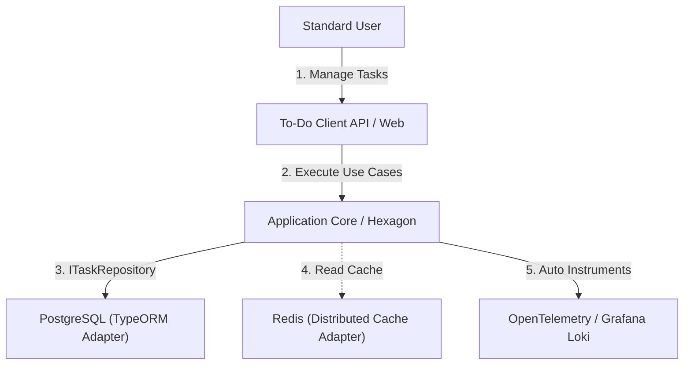

# Business Context - Classic To-Do System Reference Template

## 1. Problem Statement
Enterprise software delivery often suffers from highly coupled architectures that mix domain complexity with infrastructural details. Junior and intermediate developers frequently struggle to understand where to apply **Clean Architecture**, **Hexagonal Boundaries**, and **Domain-Driven Design (DDD)** principles when starting with monolithic "getting started" projects that are already too coupled or conversely, too abstract.

This project solves that problem through a **two-layer approach**:
- **The Skeleton Layer**: A pure architectural instructional framework with strict Hexagonal boundaries, observable infrastructure, and 30 approved ADRs.
- **The Demo App Layer**: A fully implemented **Enterprise SaaS Multi-Tenant To-Do Platform** that physically instantiates every pattern in the skeleton, proving it is production-ready - not just theoretical.

By using the universally understood "To-Do" domain, all cognitive overhead is directed 100% toward mastering the enterprise Node.js architecture patterns, not toward learning business rules.

---

## 2. Proposed Solution
This To-Do application serves as the authoritative reference for the **Hexagonal Ports & Adapters** architecture inside a modern NestJS Monorepo.

The solution rigorously isolates three concerns:
1. **Domain Core**: Contains the Pure Typescript entities (`User`, `Task`) and simple invariants. Zero external dependencies.
2. **Application Services**: Contains use-cases (Commands/Queries) coordinates persistence and orchestrates actions.
3. **Infrastructure Adapters**: Concrete implementations for PostgreSQL, REST controllers, and CLI gateways.

---

## 3. Executive Business Rationale (The Value Proposition)
Standardizing this reference template provides:
- **Frictionless Onboarding**: Developers immediately understand the domain (To-Do) allowing immediate architecture comprehension.
- **Safe Technical Sandbox**: A completely rigged up, testable environment for performance benchmarks, testing pyramid validation, and caching tuning.
- **Future-Proof Blueprint**: A reusable `libs/core` structure easily clonable to serve as the genesis for new business features.

---

## 4. Reference Model
The basic unit of execution is a personal **Task Management Cycle** (Create, Edit, Complete, Delete), scoped exclusively by authenticatable users. Detailed flow maps are located within Phase 01 - Requirements.

---
[Back to Index](./README.md)
