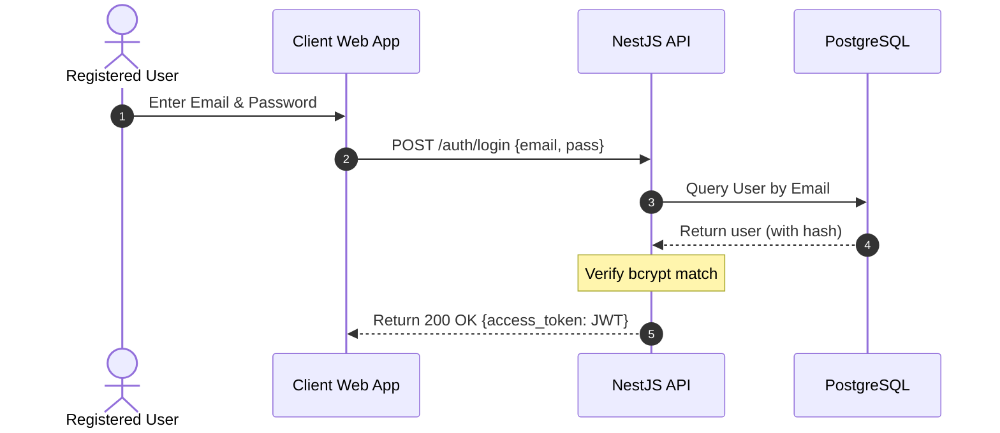

# Use Case 1: User Authentication (Local)

This document specifies the transaction flow for authenticating a user against the local database.

---

## 1. Use Case Definition

| Attribute | Specification |
| :--- | :--- |
| **Name** | Local Authentication |
| **Primary Actor** | Registered User |
| **Preconditions** | User profile exists with a valid email and hashed password in the database. |
| **Postconditions** | A valid JWT Access Token is returned. |

---

## 2. Transaction Flow

### A. Main Flow
1. The user enters their credentials on the login screen.
2. The client sends the credentials securely to the backend API.
3. The backend retrieves the user record by email from the repository.
4. The backend hashes the incoming password and compares it via `bcrypt`.
5. Upon successful validation, a signed JSON Web Token (JWT) is generated containing user identification.
6. The token is returned to the client for subsequent authenticated requests.

---

## ¡ 3. Exception Handling

### Error: User Not Found / Invalid Password
* The system must return a generic `401 Unauthorized` response to prevent email enumeration attacks.
* Log the failure event via the observability dashboard for threshold monitoring.

---
[Back to Index](./README.md)
