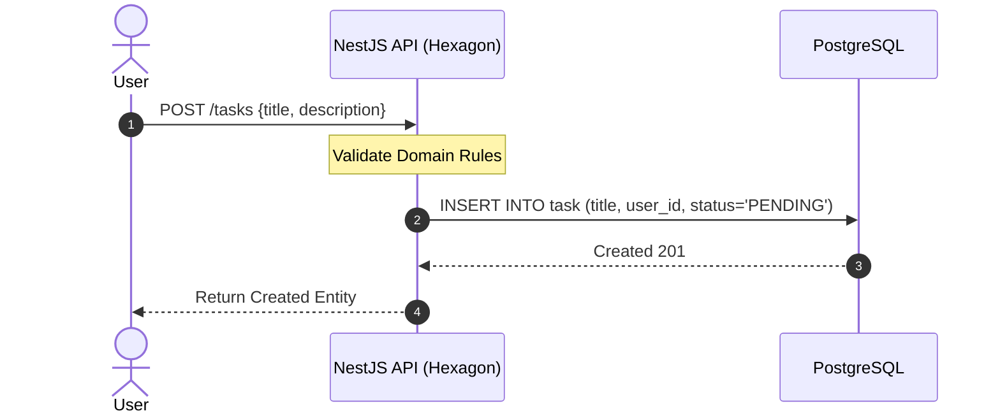

# Use Case 2: Create To-Do Task

Specification for adding new atomic work units.

## 1. Use Case Definition

| Attribute | Specification |
| :--- | :--- |
| **Name** | Create Task |
| **Primary Actor** | Authenticated User |
| **Preconditions** | User possesses a valid JWT token. |
| **Postconditions** | Task entity persists in database mapped to the user ID. |

## 2. Transaction Flow

### A. Main Flow
1. User fills out title and description and submits.
2. API decodes `user_id` from JWT header.
3. The `CreateTaskUseCase` validates domain constraints (e.g., title cannot be empty).
4. The domain entity maps to the infrastructure entity and pushes to the Database Adapter.
5. The created record with its system-generated ID is returned to the user.

---
[Back to Index](./README.md)
