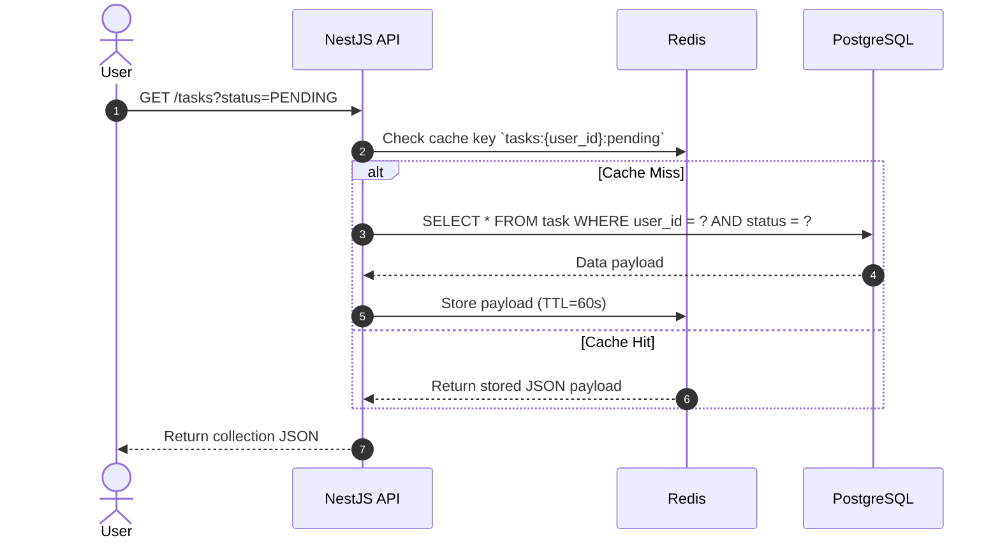

# Use Case 3: List Personal Tasks

Specification for querying existing user task workloads.

## 1. Use Case Definition

| Attribute | Specification |
| :--- | :--- |
| **Name** | List Tasks |
| **Primary Actor** | Authenticated User |
| **Preconditions** | User possesses a valid JWT token. |
| **Postconditions** | An array of task objects belonging to the User is retrieved. |

## 2. Transaction Flow

### A. Main Flow
1. User accesses the "My Tasks" dashboard.
2. Client calls the `/tasks` endpoint.
3. The API uses read-aside caching logic: first checking Redis for the scoped result.
4. If missing, queries Postgres, caches the result, and serves the requester.

---
[Back to Index](./README.md)
