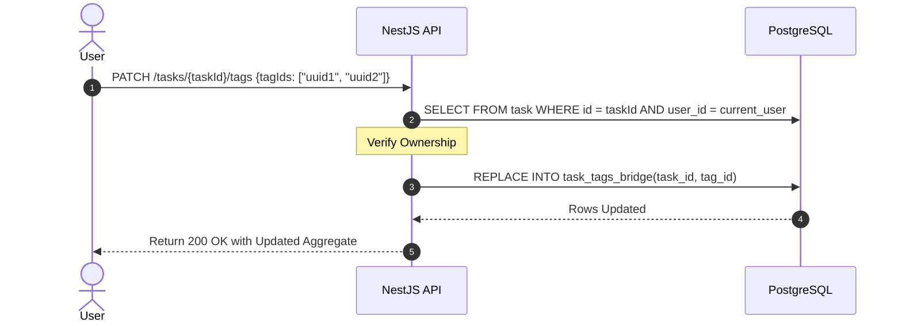

# Use Case 4: Manage Task Tags

Specification for decorating atomic tasks with searchable metadata tags.

## 1. Use Case Definition

| Attribute | Specification |
| :--- | :--- |
| **Name** | Associate Tags to Task |
| **Primary Actor** | Authenticated User |
| **Preconditions** | User owns the target Task entity. |
| **Postconditions** | Many-to-many mapping is established in the bridge table. |

## 2. Transaction Flow

### A. Main Flow
1. User navigates to a task detail and selects multiple checkboxes representing available tags.
2. Client delivers array of tag IDs to the endpoint.
3. System verifies task ownership (security check).
4. Infrastructure persistence adapter recalculates relationship mapping, clearing obsolete bridge records and inserting new pairings.

---
[Back to Index](./README.md)
