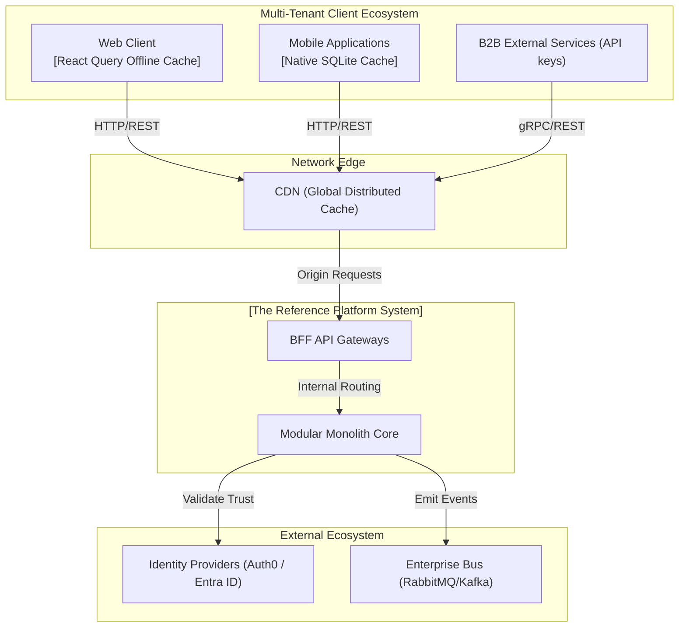
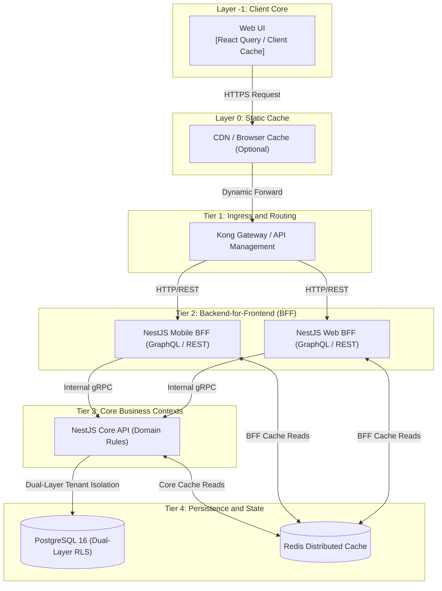
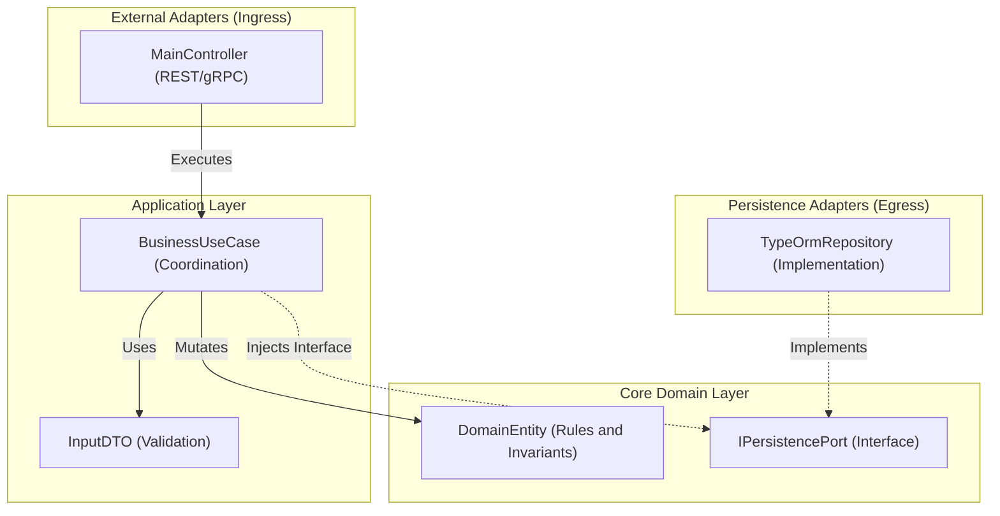

# Architecture Specification and C4 Model Specifications

This document details the rigorous enterprise-grade architectural design for the reference platform, conforming to the **arc42** blueprint standard and maintained with the arc32 toolset. The design implements an advanced **SaaS Multi-Tenant** topology utilizing **BFF Gateways** to manage client delivery.

> Scope: this is a **reference topology**. Product teams may map the same architectural responsibilities to different approved runtimes or tools through the runtime profiles and ADR process. Concrete labels such as framework, database, gateway, or broker names are examples unless a referenced ADR explicitly marks them as mandatory.

---

## 1. System Static Structure (C4 Model)

### Level 1: System Context Diagram
Defines our bounded system within the enterprise ecosystem, its consumers (tenants), and active external actors.

### Level 2: Container Diagram (High-Density Runtime)
Demonstrates the physical segregation of communication entry-points (BFFs) down to the multi-tenant database infrastructure.

### Level 3: API Component Diagram (Hexagonal Architecture)
Explosion of internal coupling inside the **NestJS Core API**.

---

## 2. The Approved Decision Ledger (All 32 ADRs)

As validated by the Principal Architect, all 32 foundational decisions are **officially Approved** and mandatory for system implementation.

### Group A: Core Foundation and Standards
1. **[ADR 0001: Monorepo Orchestration](../adrs/core/0001-monorepo-orchestration-nx.md)**: Nx and npm workspaces for linear, centralized CI/CD.
2. **[ADR 0002: Clean Hexagonal Architecture](../adrs/nodejs/0002-clean-architecture-nestjs.md)**: Separation of core logic from framework code.
3. **[ADR 0003: Strict TypeScript Standards](../adrs/nodejs/0003-strict-typescript-standards.md)**: Absolute typing, no `any`, mandatory ESLint rules.
4. **[ADR 0005: Zero-Cost Security CodeQL](../adrs/core/0005-ci-cd-quality-codeql.md)**: Automated vulnerability detection inside pipeline.
5. **[ADR 0009: Strict Dependency Pinning](../adrs/core/0009-strict-dependency-pinning-vulnerability-management.md)**: Blocking dynamic updates to prevent supply-chain breaches.

### Group B: SaaS, Scalability and Distribution
6. **[ADR 0006: Future Microservices transition via Dapr](../adrs/core/0006-future-microservices-transition-dapr.md)**: Decoupling triggers to break monoliths into mesh node networks.
7. **[ADR 0007: Observability via OpenTelemetry](../adrs/nodejs/0007-observability-telemetry-loki-opentelemetry.md)**: Distributed tracing across BFF, API and DB.
8. **[ADR 0008: BFF Patterns](../adrs/nodejs/0008-progressive-multimodule-evolution-gateway-bff.md)**: Multi-channel integration via dedicated translation layers.
9. **[ADR 0010: Multi-Tenancy SaaS Strategy](../adrs/core/0010-multi-tenancy-architecture-strategy.md)**: Implementing physical Row-Level Security (RLS) inside PostgreSQL to guarantee isolation.
10. **[ADR 0011: Fault Tolerance Circut Breakers](../adrs/core/0011-fault-tolerance-resiliency-patterns.md)**: Preventing cascade degradation using `opossum`.
11. **[ADR 0013: Disaster Recovery Topology](../adrs/core/0013-cloud-infrastructure-topology-dr.md)**: Multi-region node design.
12. **[ADR 0014: Distributed Caching](../adrs/core/0014-distributed-caching-strategy-redis.md)**: Offloading the database via centralized Redis.
13. **[ADR 0015: Event Driven Architecture](../adrs/core/0015-event-driven-architecture-intra-domain.md)**: Asynchronous messaging between bounded contexts.
14. **[ADR 0016: Immutable Business Auditing](../adrs/core/0016-immutable-business-audit-trail.md)**: Ledger system recording full transactional state diffs.

### Group C: Integration, Identity and Governance
15. **[ADR 0020: Identity Provider Abstraction](../adrs/core/0020-identity-provider-abstraction-strategy.md)**: Port abstraction for Okta/Entra ID/Auth0.
16. **[ADR 0021: High Performance Auth Graphs](../adrs/nodejs/0021-high-performance-auth-and-graph-compilation.md)**: Latency requirements below 5ms.
17. **[ADR 0026: MFA and Adaptive Security](../adrs/nodejs/0026-mfa-passwordless-adaptive-authentication.md)**: WebAuthn and Passkeys support.
18. **[ADR 0027: Dual REST and gRPC Protocols](../adrs/nodejs/0027-dual-protocol-rest-grpc-api-gateway.md)**: Internal performant streaming via gRPC.
19. **[ADR 0030: Kong Gateway vs NestJS Gateway](../adrs/core/0030-api-gateway-kong-vs-nestjs.md)**: Separation of infrastructure proxies from business orchestration.
20. **[ADR 0029: Tactical DDD Primitives](../adrs/nodejs/0029-tactical-ddd-primitives-library.md)**: Mandatory utilization of standardized `@nestjslatam/ddd`.
21. **[ADR 0032: API Protocol Decision Matrix](../adrs/core/0032-api-protocol-decision-matrix-rest-grpc-graphql.md)**: Evaluation framework mandating REST for public exposure, gRPC for internal backbones, and GraphQL for optimized BFF aggregation.

### Group D: Microservices Evolution Readiness
22. **[ADR 0031: Schema-per-Context and Domain Event Catalog](../adrs/core/0031-schema-per-context-domain-event-catalog.md)**: Each bounded context owns a dedicated PostgreSQL schema (`auth` | `tasks` | `taxonomy` | `audit`). All cross-context communication is governed by a formal Domain Event Catalog with typed payload contracts, enabling zero-migration microservices extraction.

---
[Back to Index](./README.md)
