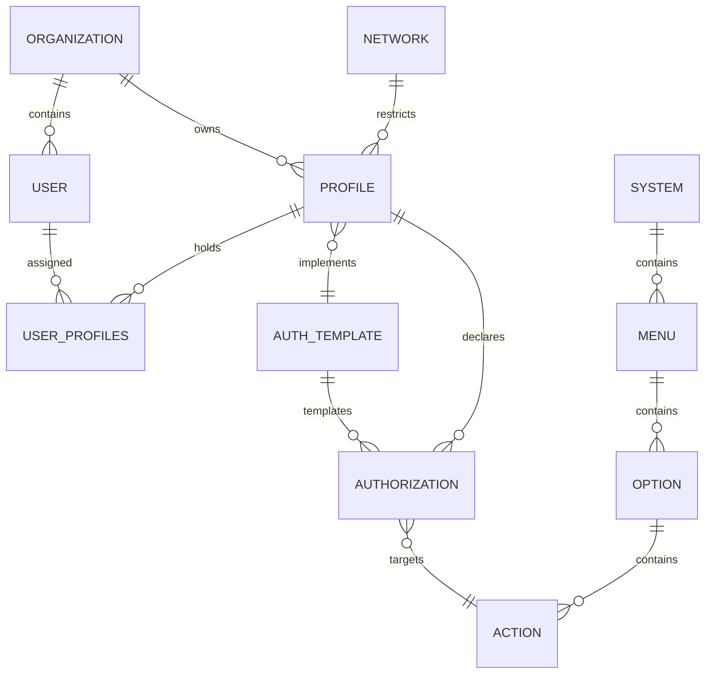

# 💾 Conceptual Data Model (Artifact 3)

This document details the database schema, entity structures, relationships, and Entity-Relationship diagrams for the **User Life-Cycle & Permissions Management System (ULPMS)** under the **bMAD Method**.

---

## 🏛️ 1. Entity-Relationship Diagram

---

## 📋 2. Entity Attributes Specification

The following tables define the attributes, keys, and constraints of each primary entity:

### A. User Entity
*   `id` (UUID, PK): Unique identifier for the user.
*   `email` (string, Unique): Corporate email address.
*   `password_hash` (string): Cryptographically secure password hash (bcrypt).
*   `employee_reference` (string): External unique ID linking to corporate RR.HH./ERP records.
*   `status` (string): Active, Suspended, or Terminated.
*   `created_at` (timestamp): Record creation timestamp.

### B. Organization Entity (Tenant)
*   `id` (UUID, PK): Unique identifier for the tenant.
*   `name` (string): Corporate legal company name.
*   `company_reference` (string, SAP): External company code linking to corporate ERP.
*   `status` (string): Active or Blocked.

### C. Profile Entity
*   `id` (UUID, PK): Unique identifier for the profile.
*   `organization_id` (UUID, FK): The owning tenant organization.
*   `name` (string): Human-readable profile name (e.g., `PortOperator`).
*   `template_id` (UUID, FK, Nullable): Optional linked Authorization Template.

### D. Authorization Entity
*   `id` (UUID, PK): Unique identifier for the authorization record.
*   `profile_id` (UUID, FK, Nullable): Linked profile if customized locally.
*   `template_id` (UUID, FK, Nullable): Linked template if inherited from a blueprint.
*   `action_id` (UUID, FK): Mapped system action.
*   `effect` (string): Effect of the policy (`ALLOW` or `DENY`).

### E. System Entity
*   `id` (UUID, PK): Unique identifier for the application/sub-portal.
*   `name` (string, Unique): Application name (e.g., `Inventory`).
*   `base_url` (string): Base physical URL for routing.
