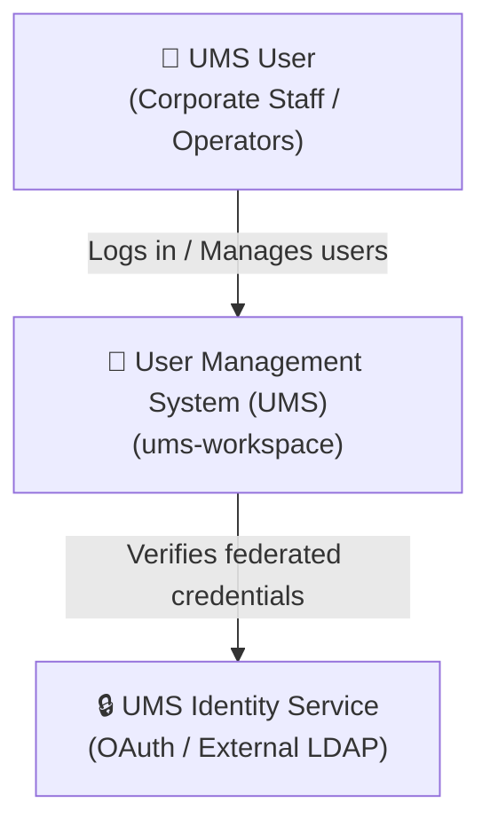
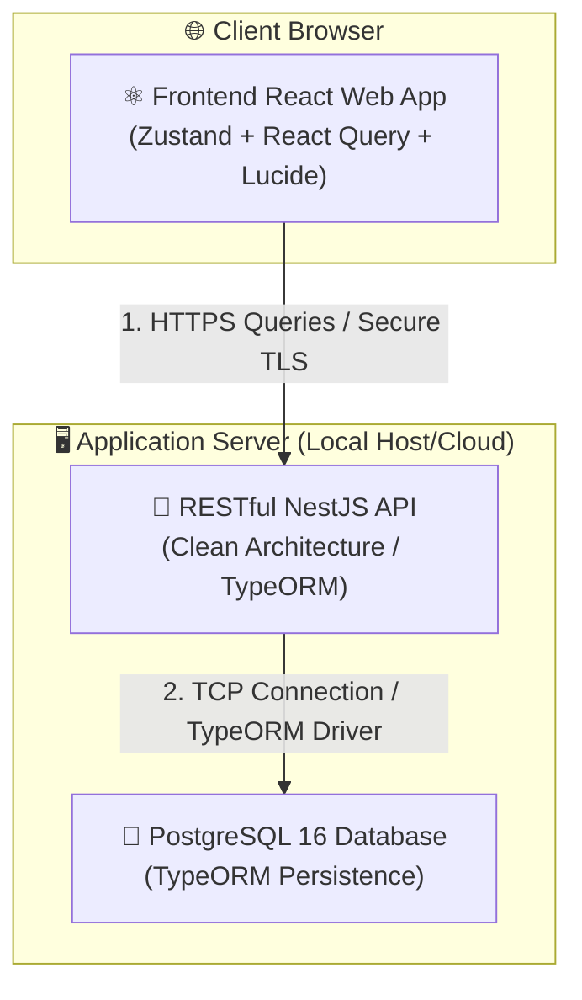
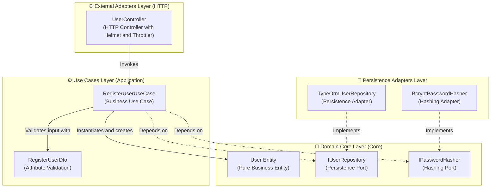

# 🏛️ Software Architecture Design Document (UMS)

This document details the formal system design specification for the **`ums-workspace`** monorepo. It adopts the **C4 Model** software modeling standard (Level 1: System Context, Level 2: Containers, Level 3: Components) and presents the unified and audited technical inventory of the project.

---

## 🗺️ 1. C4 Model

The architectural design of UMS is modeled at three progressive levels of abstraction to align business vision with physical code implementation.

### Level 1: System Context Diagram
Defines the boundary of the User Management System (UMS) interacting with corporate users and external identity services.

---

### Level 2: Container Diagram
Maps the physical subsystems (React Frontend, NestJS API, PostgreSQL Database) that make up the monorepo and how they communicate using secure protocols.

---

### Level 3: API Component Diagram
An interactive zoom into the **NestJS API** structure, demonstrating the flow of control towards the core (*Inversion of Control*) of the Hexagonal Architecture.

---

## 📊 2. Dependency Technical Inventory (Sovereign Tech Inventory)

This inventory details all tools, libraries, plugins, and components per workspace with their respective installed version, technical lifecycle recommendation (*Staff Recommendation*), and official reference URL.

### 🦁 A. Backend (NestJS API Layer)

| Dependency / Library | Installed Version | Technical Recommendation | Reference URL |
| :--- | :--- | :--- | :--- |
| `@nestjs/core` | `^10.0.0` | **Keep (Stable)** - Robust core for dependency injection. | [NestJS Docs](https://docs.nestjs.com/) |
| `@nestjs/throttler` | `^6.5.0` | **Keep (Stable)** - Prevention of brute force and local DDoS attacks. | [NestJS Rate Limiting](https://docs.nestjs.com/security/rate-limiting) |
| `@nestjs/typeorm` | `^11.0.1` | **Keep (Stable)** - Native persistence integration with transaction support. | [NestJS TypeORM](https://docs.nestjs.com/techniques/database) |
| `typeorm` | `^0.3.28` | **Keep (Stable)** - Mature ORM with excellent migration support and Type Safety. | [TypeORM Official](https://typeorm.io/) |
| `bcrypt` | `^6.0.0` | **Keep (Stable)** - Robust cryptographic algorithm for password storage. | [Bcrypt GitHub](https://github.com/kelektiv/node.bcrypt.js) |
| `helmet` | `^8.1.0` | **Keep (Critical)** - Automatic injection of secure HTTP headers (CORS, XSS). | [Helmet Docs](https://helmetjs.github.com/) |
| `pg` | `^8.20.0` | **Keep (Stable)** - High-performance native connection driver for PostgreSQL. | [Node Postgres](https://node-postgres.com/) |
| `class-validator` | `^0.15.1` | **Keep (Stable)** - Declarative validation of DTOs at runtime. | [Class Validator](https://github.com/typestack/class-validator) |

---

### ⚛️ B. Frontend (React Web Client)

| Dependency / Library | Installed Version | Technical Recommendation | Reference URL |
| :--- | :--- | :--- | :--- |
| `react` | `^18.3.1` | **Keep (Stable)** - Ultra-stable version compatible with mature ecosystems. | [React Documentation](https://react.dev/) |
| `vite` | `^5.4.10` | **Keep (Stable)** - Ultra-fast bundler compatible with Node 18. | [Vite JS](https://vitejs.dev/) |
| `@tanstack/react-query`| `^5.100.9` | **Keep (Critical)** - Asynchronous server state synchronization and smart caching. | [TanStack Query Docs](https://tanstack.com/query/latest) |
| `zustand` | `^5.0.13` | **Keep (Stable)** - Lightweight global state manager alternative to Redux. | [Zustand GitHub](https://github.com/pmndrs/zustand) |
| `tailwindcss` | `^3.4.19` | **Keep (Stable)** - High-performance utility-first CSS engine. | [Tailwind CSS](https://tailwindcss.com/) |
| `axios` | `^1.16.0` | **Keep (Stable)** - Robust HTTP client with global interceptor support. | [Axios Docs](https://axios-http.com/) |
| `lucide-react` | `^1.14.0` | **Keep (Stable)** - Modern collection of reactive SVG icons. | [Lucide Icons](https://lucide.dev/) |

---

### 🛠️ C. Quality and Global Governance (Root Monorepo)

| Dependency / Library | Installed Version | Technical Recommendation | Reference URL |
| :--- | :--- | :--- | :--- |
| `nx` | `^20.3.0` | **Keep (Critical)** - High-performance task runner with caching support. | [Nx Dev Docs](https://nx.dev/) |
| `eslint-plugin-boundaries`| `^5.0.0` | **Keep (Stable)** - Strict governance for Hexagonal boundaries. | [eslint-plugin-boundaries](https://github.com/javierguzman/eslint-plugin-boundaries) |
| `eslint-plugin-sonarjs` | `^3.0.0` | **Keep (Stable)** - Zero-cost Sonar static analysis for local projects. | [SonarJS ESLint](https://github.com/SonarSource/eslint-plugin-sonarjs) |
| `husky` | `^9.0.0` | **Keep (Stable)** - Interception and automation of Git Hooks. | [Husky Docs](https://typicode.github.io/husky/) |
| `lint-staged` | `^15.0.0` | **Keep (Stable)** - Optimized execution of linters only on Git Staged files. | [lint-staged GitHub](https://github.com/lint-staged/lint-staged) |

---

## 📈 3. Technical Debt Management & Architectural Roadmap (Backlog)

To guarantee the healthy evolution of the monorepo towards distributed models and production telemetry, the following items are established in the architecture backlog:

*   **[ADR 0006: Future Microservices Transition with Dapr](file:///d:/Users/aarroyo/personal/sources/ums/ums-workspace/docs/architecture-design/adrs/0006-future-microservices-transition-dapr.md)**: Establishes the technical criteria and triggers that will determine when to split the modular monolith into independent microservices governed by Dapr sidecars.
*   **[ADR 0007: Observability Telemetry with Grafana Loki and OpenTelemetry](file:///d:/Users/aarroyo/personal/sources/ums/ums-workspace/docs/architecture-design/adrs/0007-observability-telemetry-loki-opentelemetry.md)**: Details the asynchronous telemetry and instrumentation architecture using OpenTelemetry and lightweight collection in Grafana Loki.
*   **[ADR 0008: Progressive Multi-Module Evolution with API Gateway and BFF](file:///d:/Users/aarroyo/personal/sources/ums/ums-workspace/docs/architecture-design/adrs/0008-progressive-multimodule-evolution-gateway-bff.md)**: Establishes the progressive design to transform this 100% Node.js reference solution into a multi-module portal capable of integrating independent systems (TMS, WMS, etc.) exposed as services with isolated databases, consumed via a central API Gateway and optimized through Backend For Frontend (BFF) gateways for Web and Mobile clients.
