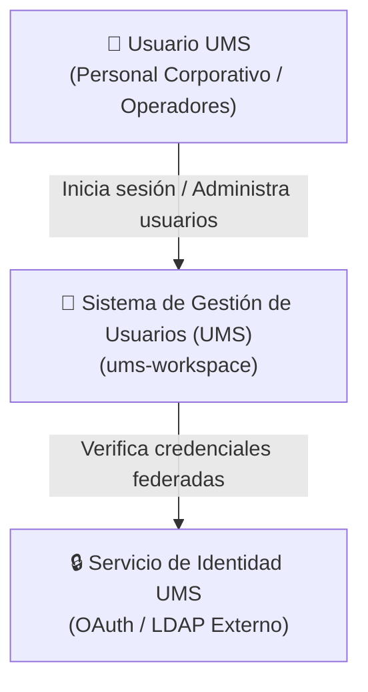
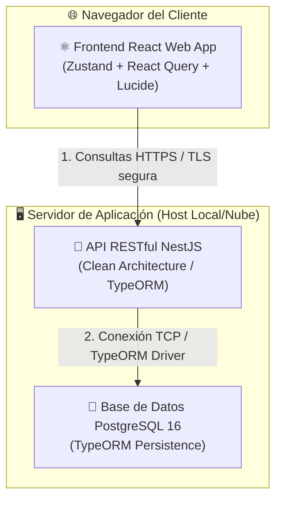

# 🏛️ Documento de Diseño y Arquitectura de Software (UMS)

Este documento detalla la especificación formal del diseño del sistema para el monorepo **`ums-workspace`**. Adopta el estándar de modelado de software **C4 Model** (Nivel 1: Contexto de Sistema, Nivel 2: Contenedores, Nivel 3: Componentes) y presenta el inventario técnico unificado y auditado del proyecto.

---

## 🗺️ 1. Modelo C4 (C4 Model)

El diseño arquitectónico de UMS se modela en tres niveles progresivos de abstracción para alinear la visión del negocio con la implementación física en código.

### Nivel 1: Contexto de Sistema (System Context Diagram)
Define la frontera del sistema de gestión de usuarios (UMS) interactuando con los usuarios corporativos y los servicios externos de UMS.



---

### Nivel 2: Diagrama de Contenedores (Container Diagram)
Mapea los subsistemas físicos (Frontend React, API NestJS, Base de Datos PostgreSQL) que componen el monorepo y cómo se comunican mediante protocolos seguros.



---

### Nivel 3: Diagrama de Componentes de la API (Component Diagram)
Zoom interactivo a la estructura de la **API NestJS**, demostrando el flujo de control hacia el interior (*Inversion of Control*) de la Arquitectura Hexagonal.

```mermaid
graph TD
    subgraph HTTP["🌐 Capa de Adaptadores Externos (HTTP)"]
        Controller["UserController<br/>(HTTP Controller con Helmet y Throttler)"]
    end

    subgraph Application["⚙️ Capa de Casos de Uso (Application)"]
        UseCase["RegisterUserUseCase<br/>(Caso de Uso de Negocio)"]
        DTO["RegisterUserDto<br/>(Validación de Atributos)"]
    end

    subgraph Core["💎 Capa del Núcleo de Dominio (Core)"]
        UserEntity["User Entity<br/>(Entidad Pura de Negocio)"]
        IUserRepo["IUserRepository<br/>(Puerto de Persistencia)"]
        IPassHasher["IPasswordHasher<br/>(Puerto de Hashing)"]
    end

    subgraph Infrastructure["💾 Capa de Adaptadores de Persistencia"]
        TypeOrmRepo["TypeOrmUserRepository<br/>(Adaptador de Persistencia)"]
        BcryptHasher["BcryptPasswordHasher<br/>(Adaptador de Hashing)"]
    end

    Controller -->|Invoca| UseCase
    UseCase -->|Valida entrada con| DTO
    UseCase -->|Instancia y crea| UserEntity
    UseCase -.->|Depende de| IUserRepo
    UseCase -.->|Depende de| IPassHasher

    TypeOrmRepo --.->|Implementa| IUserRepo
    BcryptHasher --.->|Implementa| IPassHasher
```

---

## 📊 2. Inventario Técnico de Dependencias (Sovereign Tech Inventory)

Este inventario detalla todas las herramientas, librerías, plugins y componentes por espacio de trabajo con su respectiva versión instalada, su recomendación de ciclo de vida tecnológica (*Staff Recommendation*) y su documentación oficial de referencia.

### 🦁 A. Backend (Capa API NestJS)

| Dependencia / Librería | Versión Instalada | Recomendación Técnica | URL de Referencia |
| :--- | :--- | :--- | :--- |
| `@nestjs/core` | `^10.0.0` | **Mantener (Estable)** - Núcleo robusto para inyección de dependencias. | [NestJS Docs](https://docs.nestjs.com/) |
| `@nestjs/throttler` | `^6.5.0` | **Mantener (Estable)** - Prevención de ataques de fuerza bruta y DDoS local. | [NestJS Rate Limiting](https://docs.nestjs.com/security/rate-limiting) |
| `@nestjs/typeorm` | `^11.0.1` | **Mantener (Estable)** - Integración nativa de persistencia con soporte de transacciones. | [NestJS TypeORM](https://docs.nestjs.com/techniques/database) |
| `typeorm` | `^0.3.28` | **Mantener (Estable)** - ORM maduro con soporte excelente de migraciones y Type Safety. | [TypeORM Official](https://typeorm.io/) |
| `bcrypt` | `^6.0.0` | **Mantener (Estable)** - Algoritmo criptográfico robusto para almacenamiento de contraseñas. | [Bcrypt GitHub](https://github.com/kelektiv/node.bcrypt.js) |
| `helmet` | `^8.1.0` | **Mantener (Crítico)** - Inyección automática de cabeceras HTTP de seguridad (CORS, XSS). | [Helmet Docs](https://helmetjs.github.com/) |
| `pg` | `^8.20.0` | **Mantener (Estable)** - Driver de conexión nativa de alto rendimiento para PostgreSQL. | [Node Postgres](https://node-postgres.com/) |
| `class-validator` | `^0.15.1` | **Mantener (Estable)** - Validación declarativa de DTOs en tiempo de ejecución. | [Class Validator](https://github.com/typestack/class-validator) |

---

### ⚛️ B. Frontend (React Web Client)

| Dependencia / Librería | Versión Instalada | Recomendación Técnica | URL de Referencia |
| :--- | :--- | :--- | :--- |
| `react` | `^18.3.1` | **Mantener (Estable)** - Versión ultra-estable compatible con ecosistemas maduros. | [React Documentation](https://react.dev/) |
| `vite` | `^5.4.10` | **Mantener (Estable)** - Bundler de altísima velocidad compatible con Node 18. | [Vite JS](https://vitejs.dev/) |
| `@tanstack/react-query`| `^5.100.9` | **Mantener (Crítico)** - Sincronización asíncrona de estado de servidor y caché inteligente. | [TanStack Query Docs](https://tanstack.com/query/latest) |
| `zustand` | `^5.0.13` | **Mantener (Estable)** - Gestor de estado global super ligero alternativo a Redux. | [Zustand GitHub](https://github.com/pmndrs/zustand) |
| `tailwindcss` | `^3.4.19` | **Mantener (Estable)** - Motor CSS utilitario de alto rendimiento y customización. | [Tailwind CSS](https://tailwindcss.com/) |
| `axios` | `^1.16.0` | **Mantener (Estable)** - Cliente HTTP robusto con soporte de interceptores globales. | [Axios Docs](https://axios-http.com/) |
| `lucide-react` | `^1.14.0` | **Mantener (Estable)** - Colección moderna de iconos en formato SVG reactivos. | [Lucide Icons](https://lucide.dev/) |

---

### 🛠️ C. Calidad y Gobernanza Global (Monorepo Raíz)

| Dependencia / Librería | Versión Instalada | Recomendación Técnica | URL de Referencia |
| :--- | :--- | :--- | :--- |
| `nx` | `^20.3.0` | **Mantener (Crítico)** - Task runner de alto rendimiento con soporte de caching. | [Nx Dev Docs](https://nx.dev/) |
| `eslint-plugin-boundaries`| `^5.0.0` | **Mantener (Estable)** - Gobernanza estricta para límites Hexagonales. | [eslint-plugin-boundaries](https://github.com/javierguzman/eslint-plugin-boundaries) |
| `eslint-plugin-sonarjs` | `^3.0.0` | **Mantener (Estable)** - Análisis estático Sonar a costo $0 para proyectos locales. | [SonarJS ESLint](https://github.com/SonarSource/eslint-plugin-sonarjs) |
| `husky` | `^9.0.0` | **Mantener (Estable)** - Intercepción y automatización de Git Hooks. | [Husky Docs](https://typicode.github.io/husky/) |
| `lint-staged` | `^15.0.0` | **Mantener (Estable)** - Ejecución optimizada de linters solo en Git Staged files. | [lint-staged GitHub](https://github.com/lint-staged/lint-staged) |

---

## 📈 3. Gestión de Deuda Técnica y Roadmap de Arquitectura (Backlog)

Para garantizar la evolución saludable del monorepo hacia modelos distribuidos y telemetría de producción, se establecen los siguientes elementos en el backlog de arquitectura:

*   **[ADR 0006: Future Microservices Transition with Dapr](file:///d:/Users/aarroyo/personal/sources/ums/ums-workspace/docs/architecture-design/adrs/0006-future-microservices-transition-dapr.md)**: Establece los criterios y gatilladores técnicos (*triggers*) que determinarán cuándo dividir el monolito modular en microservicios independientes gobernados por sidecars de Dapr.
*   **[ADR 0007: Observability Telemetry with Grafana Loki and OpenTelemetry](file:///d:/Users/aarroyo/personal/sources/ums/ums-workspace/docs/architecture-design/adrs/0007-observability-telemetry-loki-opentelemetry.md)**: Detalla la arquitectura de telemetría e instrumentación asíncrona mediante OpenTelemetry y recolección ligera en Grafana Loki.
*   **[ADR 0008: Progressive Multi-Module Evolution with API Gateway and BFF](file:///d:/Users/aarroyo/personal/sources/ums/ums-workspace/docs/architecture-design/adrs/0008-progressive-multimodule-evolution-gateway-bff.md)**: Establece el diseño progresivo para transformar esta solución base 100% Node.js en un portal multi-módulo capaz de integrar otros sistemas independientes (TMS, WMS, etc.) expuestos como servicios con bases de datos aisladas, consumidos a través de un API Gateway central y optimizados mediante el patrón Backend For Frontend (BFF) si se implementa una aplicación móvil.
