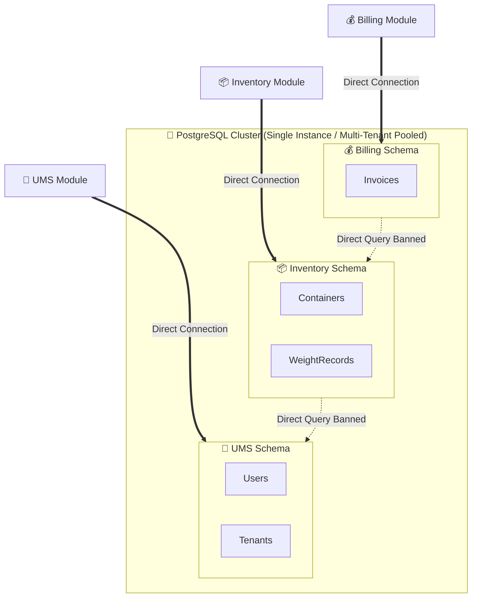

# 💾 Enterprise Database & Multi-Tenant Persistence Strategy

This document substantiates the persistence design, multi-tenant isolation, distributed transactions, and backup policies for the SCM/UMS platform under the **bMAD Method**.

---

## 🏛️ 1. Persistence Pattern: Database-per-Module (Logical Schema Isolation)

To balance immediate operational cost-efficiency with long-term architectural agility, the platform implements a **Logical Database-per-Module** pattern utilizing a single high-performance PostgreSQL cluster.



### Key Principles:
*   **Absolute Schema Isolation**: Each module (UMS, Inventory, Billing) governs its own schema and tables. No module is permitted to join tables across different schemas.
*   **Long-Term Agnosticism**: Because tables are decoupled logically, splitting this modular monolith into physical microservices with separate PostgreSQL databases in the future (ADR 0006) requires zero schema refactoring.

---

## 🛡️ 2. Multi-Tenant Isolation Strategy (Row-Level Security)

The platform adopts a **Hybrid Pooled Model** with PostgreSQL **Row-Level Security (RLS)** as specified in **ADR 0010**:

1.  **Shared Database, Shared Schema**: Tenants share the same physical tables (e.g., `Containers`) to keep cloud infrastructure costs extremely low.
2.  **Strict Engine-Level Isolation**: Every multi-tenant table contains a non-nullable `tenant_id` column. PostgreSQL RLS policies automatically filter queries at the database engine level:
    ```sql
    ALTER TABLE inventory.containers ENABLE ROW LEVEL SECURITY;
    CREATE POLICY tenant_isolation_policy ON inventory.containers
      USING (tenant_id = current_setting('app.current_tenant_id'));
    ```
3.  **Application Propagation**: `AsyncLocalStorage` captures the tenant context from JWT claims at the request entrypoint and injects it into the TypeORM execution context on every connection.

---

## 🔄 3. Distributed Transactions & Eventual Consistency

Two-Phase Commit (2PC) is banned due to performance bottlenecks and locking risks. The platform guarantees consistency across modules using **Asynchronous Eventual Consistency** via the **Transactional Outbox Pattern**:

*   **Process**: When a transaction occurs (e.g., container checked in), the domain write and a corresponding integration event (e.g., `ContainerCheckedInEvent`) are saved inside the *same* local database transaction.
*   **Outbox Publisher**: An asynchronous worker polls the local Outbox table and publishes events to the Event Bus (ADR 0015). This guarantees **At-Least-Once Delivery** and prevents data loss if the network fails during event publication.
*   **Idempotency**: All event subscribers (e.g., Billing) are strictly idempotent, verifying if the unique `event_id` has already been processed before mutating their state.

---

## 📈 4. Backup, Disaster Recovery & Financial Sizing

To meet enterprise service-level agreements (SLAs), the database operations are governed by the following policies:

| Metric / Feature | Operational Strategy | Business & Financial Impact |
| :--- | :--- | :--- |
| **Recovery Point Objective (RPO)** | **< 5 minutes** | Near-zero data loss in case of severe cluster failure. |
| **Recovery Time Objective (RTO)** | **< 15 minutes** | High-availability automatic failover keeps SCM logistics active. |
| **PITR (Point-in-Time Recovery)** | Daily full backups + continuous Write-Ahead Log (WAL) archiving to encrypted Azure Blob/AWS S3 storage. | Protects against accidental manual deletions or ransomware. |
| **Multi-AZ Replication** | Synchronous replication to a secondary database replica in another availability zone. | Zero-downtime automatic failover during cloud infrastructure outages. |
