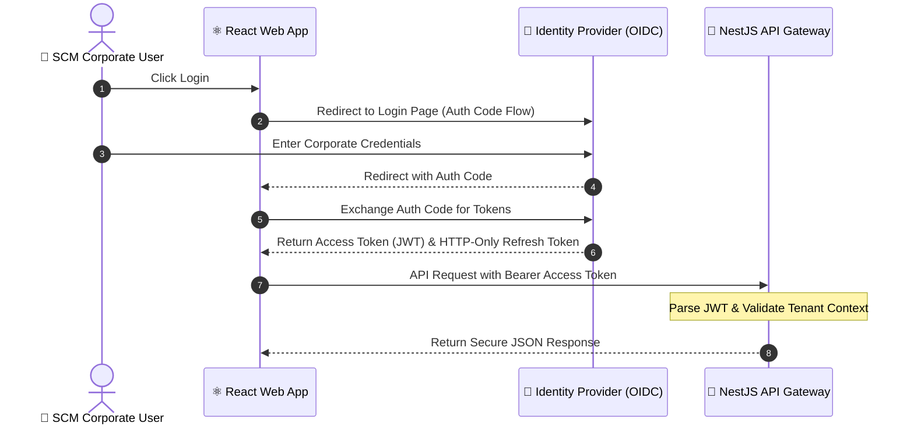

# 🔑 Enterprise Identity & Multi-Tenant Authorization Design

This document specifies the identity provider architecture, secure authentication flows, and tenant-aware RBAC/ABAC security enforcement for the SCM/UMS platform under the **bMAD Method**.

---

## 🏛️ 1. Identity & Session Architecture

The platform leverages **OpenID Connect (OIDC)** and **OAuth 2.0** standards to centralize authentication, utilizing enterprise Identity Providers (e.g., Keycloak, Microsoft Entra ID/Azure AD, or Auth0) to manage user credentials securely.



---

## 🛡️ 2. JWT Claim Schema (Published Language)

The Identity Provider generates signed JWTs using **RS256** signatures. The token payload serves as the published language for tenant context propagation across modules:

```json
{
  "iss": "https://identity.beyondnetcode.com/realms/scm",
  "sub": "user-uuid-9922-8833",
  "name": "Alex Arroyo",
  "email": "aarroyo@beyondnetcode.com",
  "tenant": {
    "id": "tenant-unimar-lima-01",
    "tier": "enterprise",
    "status": "active"
  },
  "roles": ["TerminalOperator", "AuditAuditor"],
  "permissions": [
    "containers:create",
    "containers:weigh",
    "invoices:view"
  ],
  "iat": 1778259224,
  "exp": 1778260124
}
```

---

## ⚙️ 3. Multi-Tenant Authorization Enforcement (RBAC & ABAC)

To isolate tenant data and protect endpoints from unauthorized privilege escalation, we implement a **Double-Layer Guard** inside NestJS as specified in **ADR 0012**:

### A. Tenant Context Guard (`TenantGuard`)
*   **Enforcement**: Extracts the `.tenant.id` from the Bearer JWT.
*   **Propagation**: Injects the tenant identifier into the request object and propagates it into `AsyncLocalStorage`. If `tenant.id` is missing or the tenant is suspended, the guard immediately rejects the request with a `403 Forbidden` response.

### B. Role-Based Access Control (`RolesGuard` - RBAC)
*   **Enforcement**: Decorates controllers and routes with `@Roles()` or `@Permissions()`.
*   **Implementation**:
    ```typescript
    @Post('/containers')
    @Permissions('containers:create')
    async createContainer(@Body() dto: CreateContainerDto) {
      return this.useCase.execute(dto);
    }
    ```

### C. Attribute-Based Access Control (ABAC)
*   **Enforcement**: For dynamic business constraints (e.g., a "Junior Operator" can only register container weights `< 30 tons`), the application domain performs context validation against user attribute claims inside the Core entity layers, guaranteeing business safety.

---

## 💾 4. Secure Session & Token Policies

*   **Token Expiry**: Access tokens are strictly short-lived (**15 minutes**) to minimize compromise windows.
*   **Session Refresh**: Secure, **HTTP-Only, SameSite=Strict** cookies store the refresh token. Refreshing sessions occurs seamlessly in the background without user interruption.
*   **Revocation Ledger**: Compromised or blacklisted sessions are stored inside Redis with a TTL matching the token's remaining lifespan, allowing instant global logout across all terminals.
