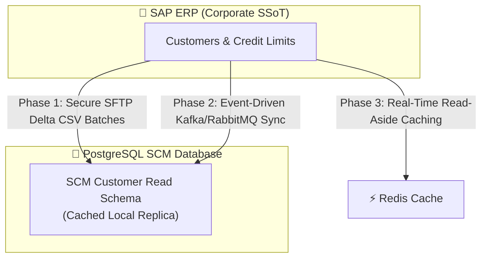

# 📊 Master Data Management & SAP Migration Strategy

This document establishes the strategic architectural design, migration plan, and synchronization guidelines for enterprise **Master Data** (Users, Tenants, Customers, and Seaport Scales) from the corporate SAP ERP under the **bMAD Method**.

---

## 🏛️ 1. Master Data Entities & Ownership

To maintain absolute data integrity across multiple bounded contexts, we declare the single sources of truth (SSoT) and schemas for our SCM master entities:

| Master Entity | Single Source of Truth | Shared Bounded Contexts | Schema & Unique ID |
| :--- | :--- | :--- | :--- |
| **Tenant / Organization** | **UMS Module** | Inventory, Billing, Customs | Logical Schema, `tenant_id` (UUIDv4) |
| **Corporate User** | **UMS Module** | Inventory, Billing, Audit | Logical Schema, `user_id` (UUIDv4) |
| **Customer (Credit/Tax ID)**| **SAP ERP (External)** | Billing, Inventory | SAP Customer ID (RFC Standard) |
| **Seaport Scales / IoT Devices**| **Inventory Module** | Customs, Audit Ledger | Logical Schema, `scale_id` (UUIDv4) |

---

## 🔄 2. SAP Integration & Migration Roadmap

Corporate SAP ERP governs customers, tax IDs (RUC in Peru), and credit thresholds. We migrate and synchronize this data into the SCM platform using a **Three-Phase Progressive Migration Strategy**:

### 🟢 Phase 1: Batch-Based Decoupled ETL (Incremental Delta)
*   **Process**: Every 24 hours (during low-traffic maintenance hours), a secure script extracts Customer deltas from SAP and saves them inside an encrypted secure SFTP folder.
*   **Ingestion**: An SCM background worker reads the CSV files, validates the schemas, deduplicates entries, and syncs them into the SCM local `Customer` table, minimizing transactional impact.

### 🟡 Phase 2: Event-Driven Delta Synchronization
*   **Process**: Introduce an Enterprise Service Bus (ESB) or event broker (Kafka/RabbitMQ). Whenever a customer record updates in SAP, a `CustomerUpdated` event dispatches.
*   **Ingestion**: SCM consumes the event asynchronously and updates the local schema within milliseconds, achieving eventual consistency.

### 🔴 Phase 3: High-Performance Read-Aside Caching (Redis)
*   **Process**: For real-time validation (e.g., verifying a customer's credit limit during container weigh-in), the system uses the **Read-Aside Caching pattern** as specified in **ADR 0014**:
    *   Check Redis Cache. If **Hit**, return credit limit immediately (Target p95 < 5ms).
    *   If **Miss**, query the local PostgreSQL customer replica, store the result in Redis with a 4-hour TTL, and return.

---

## 🛡️ 3. Master Data Quality & Deduplication Standards

1.  **Strict UUID Schema**: All local entities generated within the UMS/SCM platform strictly use non-sequential, cryptographically secure **UUIDv4** keys to prevent enumeration attacks and support seamless data merging.
2.  **Tax ID Validation**: Tax IDs (e.g., 11-digit RUC) must be programmatically validated on write using modulo-11 validation algorithms prior to database saving.
3.  **Audit Trail Integration**: Every mutation of master data (e.g., changing a scale's calibration offset or updating a tenant's billing tier) automatically registers in the immutable audit trail as mandated by **ADR 0016**.
