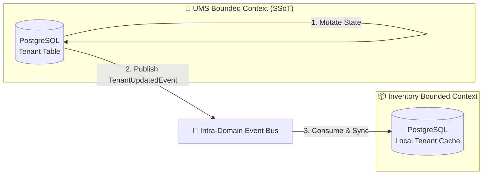

# 🔄 Multi-Domain Synchronization & Eventual Consistency Strategy

This document establishes the architectural framework, SSoT (Single Source of Truth) assignments, conflict-resolution policies, and data duplication guidelines to manage eventual consistency across SCM/UMS domains under the **bMAD Method**.

---

## 🏛️ 1. Eventual Consistency & Decoupling Philosophy

In a high-throughput enterprise SCM system, executing synchronous cross-database joins or immediate HTTP calls across bounded contexts creates tight coupling and introduces systemic bottlenecks. We enforce **Asynchronous Eventual Consistency** via pub/sub events.

Data is duplicated logically into local read-only tables where high-performance queries are required, bypassing synchronous API hops.

---

## 🔑 2. Single Sources of Truth (SSoT)

To prevent data drift and split-brain scenarios across schemas, we assign absolute SSoT ownership for every enterprise record type:

| Record Type | SSoT Owner Bounded Context | Ingestion / Modification Authorization | Downstream Read-Only Consumer Contexts |
| :--- | :--- | :--- | :--- |
| **User & Tenant Profile** | **UMS Context** | Authorized only via UMS Core/Controllers. | Inventory, Billing, Customs. |
| **Container Status & Weight** | **Inventory Context** | Physical IoT Scales / Port Operators. | Customs, Billing, Audit. |
| **Customs Clearance Status** | **Customs Context** | Official SUNAT API Integration. | Inventory, Billing. |
| **Invoicing & Billing Records**| **Billing Context** | SCM billing use cases / SAP sync. | Audit Ledger. |

---

## ⚖️ 3. Conflict Resolution Policies

When data is distributed and synchronized asynchronously, concurrent updates can lead to conflicts. We resolve conflicts at the database/ingestion level using two strict policies:

### A. Last-Write-Wins (LWW) with NTP Synchronization
*   **Policy**: If concurrent updates to the same entity (e.g., Tenant configuration) occur across different nodes, the update with the highest cryptographic timestamp wins.
*   **Enforcement**: All SCM application servers must synchronize their system clocks using the **Network Time Protocol (NTP)** to guarantee sub-millisecond drift.

### B. Logical Sequence Ordering
*   **Policy**: For SCM logistics entities (e.g., Container state), changes must follow a chronological sequence number (Vector Clocks or incrementing database state versions).
*   **Enforcement**: A subscriber rejects any incoming event whose payload sequence number is lower than or equal to the sequence number currently stored in the local database.

---

## 📦 4. Controlled Data Duplication (Denormalization Guidelines)

To achieve **GET endpoints p95 < 200ms** (ADR 0014), we allow controlled data duplication under the following three restrictions:

1.  **Read-Only Local Replicas**: Duplicated tables (e.g., a read-only `TenantCache` table inside the Inventory schema) must be treated as completely read-only by the inheriting module. No use case inside the Inventory module is permitted to execute `UPDATE` or `INSERT` queries on duplicated tables outside of event subscribers.
2.  **Minimal Attributes Only**: Local caches must only store the minimum set of attributes required for local UI rendering (e.g., duplicate only `tenant_id`, `tenant_name`, and `status`, omitting billing plans or payment records).
3.  **Automatic Resync**: If a consumer detects data drift, it triggers an automated asynchronous "Resync Command" to fetch a fresh snapshot from the SSoT upstream context, maintaining self-healing consistency.
