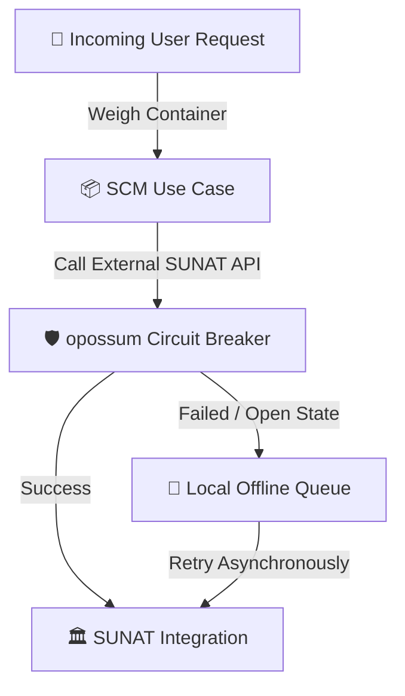

# 📐 Measurable Non-Functional Requirements (NFR Specification)

This document formalizes the measurable engineering performance targets, availability thresholds, security mandates, and graceful degradation mechanics for the SCM/UMS platform under the **bMAD Method**.

---

## 🏛️ 1. Core Performance & Throughput Targets

To support real-time seaport terminal operations and high-speed customs reporting, the platform enforces strict, measurable quality gates:

| Metric Category | Target SLA (Contractual) | Measurement Method | Failure Response / Mitigation |
| :--- | :--- | :--- | :--- |
| **Read Latency (p95)** | **< 200 ms** | OpenTelemetry spans on GET endpoints. | Automated Read-Aside Redis caching bypasses the primary database. |
| **Write Latency (p95)** | **< 500 ms** | OpenTelemetry spans on POST/PUT endpoints. | In-memory asynchronous handoff using local Transactional Outbox. |
| **Throughput Baseline** | **500 req / second** | Load tests via k6 in CI staging pipelines. | Horizontal Pod Autoscaler (HPA) triggers scaling based on CPU > 70%. |
| **Concurrency Peak** | **10,000 active sessions** | Simulated terminal user sessions in staging. | Centralized Redis session state with NestJS throttler rate-limiting. |

---

## 🛡️ 2. Availability & Disaster Recovery Mandates

High-availability logistics demand near-zero unplanned downtime:
*   **Availability SLA**: **99.9% Uptime** (yearly downtime < 8.76 hours; monthly downtime < 43.8 minutes).
*   **Geographical Resilience**: Multi-AZ (Availability Zone) deployment in Azure/AWS. If Zone A goes offline, Zone B automatically inherits traffic within 30 seconds via global load balancers.
*   **Database DR**: Synchronous PostgreSQL read replicas with automatic failover (RTO < 15 minutes, RPO < 5 minutes).

---

## ⚙️ 3. Resiliency & Graceful Degradation Patterns

A single external failure must never cascade and crash the SCM core. We enforce the following fallback strategies:

### A. Circuit Breaker (`opossum` Integration - ADR 0011)
*   **Mechanism**: If external integrations (e.g., SUNAT Customs API, OCR Scanner) fail > 50% of the time over a rolling 10-second window, the circuit breaks (opens).
*   **Fallback**: Incoming requests bypass the external call and queue transactions locally in an offline pending-audited state, allowing terminal physical scales to continue operating without interruption.

### B. Read-Aside Cache Bypass (ADR 0014)
*   **Mechanism**: If the Redis cache cluster crashes, the application intercepts the error, bypasses the cache port seamlessly without throwing error codes, and routes queries directly to the primary PostgreSQL database, degrading performance slightly but preserving total availability.

---

## 🔐 4. Enterprise Security & Sovereign Compliance

*   **Transport Layer Security**: Strictly enforces **TLS 1.3** only. Legacy protocols (TLS 1.0, 1.1) are rejected at the Gateway.
*   **Encryption at Rest**: Databases and file storage use AES-256 encryption.
*   **Vulnerability Scanning**: CI blocks builds with dynamic versions or `high`/`critical` vulnerabilities as specified in **ADR 0009**.
*   **OWASP Top 10 Mitigation**: Enforced via declarative input sanitization (using `class-validator`) and secure HTTP headers (using `helmet` - ADR 0002).
