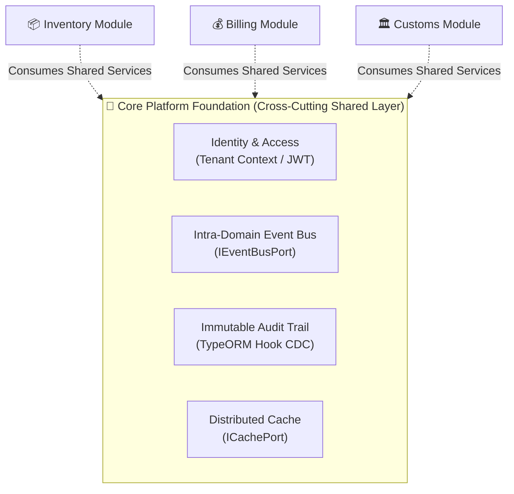

# 🧠 Platform Core Definition & Shared Services Strategy

This document defines the **Platform Core** of the UMS/SCM platform. It details the shared capabilities, common technical purpose, and reusability guidelines that justify joint investments in central cross-cutting components under the **bMAD Method**.

---

## 🏛️ 1. Platform Core Capabilities

The Platform Core is the foundation of the modular monolith. It provides critical, cross-cutting infrastructure services so that business domain modules (Inventory, Billing, Customs) remain lightweight and focused entirely on business rules.

---

## 📊 2. Strategic Shared Services Inventory

The Platform Core manages the following four central capabilities:

### 🔑 A. Unified Identity & Authorization
*   **Purpose**: Centralizes tenant context, token generation, cryptographic verification (RSA-256), and Guard-based authorization.
*   **Reusability Principle**: Injected into the NestJS request lifecycle via global guards. No individual module has to write custom token decoders or tenant validation code.

### 🚌 B. Intra-Domain Event Bus (`IEventBusPort`)
*   **Purpose**: High-performance, in-memory event distribution using NestJS `EventEmitter2`.
*   **Reusability Principle**: Modules publish and subscribe to domain events using pure Core interfaces. This decouples modules synchronously (e.g., Inventory does not import Billing Services; it simply publishes `ContainerCheckedInEvent`).

### 📦 C. Distributed Caching (`ICachePort`)
*   **Purpose**: Transparent read-aside caching hidden behind a pure Core interface. 
*   **Reusability Principle**: Leverages Redis in Infrastructure, but business use cases only interact with `ICachePort` to maintain absolute vendor agnosticism.

### 📝 D. Immutable Auditing Ledger
*   **Purpose**: Automatic Change Data Capture (CDC) of business entity mutations.
*   **Reusability Principle**: Hooked directly into TypeORM database subscribers. Developers write standard entity saves, and the Core automatically captures and logs changes securely.

---

## ⚙️ 3. Principles of Reusability & Zero-Leakage Governance

To prevent the shared core from becoming a tightly coupled garbage dump (the "God Shared Module" anti-pattern), we enforce three strict governance rules:

1.  **Strict Hexagonal Boundaries**: The Core layer of a module must **never** depend on an external package or concrete shared adapter. Shared libraries must expose pure interfaces (Ports) in the Core, with implementations residing strictly in the Infrastructure layer.
2.  **No Direct Database Cross-Imports**: Modules cannot query another module's tables directly. All cross-module communication must happen asynchronously via the Event Bus or synchronously via declared Application Interfaces (Ports).
3.  **No Vendor Lock-In**: Concrete libraries like `bcrypt`, `opossum`, or `redis` must never leak into Use Cases. They are strictly confined inside Infrastructure Adapters.
