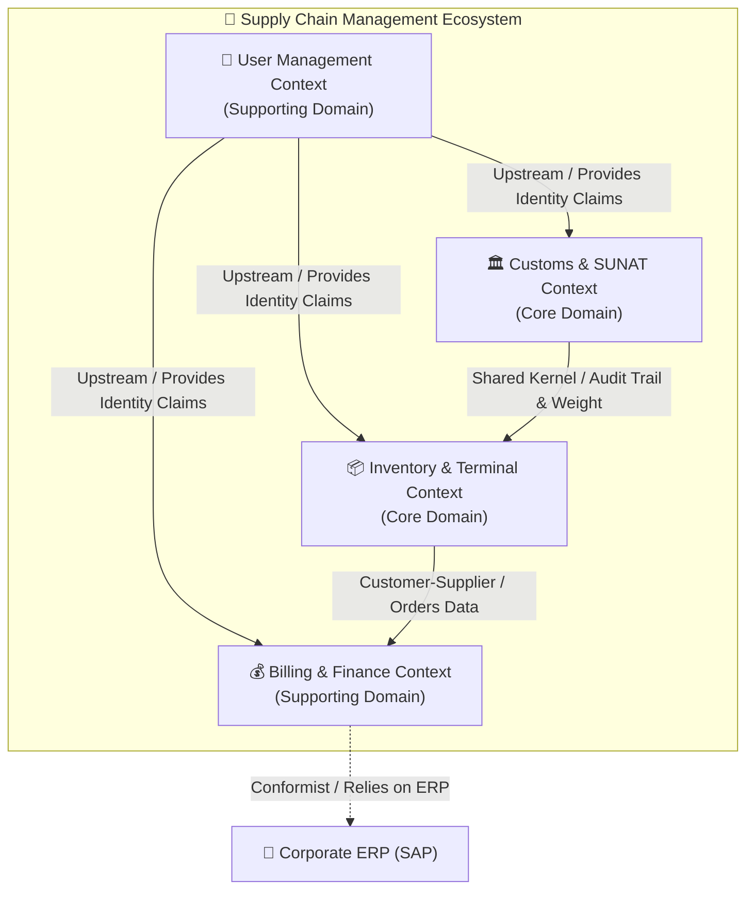

# 🗺️ Bounded Context Map (SCM & UMS Domain)

This document establishes the strategic domain boundaries, context definitions, and relationships within the **Supply Chain Management (SCM)** and **User Management System (UMS)** ecosystem under the **bMAD Method**.

---

## 🏛️ 1. Domain Categorization

To optimize resource allocation and architectural focus, we categorize the subdomains into three distinct layers:

| Subdomain | Type | Business Value | Operational Complexity |
| :--- | :---: | :--- | :--- |
| **Identity & Access Management (UMS)** | **Supporting** | Low differentiation, high critical security. Necessary for multi-tenancy. | Medium (JWT, RBAC/ABAC). |
| **Inventory & Terminal Operations** | **Core** | High differentiation. Governs warehouse storage and terminal customs weight controls. | High (Real-time tracking, OCR, IoT scales). |
| **Customs Appraisals (SUNAT Integration)** | **Core** | High compliance and differentiation. Determines operational legality. | High (Complex integration, fault-tolerance). |
| **Billing & Finance (SAP Integration)** | **Supporting** | Low differentiation. Financial records synchronization. | Medium (Batch transfers, SAP RFC). |

---

## 🗺️ 2. Bounded Context Map

---

## 🤝 3. Context Relationships & Integrations

### A. User Management Context (UMS) ➔ Operational Contexts
*   **Relationship**: Upstream / Downstream (U/D).
*   **Integration Pattern**: **Open Host Service (OHS) / Published Language (PL)**.
*   **Description**: UMS acts as the single source of truth for identities and permissions. It publishes a lightweight JWT token with tenant claims that downstream contexts consume conformingly.

### B. Customs (SUNAT) Context ➔ Inventory & Terminal Context
*   **Relationship**: **Shared Kernel (SK)**.
*   **Integration Pattern**: Common contracts for Container Weight, Audits, and Seals are shared between these contexts to maintain zero transaction lag.

### C. Inventory Context ➔ Billing Context
*   **Relationship**: Upstream (Supplier) / Downstream (Customer).
*   **Integration Pattern**: **Customer-Supplier**.
*   **Description**: Billing relies on Inventory data (storage time, weight, forklift services) to compute invoices. Changes in the Billing model do not affect Inventory.

---

## 📈 4. Evolutionary Path (Monolith to Microservices)

To keep the platform agile, the bounded contexts are implemented as decoupled modules within the NestJS monorepo. The evolution path is designed to prevent a distributed mess:
1.  **Phase 1 (Current)**: Monolith with Hexagonal Boundaries (ADR 0002) communicating via an in-memory event bus (`EventEmitter2` under `IEventBusPort` - ADR 0015).
2.  **Phase 2 (Scalability Trigger)**: Split the Inventory module into an independent service using Dapr sidecars (ADR 0006) for pub/sub (RabbitMQ/Kafka) without modifying the Core application layers.
