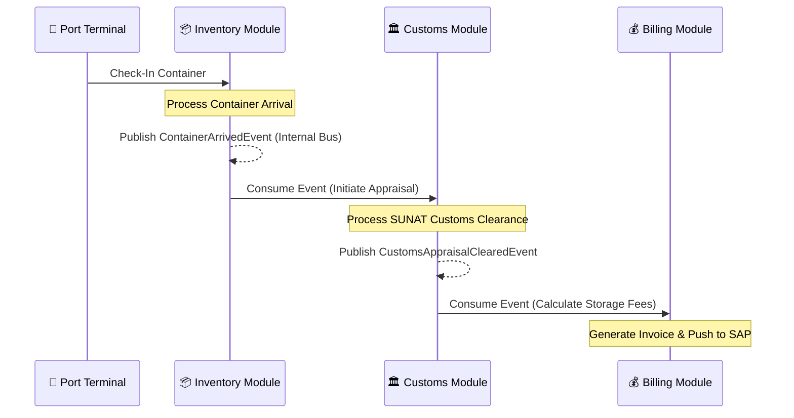

# 📢 Event Domain Model (SCM Event Storming Specification)

This document formalizes the business-critical **Domain Events**, their producers, consumers, and payloads within the Supply Chain Management (SCM) ecosystem under the **bMAD Method**.

---

## 🏛️ 1. Core Event-Driven Architecture (EDA) Overview

Domain Events are the primary mechanism used to decouple SCM business modules. By publishing asynchronous events instead of executing direct synchronous service calls, the system guarantees high throughput, isolation, and seamless scalability toward distributed microservices as specified in **ADR 0015**.

---

## 🗺️ 2. Business Event Map

The following matrix maps the primary business events triggered during SCM operations, along with their payloads, producers, and downstream consumers:

| Domain Event | Producer Module | Downstream Consumers | Event Purpose & Business Impact | Key Payload Attributes |
| :--- | :--- | :--- | :--- | :--- |
| `UserCreatedEvent` | **UMS** | Audit Ledger | Logs new user registration for security and corporate compliance. | `userId`, `tenantId`, `role`, `timestamp` |
| `ContainerArrivedEvent` | **Inventory** | Customs, Billing, Audit | Triggers OCR scan, updates terminal stock, and begins storage billing cycles. | `containerId`, `tenantId`, `weightCode`, `origin` |
| `ContainerWeighedEvent` | **Inventory** | Customs, Audit Ledger | Captures verified gross mass (VGM) from scales and initiates customs declaration. | `containerId`, `verifiedWeight`, `scaleId`, `operatorId` |
| `CustomsAppraisalClearedEvent` | **Customs** | Inventory, Billing | Notifies terminal that the container is legally authorized for release and triggers final billing. | `containerId`, `customsDeclarationId`, `status` |
| `CustomsAppraisalFailedEvent` | **Customs** | Inventory, Audit | Blocks container release immediately and logs compliance incident. | `containerId`, `reasonCode`, `customsOfficer` |
| `InvoiceGeneratedEvent` | **Billing** | ERP Integration (SAP) | Dispatches billing records to the corporate SAP ERP for financial consolidation. | `invoiceId`, `tenantId`, `amount`, `currency`, `sapBatchId` |

---

## ⚙️ 3. Integration Choreography & Event Lifecycle

---

## 🛡️ 4. Ordering, Delivery & Resiliency Principles

To maintain absolute consistency across decoupled domains, all publishers and subscribers must adhere to the following three mandates:

1.  **At-Least-Once Delivery**: Events must be persisted in a transactional Outbox table prior to publication. If the network or event broker fails, the Outbox worker will continuously retry publishing until delivery is acknowledged.
2.  **Strict Event Ordering**: Events must be distributed using partition keys (e.g., `container_id` or `tenant_id`) to ensure that all events for a specific container (e.g., `Arrived` ➔ `Weighed` ➔ `Cleared`) are processed in the exact chronological order they were produced.
3.  **Strict Idempotency**: Downstream consumers **MUST** implement idempotency. Before processing an event, the consumer checks a `processed_events` table using the unique `event_id`. If already processed, the event is immediately discarded with a successful acknowledgment.
