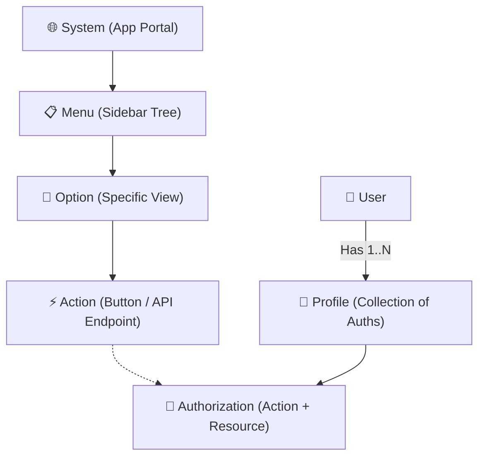
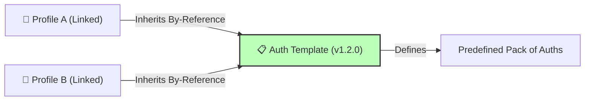
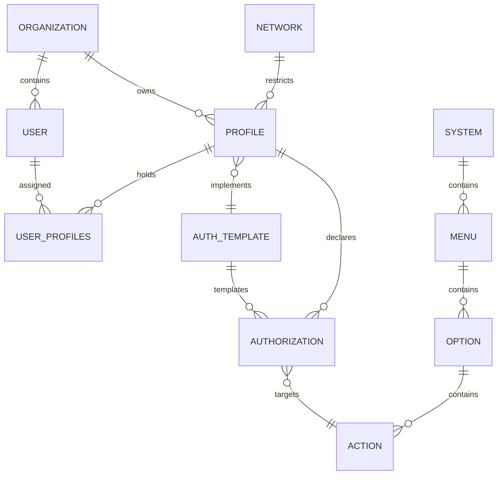

# 🔐 User Life-Cycle & Permissions Management System (ULPMS) Specification

This document defines the formal technical and functional specification for the **User Life-Cycle & Permissions Management System (ULPMS)**. It serves as an enterprise-grade functional blueprint for central, extensible, and secure multi-tenant identity administration under the **bMAD Method**.

---

## 🏛️ 1. Architectural & Authorization Analysis

Unlike transactive database engines, the ULPMS is a specialized system governing identity lifecycles and the dynamic graph of permissions. 

### A. Authorization Block Grouping & Profile Resolution
Permissions are modeled as hierarchical structural blocks representing physical and logical assets:

#### Multi-Profile Combination & Permission Resolution Engine:
A single user can hold multiple Profiles (e.g., `PortOperator` and `BillingSupervisor`). The system resolves the final runtime permission using the **Explicit-Deny Precedence Pattern**:
1.  **Deny-by-Default**: If no Profile explicitly grants an "Allow" for a specific Action, access is blocked (`403 Forbidden`).
2.  **Permissive Union**: If multiple Profiles assign "Allow" for an Action, the user inherits the union of those permissions (Permissive Union).
3.  **Explicit-Deny Overrides**: If *any* assigned Profile contains an explicit "Deny" for an Action or Resource, it overrides all other "Allow" grants across all other Profiles.
4.  **Network Constraints**: The resolution engine filters permissions against the active `Network` context (e.g., certain high-risk billing actions are stripped if the user accesses the platform from an external network outside the SCM Private Network).

---

### B. Policy & Authorization Template Pattern
An **Authorization Template** is a reusable policy blueprint representing a standard corporate role or functional bundle.

#### Propagation, Evolution & Versioning Rules:
*   **Inheritance Model**: Profiles inherit authorizations **By-Reference (Live Coupling)** from the Template. If an administrator adds a new menu to the `StandardOperatorTemplate`, all linked Profiles inherit that menu in real time.
*   **Custom Overlays (Local Overrides)**: A Profile can have custom local authorizations that override or extend the inherited Template authorizations, preserving scalability while supporting unique user exceptions.
*   **Versioning Lifecycle**: Templates are governed by semantic versioning (e.g., `v1.0.0`). Changes are drafted in a pending state and propagated to linked Profiles only after passing an automated policy validation check.

---

## 📖 [Artifact 1] Glossary of Terms

| Term | Definition | SSoT Schema Owner |
| :--- | :--- | :--- |
| **User (Usuario)** | A unique human operator or service account registered in the system. | `Identity.Users` |
| **Organization (Organización)**| A corporate tenant or company operating within the multi-tenant workspace. | `Identity.Organizations` |
| **Network (Red)** | A logical network boundary (Private SCM, Public, Shared) governing access. | `Identity.Networks` |
| **System (Sistema)** | An independent application or sub-portal registered in the platform. | `Auth.Systems` |
| **Menu (Menú)** | A structured navigation tree of sidebars and views belonging to a System. | `Auth.Menus` |
| **Option (Opción)** | A specific web page or UI view within a Menu. | `Auth.Options` |
| **Action (Acción)** | A granular operation (e.g., `create`, `read`, `export`) mapped to an API endpoint. | `Auth.Actions` |
| **Profile (Perfil)** | A physical collection of authorizations assigned to Users. | `Auth.Profiles` |
| **Authorization (Autorización)**| The mapping of an Allow/Deny policy to a specific Resource + Action. | `Auth.Authorizations` |
| **Auth Template (Plantilla)** | A reusable versioned blueprint of authorizations used to instantiate Profiles. | `Auth.Templates` |

---

## 🧪 [Artifact 2] Use Case Specification

### Caso de Uso 1: User Authentication via External IdP
*   **Actor**: SCM Corporate User.
*   **Preconditions**: User is registered in the ULPMS database and holds a valid HR employee reference.
*   **Main Flow**:
    1. User accesses the SCM portal and clicks "Login with Corporate SSO".
    2. The application redirects the user to the external IdP (Keycloak/Azure AD) using OAuth 2.0 Auth Code Flow.
    3. User authenticates successfully on the IdP portal.
    4. IdP redirects back to the SCM portal with an Authorization Code.
    5. The SCM backend exchanges the code for a secure access token (JWT) containing employee claims.
    6. The system verifies the `employee_reference` against the local database, initializes the user session, and returns the application cookie.

---

### Caso de Uso 2: Build User Authorization Graph
*   **Actor**: Authentication Guard / API Gateway.
*   **Preconditions**: User is successfully authenticated.
*   **Main Flow**:
    1. User dispatches an API request with their active session token.
    2. The Authorization Engine retrieves all Profiles assigned to the User.
    3. The engine fetches all authorizations linked to those Profiles, resolving any inherited Template policies.
    4. The engine applies the **Explicit-Deny Precedence** rules to compile the final list of allowed Actions and Resources.
    5. The system builds a lightweight hierarchical JSON Graph (Systems ➔ Menus ➔ Options ➔ Actions) and caches it in Redis (TTL < 1 hour) to ensure p95 response times < 200ms.

---

### Caso de Uso 3: Create & Instantiate Auth Template
*   **Actor**: Global IT Administrator.
*   **Preconditions**: Systems, Menus, and Actions are already registered in the system.
*   **Main Flow**:
    1. IT Administrator navigates to the Template Manager and clicks "Create New Template".
    2. Administrator defines the template name (e.g., `OperatorBaseline`) and initial version (`v1.0.0`).
    3. Administrator selects the authorized Systems, Menus, and Actions, saving the template.
    4. Administrator selects a Profile (or creates a new one) and links it to the newly created Template.
    5. The ULPMS automatically propagates the authorizations to all Users holding that Profile, logging the transaction in the immutable audit ledger.

---

## 💾 [Artifact 3] Conceptual Data Model

### Attributes Specification:
*   **User**: `id` (UUID, PK), `email` (string, Unique), `password_hash` (string), `employee_reference` (string), `status` (string), `created_at` (timestamp).
*   **Organization**: `id` (UUID, PK), `name` (string), `company_reference` (string, SAP), `status` (string).
*   **Profile**: `id` (UUID, PK), `organization_id` (FK), `name` (string), `template_id` (FK, Nullable).
*   **Authorization**: `id` (UUID, PK), `profile_id` (FK, Nullable), `template_id` (FK, Nullable), `action_id` (FK), `effect` (string: "ALLOW" | "DENY").
*   **System**: `id` (UUID, PK), `name` (string, Unique), `base_url` (string).
*   **Action**: `id` (UUID, PK), `option_id` (FK), `name` (string: "CREATE" | "READ" | "UPDATE" | "DELETE").

---

## 📊 [Artifact 4] Permission Matrix Example

The following matrix demonstrates how the **ULPMS Resolution Engine** resolves conflicting permissions for a single user assigned to multiple Profiles:

*   **User**: `Alex Arroyo` (Tenant: `Unimar LIMA-01`)
*   **Assigned Profiles**:
    1.  `Terminal Operator Profile` (Linked to Template: `OperatorBaseline_v1.0.0`)
    2.  `Billing Guest Profile` (Local Custom Profile)

| System | Menu | Option | Action | Profile 1: Operator (Template) | Profile 2: Billing Guest (Custom) | Final Resolved Access | Rationale |
| :--- | :--- | :--- | :--- | :---: | :---: | :---: | :--- |
| **Inventory** | Containers | Check-In | `create` | **ALLOW** | *None* | **ALLOW** | Granted by Profile 1. |
| **Inventory** | Containers | Delete | `delete` | *None* | *None* | **DENY** | Deny-by-Default (No grant found). |
| **Billing** | Invoices | View | `read` | *None* | **ALLOW** | **ALLOW** | Granted by Profile 2. |
| **Billing** | Invoices | Dispatch | `update` | **ALLOW** | **DENY** (Override) | **DENY** | **Explicit Deny Overrides** the Allow in Profile 1. |
