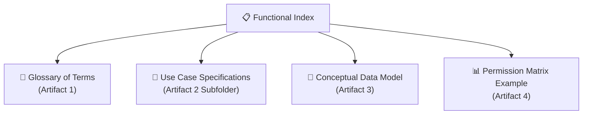

# 📋 ULPMS Functional Documentation Index

This directory contains the formal, divided technical-functional specifications for the **User Life-Cycle & Permissions Management System (ULPMS)** under the **bMAD Method**.

---

## 🗺️ Functional Core Map

The functional design of ULPMS is divided into four main architectural artifacts:

---

## 📂 Architectural & Functional Artifacts

Select an artifact to review its complete enterprise functional specification:

1.  **[Artifact 1: Glossary of Terms](./glossary_of_terms.md)**: Standardized business terms and technical definitions for ULPMS entities.
2.  **Artifact 2: Use Case Specifications (Subfolder)**: Detailed transaction flows, pre-conditions, and alternative paths for core operations:
    *   👉 **[Use Case 1: User Authentication via IdP](./usecases/uc1_user_authentication.md)**
    *   👉 **[Use Case 2: Build User Authorization Graph](./usecases/uc2_build_authorization_graph.md)**
    *   👉 **[Use Case 3: Create & Instantiate Auth Template](./usecases/uc3_create_authorization_template.md)**
3.  **[Artifact 3: Conceptual Data Model](./conceptual_data_model.md)**: Database schemas, attributes, relationships, and Entity-Relationship diagrams.
4.  **[Artifact 4: Permission Matrix Example](./permission_matrix_example.md)**: Practical demonstrations of multi-profile permission resolution under the *Explicit-Deny Precedence* rules.

---

## 🚚 Domain & Product Specifications (SCM / UMS)

The following core business domain and strategic functional specifications are mapped here under bMAD:

*   👉 **[Product Vision & Functional Scope Plan](./product_scope_and_functional_plan.md)**: Strategic product roadmap, user personas, and backlog capabilities.
*   👉 **[SCM Bounded Context Map](./bounded_context_map.md)**: Subdomain categorization, context relationships, and microservices evolutionary paths.
*   👉 **[SCM Event Domain Model](./event_domain_model.md)**: Detailed choreography of business events, payloads, and idempotency constraints.

---

## 🖼️ Conceptual Diagram
*   Review the original high-resolution **[Conceptual UML Diagram](./UMS.conceptual.jpg)** which serves as the visual reference for this technical-functional design.
