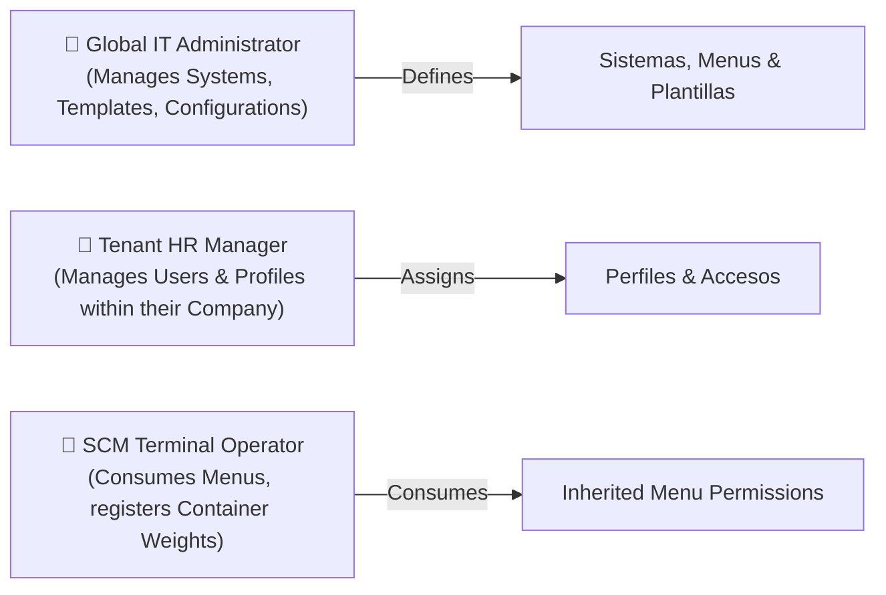
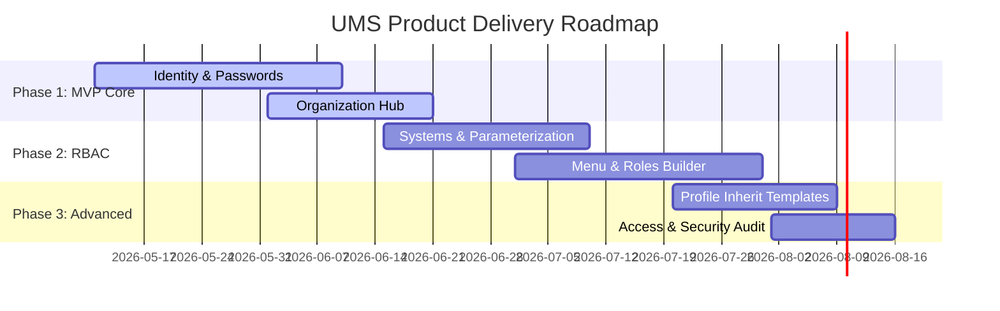

# 🎯 Product Vision, Context & Functional Scope Plan (PO Specification)

This document formalizes the product vision, user personas, functional boundaries, and strategic product roadmap for the **User Management System (UMS) / Master Data Portal**. It translates the conceptual architecture diagram into actionable product backlog epics and capabilities from a Product Owner (PO) perspective under the **bMAD Method**.

---

## 🏛️ 1. Product Vision & Executive Rationale

Seaport terminal operations, logistics, and customs integrations (SUNAT) require a secure, multi-tenant portal where corporate organizations can manage their employees, roles, and granular permissions across multiple sub-applications (e.g., Inventory App, Scale App, Billing App).

The **UMS** serves as the **Sovereign Source of Truth (SSoT)** for identities, companies, and application menu configurations, integrating with corporate HR/ERP systems to prevent administrative overhead and security leaks.

---

## 👥 2. Target User Personas

To guide functional design, we identify three primary corporate personas:

---

## 📦 3. Product Backlog Epics & Capabilities

Based on the conceptual diagram (`UMS.conceptual.jpg`), the product scope is organized into five foundational **Epics**:

### 🗺️ Epic 1: Multi-System Governance & Parameterization
*   **Business Goal**: Allow the platform to act as a central hub for multiple sub-applications (e.g., Inventory, Billing) without repeating configuration code.
*   **Core Capabilities**:
    *   *System Registration*: Define physical systems (APIs/Web clients) with unique IDs.
    *   *Parameterization Engine*: Manage environment and functional configurations on a per-system basis.

### 🔑 Epic 2: Corporate Identity & Password Lifecycle
*   **Business Goal**: Enforce secure, corporate-grade user authentication and password policies integrated with employee references.
*   **Core Capabilities**:
    *   *Employee HR Ingestion*: Map user accounts directly to unique corporate employee IDs (HR references).
    *   *Password Cryptographic Lifecycle*: Enforce strict hashing (bcrypt), expiration, and password reset workflows.

### 🏢 Epic 3: Multi-Tenancy Organization Hub
*   **Business Goal**: Support multi-tenant isolation where each seaport agency operates within its own secure workspace.
*   **Core Capabilities**:
    *   *Company ERP Integration*: Link local organizations to unique enterprise SAP company codes (Company references).
    *   *Tenant Lifecycle*: Provision, suspend, or terminate corporate tenants.

### 🛡️ Epic 4: Dynamic Role & Menu Permissions
*   **Business Goal**: Enable flexible, template-based access control where users only see the menus and buttons they are authorized to use.
*   **Core Capabilities**:
    *   *Menu Tree Builder*: Configure application menus (modules, submenus, routes) dynamically per system.
    *   *Template-Based Roles*: Define reusable role templates (e.g., "Standard Port Operator") containing a predefined pack of menus and authorizations.

### 👤 Epic 5: Profile & Access Auditing
*   **Business Goal**: Merge systems, users, and organizations into unified profiles with comprehensive security audit logs.
*   **Core Capabilities**:
    *   *Profile Matrix*: Map users to specific systems and organizations, inheriting authorizations from templates.
    *   *Unified Access Logs*: Automatically log all successful/failed login attempts and resource accesses for forensic audit reviews.
    *   *Manual Override*: Allow tenant managers to add custom authorizations to a user profile, overriding standard template defaults.

---

## 🚫 4. Context Boundary (In-Scope vs. Out-of-Scope)

| Feature / Domain | In-Scope (UMS Responsibility) | Out-of-Scope (External Responsibility) |
| :--- | :--- | :--- |
| **Identity & Authentication** | JWT issuance, password hashing, session revocation. | Direct hosting of employee credentials (delegated to Active Directory/OIDC IdP). |
| **HR Master Data** | Mapping user records to `employee_id` and `company_id`. | Managing employee payroll, contracts, or active department hierarchies (delegated to SAP/HR). |
| **Menu Configuration** | Defining which routes, sidebars, and actions a profile can access. | Client-side React routing logic (handled natively by Web Client router). |
| **Audit Logs** | Logging successful accesses and transactional mutations. | System-level infrastructure CPU/Memory log aggregation (handled by Loki/Tempo). |

---

## 📈 5. Strategic Product Roadmap

